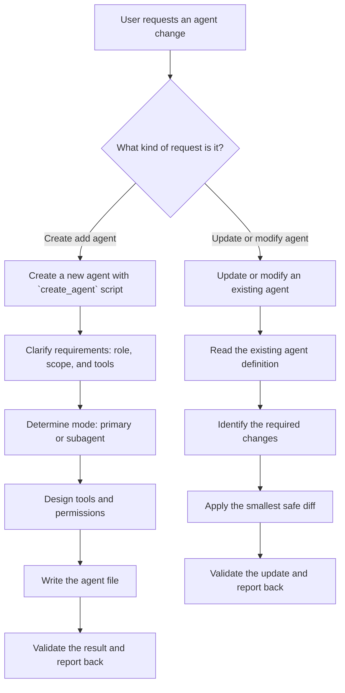

# Agent Architect

Create and update OpenCode agents following best practices and official specification.

This `SKILL.md` is authoritative. Files under `references/` provide supporting
detail, and `scripts/create_agent.py` is an implementation helper; neither may
override this workflow.

## Workflow Decision Tree



## Quick Start: Use the Script

For common agent types, use the [create_agent](#scripts) script:

## Create Flow (Manual)

### Step 1: Clarify Requirements

Ask user (if not clear):
- **Role**: What should the agent do? (code review, testing, docs, security audit, etc.)
- **Scope**: What files/areas should it access?
- **Autonomy**: Should it make changes or only analyze?

### Step 2: Determine Mode

| Mode | When to Use |
|------|-------------|
| `primary` | Main agents user interacts with directly (Tab to switch) |
| `subagent` | Specialized agents invoked by primary agents or via `@mention` |
| `all` | Can be used as both (default if omitted) |

**Rule of thumb**: Most custom agents should be `subagent`.

### Step 3: Design Tools & Permissions

Apply **permission hygiene** — explicitly list tools based on agent role:

| Role | Recommended Tools |
|------|-------------------|
| Analyzer/Reviewer | `Read, Grep, Glob, WebSearch` |
| Implementer | `Read, Edit, Write, Bash, Grep, Glob` |
| Planner | `Read, Grep, Glob, Task` |
| Documentation | `Read, Write, Grep, Glob` |

**Permission values**: `allow`, `ask`, `deny`

### Step 4: Write Agent File

**Location**: `.opencode/agents/<name>.md`

**Description contract**: make `description` a compact formal agent contract, not a generic summary. It should state:
- input files to be attached as context 
- required input prompt content
- output artifacts (files, directories, or paths; say `none` if no files are produced)
- output message content
- when to use the agent

**Template**:
```markdown
---
description: >
  <clear description of what agent does and when to use>
  Meta:
  - Input prompt: must include <goal, scope, constraints>.
  - Consumes: <files/paths>.
  - Produces: <files/paths or none>
  - Output message: Responds with <message contents>
mode: subagent
model: cibaa/qwen-coder  # optional
temperature: 0.3                            # optional
tools:
  write: false
  edit: false
  bash: false
permission:
  bash:
    "git status *": allow
    "git diff *": allow
---

# Role
<What the agent does>

# Process
<Step-by-step workflow>

# HITL Rules
<When to stop and ask user>

# Definition of Done
<Checklist for completion>
```

### Step 5: Validate

Check:
- [ ] `description` is clear, actionable and includes the input/output contract and usage trigger
- [ ] `mode` matches intended usage
- [ ] `tools` explicitly listed (not inherited)
- [ ] HITL rules defined for risky operations
- [ ] Definition of Done included

## Update Flow

1. **Read** existing agent file
2. **Identify** what needs to change (tools, permissions, prompt)
3. **Apply** minimal changes preserving existing structure
4. **Validate** updated configuration

## Best Practices

### Single-Responsibility Principle

Each agent should have ONE clear goal:
- **Good**: "Reviews code for security vulnerabilities"
- **Bad**: "Reviews code, writes tests, and deploys"

### Description as Contract

Prefer a stable description schema so callers can understand the interface without reading the full prompt:

```text
  Meta:
  - Input prompt: must include <goal, scope, constraints>.
  - Input files context: <files>.
  - Produces: <files/paths or none>
  - Output message: Responds with <message contents>
```

This keeps the agent contract explicit for orchestration and reuse.

### HITL (Human-in-the-Loop) Rules

Embed "ask first" rules in agent prompts:

```markdown
# HITL Rules
- If acceptance criteria are ambiguous → ask numbered questions and WAIT
- If changes affect public API → STOP and request approval
- If refactors exceed scope → ask before proceeding
```

### Definition of Done

Every agent should have completion criteria:

```markdown
# Definition of Done
- [ ] All files analyzed
- [ ] Issues documented with severity
- [ ] Recommendations provided
- [ ] Summary written
```

### Tool Scoping by Role

**Read-heavy agents** (PM, Architect, Reviewer):
```yaml
tools:
  write: false
  edit: false
  bash: false
```

**Write-enabled agents** (Implementer):
```yaml
tools:
  write: true
  edit: true
  bash: true
permission:
  bash:
    "*": ask
    "git *": allow
    "npm test *": allow
```

## Examples

Ready-to-use agent templates include:
- Code Reviewer
- Security Auditor
- Documentation Writer
- Test Runner
- Refactoring Assistant

## Resources

### Scripts

[create_agent](scripts/create_agent.py) — Generates agents from templates

<create_agent_usage>
    Agent Creator - Creates OpenCode agents from templates or specifications.
    
    Usage:
    create_agent.py <name> --role <role> [options]
    create_agent.py <name> --template <template> [options]
    create_agent.py --list-templates
    create_agent.py --list-roles
    
    Options:
    --role <role>           Agent role: reviewer, security, docs, tester, refactor, planner, orchestrator
    --template <template>   Use predefined template
    --mode <mode>           primary or subagent (default: subagent)
    --path <path>           Output directory (default: .opencode/agents)
    --model <model>         Model to use (e.g., anthropic/claude-sonnet-4-20250514)
    --temperature <temp>    Temperature 0.0-1.0
    --description <desc>    Custom description; prefer the formal input/output contract format
    --tools <tools>         Comma-separated tools to enable
    --no-tools <tools>      Comma-separated tools to disable
    --dry-run               Print generated content without writing
    
    Examples:
    ```bash
    # List available templates
    uv run --native-tls .opencode/skills/agent-architect/scripts/create_agent.py --list-templates
    # Create a code reviewer
    uv run --native-tls .opencode/skills/agent-architect/scripts/create_agent.py code-reviewer --role reviewer
    # Create a security auditor
    uv run --native-tls .opencode/skills/agent-architect/scripts/create_agent.py security-audit --role security
    # Create with custom description
    uv run --native-tls .opencode/skills/agent-architect/scripts/create_agent.py android-tester --role tester \
    --description "Runs Android unit tests with Gradle"
    # Preview without writing (dry-run)
    uv run --native-tls .opencode/skills/agent-architect/scripts/create_agent.py my-agent --role planner --dry-run
    # Create in global config
    uv run --native-tls .opencode/skills/agent-architect/scripts/create_agent.py my-agent --role docs \
    --path ~/.config/opencode/agents
    ```
</create_agent_usage>


### References

- [references/agent-spec.md](references/agent-spec.md) — Full OpenCode agent specification
- [references/best-practices.md](references/best-practices.md) — Detailed best practices guide
