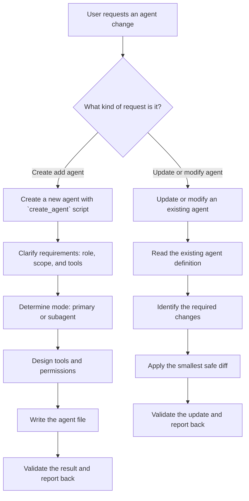

# Agent Architect

Create and update OpenCode agents using native V2 frontmatter.

This `SKILL.md` is authoritative. Files under `references/` provide supporting
detail, and `scripts/create_agent.py` is an implementation helper; neither may
override this workflow.

Use the `opencode` skill and the official V2 [Agents](https://opencode.ai/v2/docs/agents),
[Permissions](https://opencode.ai/v2/docs/permissions), and
[Migration](https://opencode.ai/v2/docs/migrate-v1) guides for configuration semantics.
These official guides take precedence over bundled examples. Do not infer V2 fields
from the V1 documentation or `https://opencode.ai/config.json` schema.

## Workflow Decision Tree



## Quick Start: Use the Script

For common agent types, use the [create_agent](#scripts) script:

## Create Flow (Manual)

### Step 1: Clarify Requirements

Ask user (if not clear):
- **Role**: What should the agent do? (code review, testing, docs, security audit, etc.)
- **Scope**: What files/areas should it access?
- **Autonomy**: Should it make changes or only analyze?

### Step 2: Determine Mode

| Mode | When to Use |
|------|-------------|
| `primary` | Main session agent; V2 default for new custom agents when omitted |
| `subagent` | Runs in a child session through the `subagent` tool |
| `all` | Can be used as either |

**Rule of thumb**: Most custom agents should be `subagent`.

### Step 3: Design Tools & Permissions

Use an ordered `permissions` list to express the agent's required policy.
Every rule has `action`, `resource`, and `effect`; the last matching rule wins.
Put broad rules before specific exceptions. Agent rules append after global rules.
Custom agents start with the base policy; they do not inherit the parent's permissions
or agent-specific `build` overrides. Omitting `permissions` is valid when that policy fits.
If asked to match `build`, inspect its effective policy in the target workspace instead of guessing.

| Role | Common permission actions |
|------|-------------------|
| Analyzer/Reviewer | `read`, `grep`, `glob`, `websearch` |
| Implementer | `read`, `edit`, `shell`, `grep`, `glob` |
| Planner | `read`, `grep`, `glob`, scoped `subagent` |
| Documentation | `read`, `edit`, `grep`, `glob` |

**Permission values**: `allow`, `ask`, `deny`

`edit` covers editing, writing and patching; it cannot distinguish create-only from
update-only access. `shell` resources match command text; use `curl *` for a command
with arguments (also matches bare `curl`). MCP actions use sanitized `<server>_<tool>`
names, for example `chrome_devtools_*`. Permission rules cannot supply absent tools.

### Step 4: Write Agent File

**Location**: `.opencode/agents/<name>.md`

The path determines the agent ID; do not add a `name` field to agent frontmatter.
Keep the system instructions in the Markdown body.

**Description contract**: make `description` a compact formal agent contract, not a generic summary. It should state:
- input files to be attached as context 
- required input prompt content
- output artifacts (files, directories, or paths; say `none` if no files are produced)
- output message content
- when to use the agent

**Template**:
```markdown
---
description: >
  <clear description of what agent does and when to use>
  Meta:
  - Input prompt: must include <goal, scope, constraints>.
  - Consumes: <files/paths>.
  - Produces: <files/paths or none>
  - Output message: Responds with <message contents>
mode: subagent
permissions:
  - action: edit
    resource: "*"
    effect: deny
  - action: shell
    resource: "*"
    effect: deny
  - action: shell
    resource: "git status *"
    effect: allow
  - action: shell
    resource: "git diff *"
    effect: allow
---

# Role
<What the agent does>

# Process
<Step-by-step workflow>

# HITL Rules
<When to stop and ask user>

# Definition of Done
<Checklist for completion>
```

### Step 5: Validate

Check:
- [ ] `description` is clear, actionable and includes the input/output contract and usage trigger
- [ ] `mode` matches intended usage
- [ ] Native V2 fields only; permission order and effective access match the role
- [ ] Model, if specified, uses `provider/model#variant` (variant optional)
- [ ] YAML parses, including descriptions, wildcard resources and quoted scalar values
- [ ] HITL rules defined for risky operations
- [ ] Definition of Done included

## Update Flow

1. **Read** existing agent file
2. **Identify** what needs to change (tools, permissions, prompt)
3. **Apply** minimal changes preserving existing structure
4. **Validate** updated configuration

For V1 migration, convert the entire agent entry to V2 rather than mixing formats:
- `permission` and boolean `tools` → ordered `permissions` rules.
- `bash` → `shell`; `task` → `subagent`; `write`/`patch` → `edit`.
- `disable` → `disabled`; `maxSteps` → `steps`; join `variant` to `model` with `#`.
- Move `temperature`, `top_p`, and provider options to `request.body`.
- Remove `name`; retain the file path and Markdown body.

Resolve conflicting write/edit settings explicitly because V2 combines them. Preserve
existing approval requirements and user changes. Supported V1 definitions are translated
automatically; native conversion is optional unless requested.

The V2 runner currently preserves agent `request` values but does not send them to the
model. Do not promise that agent-level temperature changes generation; active request
settings belong on the provider, model or variant. Use `steps`, `hidden`, `disabled`,
and six-digit hex `color` only when needed. See the reference for details.

For runtime verification, use the read-only agent API with an explicit workspace:
`opencode api get '/api/agent?location%5Bdirectory%5D=<URL-encoded-absolute-workspace>'`.
Check the returned `location.directory` and the relevant agents' loaded values; a result
from another location or an old cached definition is not validation of the edited files.

## Best Practices

### Single-Responsibility Principle

Each agent should have ONE clear goal:
- **Good**: "Reviews code for security vulnerabilities"
- **Bad**: "Reviews code, writes tests, and deploys"

### Description as Contract

Prefer a stable description schema so callers can understand the interface without reading the full prompt:

```text
  Meta:
  - Input prompt: must include <goal, scope, constraints>.
  - Input files context: <files>.
  - Produces: <files/paths or none>
  - Output message: Responds with <message contents>
```

This keeps the agent contract explicit for orchestration and reuse.

### HITL (Human-in-the-Loop) Rules

Embed "ask first" rules in agent prompts:

```markdown
# HITL Rules
- If acceptance criteria are ambiguous → ask numbered questions and WAIT
- If changes affect public API → STOP and request approval
- If refactors exceed scope → ask before proceeding
```

### Definition of Done

Every agent should have completion criteria:

```markdown
# Definition of Done
- [ ] All files analyzed
- [ ] Issues documented with severity
- [ ] Recommendations provided
- [ ] Summary written
```

### Tool Scoping by Role

**Read-heavy agents** (PM, Architect, Reviewer):
```yaml
permissions:
  - action: edit
    resource: "*"
    effect: deny
  - action: shell
    resource: "*"
    effect: deny
```

**Write-enabled agents** (Implementer):
```yaml
permissions:
  - action: edit
    resource: "*"
    effect: allow
  - action: shell
    resource: "*"
    effect: ask
  - action: shell
    resource: "git status *"
    effect: allow
  - action: shell
    resource: "git diff *"
    effect: allow
  - action: shell
    resource: "npm test *"
    effect: allow
```

## Examples

Ready-to-use agent templates include:
- Code Reviewer
- Security Auditor
- Documentation Writer
- Test Runner
- Refactoring Assistant

## Resources

### Scripts

[create_agent](scripts/create_agent.py) — Generates agents from templates

The helper emits explicit rules for a known set of core actions, followed by role
exceptions and CLI overrides. It is a starting policy, not a copy of `build` and not
an exhaustive plugin allowlist. Docs and orchestrator templates permit `edit` to
retain their file-output capability. Use `--no-tools edit` for an orchestrator that
must delegate all edits. `--no-tools` wins over role rules and `--tools`.
Legacy CLI aliases `bash`, `task`, `write`, and `patch` normalize to V2 actions.

<create_agent_usage>
    Agent Creator - Creates OpenCode agents from templates or specifications.
    
    Usage:
    create_agent.py <name> --role <role> [options]
    create_agent.py <name> --template <template> [options]
    create_agent.py --list-templates
    create_agent.py --list-roles
    
    Options:
    --role <role>           Agent role: reviewer, security, docs, tester, refactor, planner, orchestrator
    --template <template>   Use predefined template
    --mode <mode>           primary, subagent or all (helper default: subagent)
    --path <path>           Output directory (default: .opencode/agents)
    --model <model>         provider/model with optional #variant
    --temperature <temp>    Stored under request.body; currently inactive in the V2 runner
    --description <desc>    Custom description; prefer the formal input/output contract format
    --tools <actions>       Comma-separated permission actions to allow
    --no-tools <actions>    Comma-separated permission actions to deny
    --dry-run               Print generated content without writing
    
    Examples:
    ```bash
    # List available templates
    uv run --native-tls .opencode/skills/agent-architect/scripts/create_agent.py --list-templates
    # Create a code reviewer
    uv run --native-tls .opencode/skills/agent-architect/scripts/create_agent.py code-reviewer --role reviewer
    # Create a security auditor
    uv run --native-tls .opencode/skills/agent-architect/scripts/create_agent.py security-audit --role security
    # Create with custom description
    uv run --native-tls .opencode/skills/agent-architect/scripts/create_agent.py android-tester --role tester \
    --description "Runs Android unit tests with Gradle"
    # Preview without writing (dry-run)
    uv run --native-tls .opencode/skills/agent-architect/scripts/create_agent.py my-agent --role planner --dry-run
    # Create in global config
    uv run --native-tls .opencode/skills/agent-architect/scripts/create_agent.py my-agent --role docs \
    --path ~/.config/opencode/agents
    ```
</create_agent_usage>


### References

- [references/agent-spec.md](references/agent-spec.md) — Full OpenCode agent specification
- [references/best-practices.md](references/best-practices.md) — Detailed best practices guide
