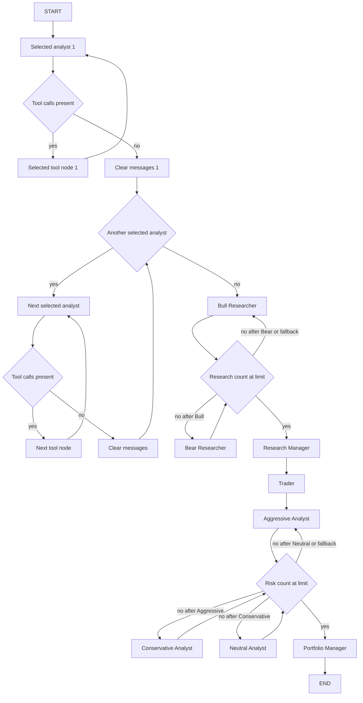

# Выполнение графа агентов

Среда выполнения — `StateGraph(AgentState)`, который собирает `GraphSetup.setup_graph()`. Сначала работает выбранная вызывающим кодом цепочка аналитиков, затем bull/bear-дебаты и связка Research Manager → Trader, наконец трёхсторонние риск-дебаты и Portfolio Manager. Это последовательная маршрутизация, а не параллельное голосование агентов.

`TradingAgentsGraph` создаёт модели, `ToolNode`, `ConditionalLogic`, `GraphSetup` и `Propagator`, сохраняет нескомпилированный `workflow` и вызывает `workflow.compile()`. Сам `setup_graph()` возвращает workflow, несмотря на упоминание компиляции в его docstring. Общий контекст системы описан в [обзоре архитектуры](system-overview.md).

## Управление потоком

Схема показывает общий каркас выбранных аналитиков и ограниченные счётчиками дебаты; проверка наличия следующего аналитика выполняется при сборке, а Sentiment Analyst в текущей реализации сразу идёт по ветви без tool calls.

Источник управления потоком: [setup.py](repo://tradingagents/graph/setup.py), [conditional_logic.py](repo://tradingagents/graph/conditional_logic.py).

## Выбор аналитиков и назначение моделей

`build_analyst_execution_plan(selected_analysts)` переводит ключи в `AnalystNodeSpec` и сохраняет порядок входной последовательности без сортировки. `START` ведёт к первому элементу, а clear-узел — к следующему. Интерактивный CLI отдельно нормализует выбор по `ANALYST_ORDER`; программный вызывающий код может задать иной порядок.

| Ключ | Узел агента | Узел инструментов | Очистка сообщений | Поле отчёта |
|---|---|---|---|---|
| `market` | `Market Analyst` | `tools_market` | `Msg Clear Market` | `market_report` |
| `social` | `Sentiment Analyst` | `tools_social` | `Msg Clear Sentiment` | `sentiment_report` |
| `news` | `News Analyst` | `tools_news` | `Msg Clear News` | `news_report` |
| `fundamentals` | `Fundamentals Analyst` | `tools_fundamentals` | `Msg Clear Fundamentals` | `fundamentals_report` |

`social` — сохранённый ради совместимости конфигураций ключ, а не имя узла `Social Analyst`. Неизвестный ключ вызывает `ValueError("unknown analyst key: ...")`, пустой выбор — `ValueError("at least one analyst must be selected")` до обращения к первому элементу плана.

В workflow добавляются агент, clear-узел и tool-узел только выбранных аналитиков. При этом `Propagator` всегда инициализирует все четыре поля отчётов пустыми строками: исследователи и риск-аналитики читают их независимо от выбора. Пропущенный аналитик означает отсутствие данных, а не отсутствие ключа состояния.

Распределение моделей задаётся фабриками в `GraphSetup`, а не сложностью конкретного промпта:

- `quick_thinking_llm`: все четыре аналитика, Bull/Bear Researcher, Trader и все три риск-аналитика;
- `deep_thinking_llm`: Research Manager и Portfolio Manager.

Обе модели создаются через `create_llm_client` с `llm_provider`, соответственно `quick_think_llm` и `deep_think_llm`, и общими настройками провайдера. Подробности — в [интеграции LLM](../integrations/llm-providers.md).

Источники: [план аналитиков](repo://tradingagents/graph/analyst_execution.py#L20-L69), [назначения моделей](repo://tradingagents/graph/setup.py#L73-L111), [создание клиентов](repo://tradingagents/graph/trading_graph.py#L108-L164), [выбор CLI](repo://cli/main.py#L1009-L1016).

## Инструменты и очистка сообщений

Для аналитиков с tool calling, например Market Analyst, узел связывает модель с инструментами и возвращает ответ в `messages`. Пока `result.tool_calls` непустой, поле отчёта возвращается пустым; ответ без вызовов записывается в отчёт. Market Analyst связывает `get_stock_data`, `get_indicators` и `get_verified_market_snapshot`.

Соответствующий `should_continue_<key>()` проверяет **только `tool_calls` последнего сообщения**:

- непустой список → соответствующий `ToolNode` → тот же аналитик;
- пустой список → clear-узел → следующий аналитик либо Bull Researcher.

Текстовый префикс `FINAL TRANSACTION PROPOSAL` из промпта не завершает граф. Маршрутизатор также не проверяет содержательность отчёта и выполнение всех рекомендованных в промпте запросов. Отдельного лимита tool-раундов здесь нет: внешним ограничением служит `recursion_limit`.

**Sentiment Analyst — исключение из механизма tool calling, но не из каркаса графа.** Он сам предварительно получает новости, StockTwits и Reddit, вставляет блоки данных в промпт и использует `SentimentReport` со structured-output/fallback. Затем возвращает `AIMessage(content=report_text)` без tool calls и `sentiment_report`. Зарегистрированный для `social` tool-узел остаётся в workflow, но такой ответ направляется сразу в `Msg Clear Sentiment`. Запрет внешних инструментов для модели не означает отсутствия предварительного сетевого получения данных самим узлом.

`create_msg_delete()` выдаёт `RemoveMessage` для каждого текущего сообщения и новый `HumanMessage` с контекстом инструмента и датой анализа. Он не очищает отчёты или дебаты. Так следующий аналитик получает осмысленную задачу вместо чужого tool-транскрипта или голого `Continue`.

Источники: [Market Analyst](repo://tradingagents/agents/analysts/market_analyst.py#L58-L93), [Sentiment Analyst](repo://tradingagents/agents/analysts/sentiment_analyst.py#L51-L125), [очистка](repo://tradingagents/agents/utils/agent_utils.py#L204-L228). Источники данных и их деградация принадлежат странице [рыночных данных](../integrations/market-data.md).

## Состояние и жизненный цикл вызова

Начальное состояние содержит `company_of_interest`, `asset_type`, `instrument_context`, строковую `trade_date`, стартовое human-сообщение с тикером, четыре пустых отчёта и `past_context`. Исследовательский и риск-подграфы получают пустые истории, последние ответы и `judge_decision`, а также `count = 0`; у риск-дебатов дополнительно пустой `latest_speaker`.

`propagate()` сначала пытается разрешить отложенные результаты прошлых решений для того же тикера, затем запускает `_run_graph()` в `checkpoint_scope`. Для нового запуска `_run_graph()` получает `past_context` из memory log, разрешает идентичность инструмента и передаёт оба значения в `create_initial_state()`. Для исторической даты контекст памяти запрашивается с `as_of`, ограничивающим уроки доступными на дату анализа результатами. Агентам не приходится заново разрешать идентичность: `get_instrument_context_from_state()` использует готовую строку, а при её отсутствии строит контекст по тикеру без сетевого запроса.

Аргументы `Propagator.get_graph_args()` задают `stream_mode = "values"` и `config.recursion_limit`; значение `max_recur_limit` по умолчанию — 100. В debug-режиме вызывающий код потребляет `graph.stream`, иначе — `graph.invoke`. После графа он сохраняет `curr_state`, журнал состояния и решение в memory log, очищает checkpoint успешного запуска и возвращает `(final_state, process_signal(final_trade_decision))`. Поэтому достижение `END` и завершение всех действий вызывающего кода — разные границы жизненного цикла.

При восстановлении вызывающий код должен использовать `checkpoint_input(init_state)`: это `None` для продолжения, а не повторная передача стартовых сообщений. `begin_checkpoint`/`end_checkpoint` ограничивают время использования перекомпилированного графа; `checkpoint_scope` гарантирует завершение области через `finally`. Подпись совместимости графа, хранение SQLite, очистка и CLI-восстановление подробно описаны в [сохранении и восстановлении](../operations/persistence-and-recovery.md), а поля и редьюсеры — в [контрактах состояния и вывода](../concepts/state-and-output-contracts.md).

Источники: [инициализация и аргументы](repo://tradingagents/graph/propagation.py#L18-L84), [жизненный цикл вызывающего кода](repo://tradingagents/graph/trading_graph.py#L404-L574), [контекст инструмента](repo://tradingagents/agents/utils/agent_utils.py#L186-L201).

## Исследовательские дебаты и открывающий ход

Последний clear-узел всегда передаёт управление Bull Researcher. Bull и Bear получают все четыре отчёта, контекст инструмента, общую историю и `current_response`. Каждый узел добавляет аргумент с меткой `Bull Analyst:` или `Bear Analyst:` в общую и собственную историю, заменяет `current_response` и увеличивает `count` на единицу. Это поля состояния, а не общий список `messages`.

`should_continue_debate()` сначала проверяет `count >= 2 * max_debate_rounds` и направляет к Research Manager. Ниже лимита префикс `Bull` в `current_response` направляет к Bear Researcher, любое другое значение — к Bull Researcher. При стандартной глубине 1 проходят два хода: Bull, Bear, затем менеджер.

Обе исследовательские реализации используют `opponent_argument_or_opening()`. Helper обрезает пробелы и возвращает реальную реплику либо явную отметку, что оппонент ещё не говорил и нужно изложить собственную позицию. При штатном старте такую отметку получает Bull. Это проверка пустоты входа, **не** сброс дебатов в начале каждого настроенного раунда и не проверка личности автора непустой реплики.

Тот же helper применён во всех трёх риск-узлах отдельно к двум последним ответам оппонентов. Поэтому первый Aggressive получает две отметки отсутствия ответов, Conservative после него — реальный ответ Aggressive и отметку для Neutral, а Neutral — два реальных ответа. Истории между раундами не обнуляются. Маркер в промпте снижает побуждение опровергать выдуманную позицию, но не является программной гарантией достоверности генерации.

Источники: [helper](repo://tradingagents/agents/utils/agent_utils.py#L68-L79), [Bull](repo://tradingagents/agents/researchers/bull_researcher.py), [Bear](repo://tradingagents/agents/researchers/bear_researcher.py), [проверки всех пяти участников](repo://tests/test_debate_opening.py).

## Какие данные действительно доходят до решений

Наличие поля в `AgentState` не означает его автоматического включения в промпт. Здесь агенты явно формируют входы:

| Узел | Фактический контекст промпта | Возвращаемое обновление |
|---|---|---|
| Research Manager | Контекст инструмента и общая bull/bear-история, без прямой вставки четырёх отчётов | `investment_plan`; тот же текст в `investment_debate_state.judge_decision` и `current_response`, сохранённый счётчик |
| Trader | Компания, контекст инструмента, `investment_plan`; условно `market_report` | `trader_investment_plan`, `AIMessage` с тем же текстом, `sender = "Trader"` |
| Риск-аналитики | `trader_investment_plan`, четыре отчёта, контекст инструмента, риск-история и последние ответы двух оппонентов | Общая и собственная истории, текущий ответ своей роли, `latest_speaker`, увеличенный `count` |
| Portfolio Manager | Риск-история, `investment_plan`, `trader_investment_plan`, контекст инструмента и непустой `past_context` | `final_trade_decision` и тот же текст в `risk_debate_state.judge_decision`; `latest_speaker = "Judge"`, прежний счётчик |

Trader вычисляет `(state["market_report"] or "").strip()`. Только при непустом результате он вставляет `Technical Market Report` и инструкцию обосновывать вход, stop-loss и размер позиции текущей ценой, поддержкой/сопротивлением, ATR и волатильностью, оставляя направленность и стратегию исследовательскому плану. При пустом отчёте нет ни секции, ни этой инструкции. Ключ `market_report` всё равно обязателен; штатный `Propagator` обеспечивает его наличие. Это передача ценового контекста, а не автоматическая проверка предложенных уровней.

Research Manager → Trader → Aggressive Analyst — безусловные рёбра, независимо от рекомендации Buy, Hold или Sell. Portfolio Manager вставляет уроки только при истинном `state.get("past_context", "")`: он не читает память самостоятельно. Четыре исходных отчёта непосредственно в его промпт не подставляются — они доходят через планы и риск-историю. Его единственное исходящее ребро — `END`.

Источники: [Research Manager](repo://tradingagents/agents/managers/research_manager.py#L17-L68), [Trader](repo://tradingagents/agents/trader/trader.py#L21-L83), [Portfolio Manager](repo://tradingagents/agents/managers/portfolio_manager.py#L25-L93).

### Рекомендации промпта и исполняемые ограничения

Research Manager и Portfolio Manager требуют доказательной направленной позиции, а при сбалансированных, существенно противоречивых, неоднозначных или недостаточных данных рекомендуют **Hold**, вместо искусственной решительности. Они также требуют оценивать аргументы независимо от порядка выступлений. Это инструкция модели, не порог в маршрутизаторе, не голосование и не автоматическая подмена результата на Hold.

Research Manager, Trader и Portfolio Manager связываются соответственно с `ResearchPlan`, `TraderProposal` и `PortfolioDecision`. Structured output рендерится обратно в текст для прежних полей состояния. Аналогичный путь использует Sentiment Analyst с `SentimentReport`.

Все четыре schema-only агента включают `NO_EXTERNAL_TOOLS`: использовать только предоставленные доказательства, не вызывать внешние инструменты и не искать в интернете, явно отмечать пробелы. Здесь модель получает схему вывода, а не набор инструментов поиска; у менеджеров и Trader нет рёбер к `ToolNode`. Это не отдельная сетевая песочница и не валидатор фактической обоснованности. Способ реализации схемы зависит от провайдера.

`bind_structured()` переходит к обычной модели при `NotImplementedError` или `AttributeError`. Во время structured-вызова любое исключение, ошибка рендеринга или результат `None` приводят к предупреждению и одному free-text вызову с тем же промптом. Исключение самого free-text вызова не перехватывается этим helper: fallback не гарантирует успешность всего запуска и не сохраняет типизированную валидацию результата.

Источники: [общий structured helper](repo://tradingagents/agents/utils/structured.py#L31-L89), [проверки сформированных промптов](repo://tests/test_structured_agent_prompts.py).

## Завершение риск-дебатов и полные карты маршрутов

Каждый риск-участник увеличивает `risk_debate_state.count` один раз за ход. `should_continue_risk_analysis()` сначала проверяет `count >= 3 * max_risk_discuss_rounds`; при достижении порога выбирает Portfolio Manager. Иначе префикс `Aggressive` в `latest_speaker` ведёт к Conservative Analyst, префикс `Conservative` — к Neutral Analyst, всё остальное, включая штатный `Neutral`, — к Aggressive Analyst. При глубине 1 каждый говорит один раз.

Счётчик проверяется **после** узла: первый Bull и первый Aggressive подключены безусловно. Значение глубины 0 поэтому не означает полного пропуска соответствующего первого участника. Ограничения раундов — обычный механизм остановки, а `max_recur_limit` — внешняя защита, которая должна учитывать ещё и tool-циклы выбранных аналитиков.

Каждое ребро с общим маршрутизатором обязано покрывать **все** его возможные возвращаемые строки, а не только ожидаемого следующего участника:

- `DEBATE_PATH_MAP` для обоих исследователей: `Bull Researcher`, `Bear Researcher`, `Research Manager`;
- `RISK_ANALYSIS_PATH_MAP` для всех трёх риск-узлов: `Aggressive Analyst`, `Conservative Analyst`, `Neutral Analyst`, `Portfolio Manager`.

Частичная карта может аварийно завершить LangGraph на fallback-ветви после изменения метки, локализации или рефакторинга. Полная карта предотвращает отсутствующий ключ маршрута, но не гарантирует правильную семантику чередования при испорченных метках. Штатные метки задаются Python-кодом участников, а не выбираются из локализованного текста LLM.

Источники: [условия](repo://tradingagents/graph/conditional_logic.py#L52-L73), [карты и рёбра](repo://tradingagents/graph/setup.py#L28-L42), [Aggressive](repo://tradingagents/agents/risk_mgmt/aggressive_debator.py), [Conservative](repo://tradingagents/agents/risk_mgmt/conservative_debator.py), [Neutral](repo://tradingagents/agents/risk_mgmt/neutral_debator.py).

## Безопасное расширение и точечные проверки

При добавлении аналитика согласуйте `AnalystNodeSpec`, фабрику, запись tool-узла, `should_continue_<key>()`, поле отчёта в `AgentState` и его начальное значение в `Propagator`. Сохраняйте порядок выбора и очистку сообщений. Если агент предварительно получает данные, как Sentiment Analyst, не описывайте его как участника обязательного tool-цикла.

При добавлении участника дебатов обновляйте увеличение счётчика, множитель числа ходов и полную карту **каждого** ребра общего маршрутизатора. Новые параметры, влияющие на форму графа или глубину циклов, требуют проверки совместимости восстановления на странице сохранения.

Полезные регрессии:

- `tests/test_analyst_execution.py`: порядок, неизвестные ключи, совместимость `social`, порядок отчёта времени;
- `tests/test_risk_router_path_map.py`: обычные и изменённые метки, покрытие возвратов и достижимость менеджеров;
- `tests/test_debate_opening.py`: пустые слоты оппонентов у всех пяти участников и передача настоящих аргументов;
- `tests/test_structured_agent_prompts.py`: наличие запрета инструментов в реально сформированных промптах четырёх schema-only агентов, сохранение инструкций дат для tool-аналитиков;
- `tests/test_checkpoint_resume.py`: совместимое восстановление и изоляция несовместимых запусков.

Это тесты контрактов кода и промптов, а не доказательство того, что реальная модель всегда следует инструкциям. Общий подход к проверке изменений — в [валидации изменений](../testing/change-validation.md).
