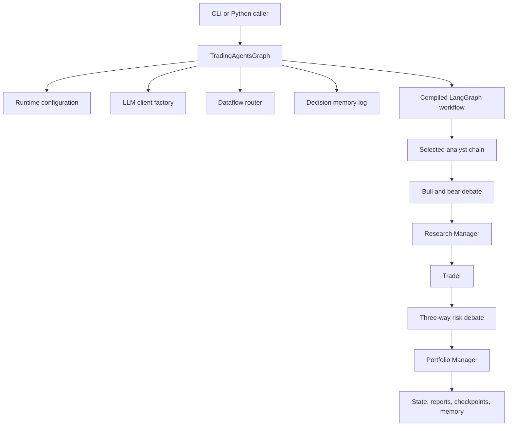

# Architecture overview

`TradingAgentsGraph` is the composition root. It merges runtime configuration, configures dataflow routing, creates quick and deep LLM clients, initializes decision memory, builds analyst tool nodes, constructs a LangGraph `StateGraph`, and exposes propagation and reporting APIs (`tradingagents/graph/trading_graph.py`).

The architecture executes the [analysis workflow](/openwiki/workflows/analysis-run.md), carries the concepts defined by the [trading decision domain](/openwiki/domain/trading-decisions.md), and depends on the adapters described in [data and LLM integrations](/openwiki/integrations/data-and-llm.md).

## Component topology

This diagram shows the main ownership boundaries established in `tradingagents/graph/trading_graph.py` and `tradingagents/graph/setup.py`.

## Graph construction

`GraphSetup.setup_graph()` validates the selected analyst keys and preserves caller order through `build_analyst_execution_plan()` (`tradingagents/graph/analyst_execution.py`). Every selected analyst receives three graph nodes:

- an agent node;
- a matching LangGraph `ToolNode`;
- a message-clear node that removes prior tool-loop messages before the next analyst.

The agent conditionally routes to tools when its latest message contains tool calls, otherwise to the clear node. Tools route back to the same analyst. The final analyst advances to the Bull Researcher, after which the fixed research, trader, risk, and portfolio stages run (`tradingagents/graph/setup.py`, `conditional_logic.py`).

The shared debate routers use complete path maps. This is intentional crash-safety: prompt, localization, or speaker-label drift must not produce a LangGraph target missing from one conditional edge. The v0.3.1 fix and `tests/test_risk_router_path_map.py` protect this contract.

## State model

`AgentState` extends LangGraph `MessagesState` and is the central interchange object (`tradingagents/agents/utils/agent_states.py`). Its major groups are:

| State group | Representative fields | Producer and consumer |
|---|---|---|
| Run identity | `company_of_interest`, `asset_type`, `instrument_context`, `trade_date` | Initialized once; consumed by all agents |
| Analyst evidence | `market_report`, `sentiment_report`, `news_report`, `fundamentals_report` | Analysts produce; researchers and trader consume |
| Research debate | `investment_debate_state`, `investment_plan` | Bull/Bear and Research Manager produce; Trader consumes |
| Trade proposal | `trader_investment_plan` | Trader produces; risk team consumes |
| Risk debate | `risk_debate_state`, `final_trade_decision` | Risk debaters and Portfolio Manager produce |
| Learning context | `past_context` | Decision memory prepares; Portfolio Manager consumes |

Nested debate states are `TypedDict`s rather than runtime-validated Pydantic models. Nodes replace these dictionaries by convention, so tests are important when adding fields or participants.

## Model allocation and structured boundary

The quick model handles analysts, researchers, the trader, risk debaters, reflection, and signal processing. The deep model handles the Research Manager and Portfolio Manager (`tradingagents/graph/setup.py`). Both clients come from the provider factory described in [Data and LLM integrations](/openwiki/integrations/data-and-llm.md).

The Research Manager, Trader, Portfolio Manager, and Sentiment Analyst prefer Pydantic schemas (`tradingagents/agents/schemas.py`). Their validated results are rendered immediately into stable Markdown because prompts, CLI output, report files, memory, and external consumers already use textual contracts. If structured binding or parsing is unavailable, `invoke_structured_or_freetext()` retries once as free text. Schema-only prompts explicitly forbid external tools so models do not call tools that were never registered (`tradingagents/agents/utils/structured.py`).

## Persistence boundaries

The graph has four different persistence products, each with a distinct purpose:

- **Full-state JSON:** diagnostic snapshot of the completed state.
- **Report tree:** human-readable projection shared by CLI and API.
- **Decision memory:** append-only pending and resolved decisions used for future lessons.
- **SQLite checkpoints:** opt-in node-level crash recovery, cleared after successful completion.

Operational paths and lifecycle commands are in the [runbook](/openwiki/operations/runbook.md); the sequence is in the [analysis workflow](/openwiki/workflows/analysis-run.md).

## Extension points

### Add an analyst

1. Add an `AnalystNodeSpec` and accepted key in `graph/analyst_execution.py`.
2. Add the analyst factory in `graph/setup.py`.
3. Add matching tools to both the agent's `bind_tools` call and `TradingAgentsGraph._create_tool_nodes()`.
4. Add the corresponding `should_continue_<key>` router.
5. Extend `AgentState`, propagation initialization, reporting, CLI choices, and tests if the analyst produces a new report field.

The two-sided tool registration is a common failure mode: a model can request only bound tools, while LangGraph can execute only tools present in the matching `ToolNode`.

### Add a debate participant

Update the nested state, node factory, rotation/count logic, every complete path map, initialization, reporting, and regression tests. Debate termination is count-based, so changing participants also changes the multiplier used for a “round.”

### Add a structured decision

Create a Pydantic schema and stable Markdown renderer in `agents/schemas.py`, then reuse the structured helpers. Preserve textual headings when downstream code parses them.

### Add a provider or data vendor

Use the registries described in [Data and LLM integrations](/openwiki/integrations/data-and-llm.md), then add targeted capability, routing, error, and configuration tests from the [testing guide](/openwiki/testing.md).

## Architectural cautions

- Runtime cost scales linearly because analysts are sequential and may loop over tools.
- `max_recur_limit` defaults to 100; deeper debates and repeated tool calls can exhaust it.
- Checkpoint signatures include graph shape, not provider/model/prompt/vendor settings. Resuming after such changes may mix semantics.
- Structured fallback preserves availability but weakens validation; downstream rating extraction can default to Hold when no valid rating is found.
- Sentiment source fetching occurs synchronously inside its agent node, not through graph tool nodes, so retries and checkpoint granularity differ from other analysts.
