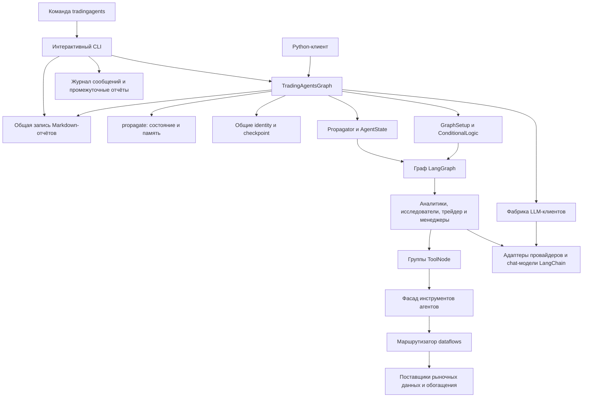
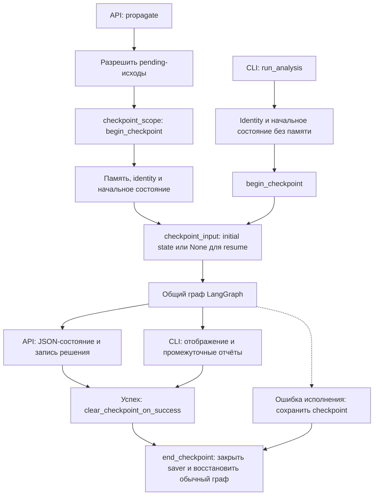

# Архитектура системы и границы ответственности

TradingAgents — Python-приложение и библиотека с центральным объектом оркестрации `TradingAgentsGraph`. Установленная команда `tradingagents` запускает `cli.main:app` с интерактивным интерфейсом Typer и Rich. Программный клиент создаёт `TradingAgentsGraph` и обычно вызывает `propagate()`, получая `(final_state, rating)`.

**Общий граф не означает одинаковый внешний жизненный цикл.** CLI самостоятельно создаёт начальное состояние и запускает `graph.graph.stream(...)`, не вызывая `propagate()`. При этом идентификация инструмента и checkpoint/resume уже вынесены в общие методы `TradingAgentsGraph` и используются обеими точками входа. Разрешение ожидающих исходов прошлых решений, внедрение памяти, JSON-журнал состояния, запись нового решения в память и извлечение сигнала остаются операциями API-пути.


*Слои сходятся на одном графе и агентах; общие checkpoint и identity не делают остальные побочные эффекты CLI и API одинаковыми.*

Основание: [сборка и жизненный цикл](repo://tradingagents/graph/trading_graph.py), [CLI](repo://cli/main.py#L1004-L1301), [структура графа](repo://tradingagents/graph/setup.py).

## Владельцы изменений

| Поверхность | Ответственность | Где проводить изменение |
|---|---|---|
| `tradingagents` → `cli.main:app` | Выбор параметров, потоковое отображение, статистика, запросы сохранения | CLI, если меняется взаимодействие с пользователем |
| `TradingAgentsGraph(...)` | Сборка моделей, инструментов, графа и вспомогательных объектов | Центральная точка Python-интеграции и сборки зависимостей |
| `propagate(ticker, date, asset_type=...)` | Полный программный запуск, память, журнал состояния, возвращаемый сигнал | Внешний API-жизненный цикл, не интерфейс терминала |
| `resolve_instrument_context()` и checkpoint-методы | Общая идентификация и восстановление исполнения для CLI/API | Общий слой жизненного цикла, а не только `propagate()` |
| `GraphSetup`, `ConditionalLogic`, фабрики агентов | Узлы, рёбра, пределы дебатов, обновления состояния | Менять здесь структуру анализа и маршрутизацию |
| `AgentState`, `Propagator` | Контракт состояния, его инициализация и аргументы исполнения | Согласованно менять производителей и потребителей полей |
| `create_llm_client()`, `BaseLLMClient` | Адаптация провайдера к chat-модели LangChain | SDK, аутентификация и особенности модели, не предметный маршрут графа |
| Фасад инструментов и `dataflows.interface` | Доступ агентов к данным и выбор поставщика | Инструментальный контракт отдельно от реализации поставщика |
| `write_report_tree()` и `save_reports()` | Общий формат дерева Markdown-отчётов | Менять общий writer, чтобы CLI и API не расходились |
| `dataflows.config.set_config()` / `get_config()` | Конфигурация инструментов на весь процесс | Не считать этот мост внедрением зависимостей на один запуск |

Фабрики `create_*` возвращают узлы LangGraph, а не самостоятельные сервисы анализа. При обычной интеграции следует пользоваться `TradingAgentsGraph`; ручная сборка означает принятие ответственности за оркестрацию. Детали маршрутов — в [исполнении агентов](./agent-runtime.md), примеры вызова — в [точках входа анализа](../workflows/analysis-entrypoints.md) и [быстром старте](../quickstart.md).

## Точки входа и жизненный цикл

### Интерактивный CLI

`analyze` передаёт управление `run_analysis()`. CLI собирает тикер, дату, тип актива, аналитиков, провайдера, модели, язык и глубину исследования; объединяет выбор с `DEFAULT_CONFIG`; создаёт `TradingAgentsGraph(debug=True, callbacks=[StatsCallbackHandler])`. Явные переменные окружения для числа раундов имеют приоритет над интерактивной глубиной. `--checkpoint/--no-checkpoint` переопределяет настройку только при явном указании, иначе сохраняется значение окружения или default.

CLI владеет живым интерфейсом, статусами агентов, временем исполнения, сообщениями и вызовами инструментов. Он создаёт `<results_dir>/<ticker>/<analysis_date>/`, дописывает `message_tool.log` и обновляет Markdown-разделы в `reports/` по мере поступления результатов. После потока он объединяет полученные состояния и предлагает сохранить либо показать полный отчёт. Финальное сохранение использует общий `write_report_tree()`, по умолчанию в `reports/<ticker>_<timestamp>` относительно текущего рабочего каталога.

До потока CLI вызывает `resolve_instrument_context()`, формирует начальное состояние и аргументы с callbacks, затем вызывает `begin_checkpoint()` и помещает возвращённый идентификатор в `config.configurable.thread_id`. В поток передаётся `checkpoint_input(init_agent_state)`. После нормального завершения потока вызывается `clear_checkpoint_on_success()`, а в `finally` — `end_checkpoint()`.

**CLI не вызывает** разрешение pending-исходов, `get_past_context()`, `_log_state()`, `store_decision()` или `process_signal()`. Наличие checkpoint у CLI не добавляет ему память API и не создаёт JSON-снимок API. См. [реализацию потока и очистки](repo://cli/main.py#L1113-L1259).

### Python API

```python
from tradingagents.default_config import DEFAULT_CONFIG
from tradingagents.graph.trading_graph import TradingAgentsGraph

config = DEFAULT_CONFIG.copy()
ta = TradingAgentsGraph(config=config)
final_state, rating = ta.propagate("NVDA", "2026-01-15")
```

Конструирование **немедленное, не ленивое**: `__init__()` публикует конфигурацию в dataflows, создаёт каталоги кеша и результатов, отдельные quick/deep LLM-клиенты, группы `ToolNode`, объекты памяти, маршрутизации, инициализации состояния, рефлексии и обработки сигнала. Затем строит `workflow` и компилирует `graph`. Ленивая загрузка модулей провайдеров в фабрике не отменяет этой ранней сборки выбранных зависимостей.

`propagate()` сначала разрешает ожидающие исходы прошлых решений для того же тикера. Затем в `checkpoint_scope()` вызывает `_run_graph()`: читает прошлый контекст, определяет инструмент, создаёт начальное состояние и запускает `invoke()` либо, при `debug=True`, `stream()`. После исполнения сохраняет `curr_state`, записывает JSON-снимок выбранных полей итогового состояния и решение в память, очищает checkpoint успешного запуска и возвращает состояние с разобранным сигналом.

`SignalProcessor` детерминированно разбирает рейтинг из текста `final_trade_decision` без дополнительного LLM-вызова. Результат — `Buy`, `Overweight`, `Hold`, `Underweight`, `Sell` **или `REVIEW`**, если рейтинг не распознан. Клиенту нельзя трактовать `REVIEW` как нейтральное торговое решение; перед преобразованием в `PortfolioRating` следует использовать `is_review()`.

`propagate()` не создаёт дерево человекочитаемых отчётов автоматически. Для него отдельно вызывают `save_reports(final_state, ticker, save_path=None)`, по умолчанию записывающий в `<results_dir>/reports/<safe-ticker>_<timestamp>/`.


*Сопоставление двух путей: ветви API/CLI показывают принадлежность операций, а `end_checkpoint()` выполняется при выходе из защищённого исполнения, включая ошибку; checkpoint очищается только на успешном пути.*

Основание: [API и общие методы](repo://tradingagents/graph/trading_graph.py#L404-L574), [CLI](repo://cli/main.py#L1113-L1301), [сигнал](repo://tradingagents/graph/signal_processing.py#L20-L38).

## Граф агентов и состояние

`GraphSetup.setup_graph()` создаёт `StateGraph(AgentState)`. Выбранная последовательность аналитиков проходит валидацию и превращается в план исполнения: требуется хотя бы один известный ключ. Каждый аналитик обновляет свой раздел отчёта и циклически обращается к собственной группе инструментов, пока последнее сообщение модели содержит tool calls. Затем узел очистки удаляет прежнюю беседу и вставляет сообщение, привязанное к инструменту и дате, перед переходом к следующему аналитику.

После выбранных аналитиков следует фиксированный маршрут:

1. дебаты `Bull Researcher` и `Bear Researcher`;
2. `Research Manager` — оценка дебатов и инвестиционный план;
3. `Trader` — торговое предложение;
4. обсуждение риска между `Aggressive Analyst`, `Conservative Analyst` и `Neutral Analyst`;
5. `Portfolio Manager` — `final_trade_decision`, затем `END`.

Quick-thinking LLM обслуживает аналитиков, исследователей, трейдера и участников обсуждения риска; deep-thinking LLM — `Research Manager` и `Portfolio Manager`. `ConditionalLogic` владеет переходами и ограничениями дебатов, агенты — текстами и обновлениями состояния. `AgentState` переносит сообщения, инструмент, дату, отчёты, вложенную историю дебатов, планы, прошлый контекст и итоговое решение. `Propagator` инициализирует поля и задаёт лимит рекурсии и callbacks исполнения.

Состав и порядок аналитиков фиксируются при построении объекта. Для другого состава или глубины дебатов следует создать граф с нужной конфигурацией: изменение словаря после компиляции не перестраивает узлы и маршрутизаторы. Подпись checkpoint учитывает порядок аналитиков, глубину обоих обсуждений и тип актива, чтобы не продолжать состояние структурно другого запуска. Контракты узлов и path maps подробно описаны в [исполнении агентов](./agent-runtime.md).

Идентификация инструмента — общий механизм, а не LLM-догадка: обе точки входа один раз на старте вызывают `resolve_instrument_context()` и передают строку в `instrument_context` начального состояния. Поиск через yfinance кешируется и при ошибке возвращает пустые метаданные: анализ продолжает работу с контекстом на основе тикера. Узлы очистки сообщений используют сохранённый контекст, не выполняя повторный сетевой поиск. При resume входом служит `None`, поэтому продолжается сохранённое состояние, а не внедряется заново построенное.

## Граница моделей

`TradingAgentsGraph` запрашивает у `create_llm_client()` два адаптера одного провайдера с разными идентификаторами моделей. Фабрика лениво импортирует реализации: импорт самой фабрики не загружает все SDK и не требует ключей всех провайдеров.

Для `anthropic`, `google`, `azure`, `bedrock` существуют отдельные ветви. Зарегистрированные OpenAI-совместимые провайдеры обслуживаются `OpenAIClient`; неизвестное имя вызывает `ValueError`. Адаптер возвращает chat-модель LangChain для фабрик агентов. Общие параметры подключения, callbacks, reasoning-настройки, temperature и бюджет повторов собираются в `TradingAgentsGraph`, а особенности SDK принадлежат адаптерам.

Добавлять провайдера следует на границе `BaseLLMClient`, маршрутизации фабрики и совместимой модели с поддержкой используемых агентами tools и structured output, не меняя предметный маршрут анализа. Подробности — в [интеграции LLM-провайдеров](../integrations/llm-providers.md).

## Граница инструментов и данных

Агенты получают инструменты через фасад `tradingagents.agents.utils.agent_utils`, а не через прямые обращения к модулям поставщиков. `_create_tool_nodes()` ограничивает исполняемые инструменты по роли:

| Ключ аналитика | Группа инструментов |
|---|---|
| `market` | Цены, технические индикаторы, проверенный рыночный снимок |
| `social` | Новости тикера для анализа настроений |
| `news` | Новости тикера и мира, инсайдерские сделки, макроиндикаторы, рынки прогнозов |
| `fundamentals` | Фундаментальные данные, баланс, денежные потоки, отчёт о прибылях |

Выбор поставщиков принадлежит `dataflows.interface.route_to_vendor()`. Настройка конкретного инструмента приоритетнее настройки категории. Явный список через запятую — полная разрешённая упорядоченная цепочка резервных поставщиков, а не подсказка для скрытого перехода к любому другому. `default` использует все реализации, зарегистрированные для метода.

При исчерпании цепочки типизированное отсутствие данных преобразуется в `NO_DATA_AVAILABLE` с инструкцией не выдумывать значения. Обычные ошибки необязательного макрообогащения и рынков прогнозов могут завершиться `DATA_UNAVAILABLE`, тогда как обычные ошибки основных категорий пробрасываются. Не следует превращать сбой основного источника в правдоподобный пустой отчёт. Точные контракты и исключения — в [рыночных данных](../integrations/market-data.md).

## Конфигурация и состояние процесса

Конфигурация проходит три уровня:

1. При импорте пакета поиск `.env` и `.env.enterprise` начинается от текущего рабочего каталога; уже экспортированные переменные не заменяются.
2. При импорте `default_config` распознанные `TRADINGAGENTS_*` накладываются на `DEFAULT_CONFIG`. Приведение опирается на тип исходного значения; неверные boolean/int завершаются `ValueError`, а не молчаливым default.
3. CLI или Python-клиент передаёт конфигурацию конструктору графа.

**Dataflow-конфигурация глобальна для процесса.** Каждый конструктор вызывает `set_config(self.config)`, обновляя модульный `_config`. Вложенные словари объединяются на один уровень; входные значения копируются, а `get_config()` возвращает глубокую копию. Это предотвращает случайное изменение по общей ссылке, но не обеспечивает изоляцию экземпляров. Создание второго графа с другими поставщиками или языком меняет настройки, которые впоследствии читают инструменты и языковые helpers в том же процессе. Разнородные параллельные запуски требуют внешней изоляции либо явной передачи конфигурации вместо глобального моста.

Перед изменением шаблона используйте `DEFAULT_CONFIG.copy()`, а для независимого изменения вложенных структур — глубокую копию. Без переданной конфигурации граф использует общий default-объект; переменные окружения к этому моменту уже вычислены при импорте. Основание: [загрузка окружения](repo://tradingagents/__init__.py#L4-L17), [default-конфигурация](repo://tradingagents/default_config.py#L10-L76), [глобальный мост](repo://tradingagents/dataflows/config.py).

## Локальное хранение и восстановление

| Артефакт | Владелец и жизненный цикл | Расположение по умолчанию |
|---|---|---|
| Каталоги кеша | Создаются конструктором графа | `~/.tradingagents/cache` |
| JSON итогового состояния API | `_log_state()` после исполнения графа в `propagate()` | `<results_dir>/<safe-ticker>/TradingAgentsStrategy_logs/full_states_log_<date>.json` |
| Решения и рефлексии | `TradingMemoryLog`, обновляемый API-путём | `~/.tradingagents/memory/trading_memory.md` |
| Checkpoint для resume | Общие методы `TradingAgentsGraph` и `SqliteSaver` для CLI/API, если включены | `<data_cache_dir>/checkpoints/<SAFE-TICKER>.db` |
| Сообщения и вызовы инструментов CLI | Дописываются при отображении потока | `<results_dir>/<ticker>/<date>/message_tool.log` |
| Дерево Markdown | Общий `write_report_tree()`, вызываемый CLI или `save_reports()` | Выбранный путь либо API-default под `<results_dir>/reports/` |

Базы checkpoint разделены по тикерам; `thread_id` хеширует тикер, дату и подпись структуры запуска. `begin_checkpoint()` перекомпилирует сохранённый `workflow` с SQLite saver. `checkpoint_input()` возвращает начальное состояние для нового запуска и `None` для продолжения: повторная передача начальных сообщений при resume дублировала бы их через reducer. Ошибка во время исполнения оставляет строки для восстановления. Успешный путь удаляет строки только соответствующего thread. `end_checkpoint()` закрывает saver, восстанавливает обычный скомпилированный граф и сбрасывает признак resume; он нужен и при исключении. Компоненты путей из тикера валидируются перед созданием имён checkpoint, JSON-журналов и стандартного пути API-отчётов.

Память имеет другой жизненный цикл. Успешный API-путь записывает pending-решение, если настроен `memory_log_path`; повторная запись уже ожидающего решения того же тикера и даты пропускается. Следующий API-запуск для того же тикера пытается получить доходность актива и бенчмарка, создать рефлексию и атомарно обновить пакет записей через временный файл. Если данные исхода ещё недоступны, запись остаётся pending. В начальное состояние поступают последние разрешённые решения того же тикера и рефлексии других тикеров, а не ожидающие исходы.

Для исторического запуска внедрение памяти ограничено датой анализа: допускаются только записи с известной датой разрешения не позднее `trade_date`. Для текущей даты фильтр отключён. Это ответственность API-пути чтения памяти, а не checkpoint или CLI. При resume используется уже сохранённое состояние. Детали форматов и восстановления — в [хранении и восстановлении](../operations/persistence-and-recovery.md).

## Инварианты безопасного изменения и тесты

- **Структура графа:** нужен непустой набор известных аналитиков, порядок значим. Проверки — `tests/test_analyst_execution.py`.
- **Исполнимость tools:** инструмент, привязанный к модели аналитика, должен быть зарегистрирован в его `ToolNode`. Регрессия проверочного рыночного снимка — `tests/test_market_toolnode.py`.
- **Полнота маршрутизации:** path maps дебатов обязаны покрывать все ответы общего router, включая запасные переходы. Проверки — `tests/test_risk_router_path_map.py`.
- **Общее восстановление:** изменения checkpoint следует проверять не только через `propagate()`. `tests/test_checkpoint_lifecycle.py` моделирует CLI-последовательность begin → stream → clear/end, падение и продолжение, вход `None`, очистку после успеха и отключённый checkpoint. `tests/test_checkpoint_resume.py` проверяет API-resume и изоляцию по дате и подписи.
- **Конфигурация:** копирование не равно изоляции процессов. `tests/test_dataflows_config.py` проверяет копии и вложенное слияние; `tests/test_cli_config_precedence.py` и `tests/test_env_overrides.py` — приоритеты и приведение типов.
- **Источники данных:** нельзя скрыто переходить к невыбранному поставщику. `tests/test_vendor_routing.py` проверяет цепочки и семантику ошибок.
- **Отчёты:** успешный `propagate()` не обещает `complete_report.md`; сохранение явно запрашивает вызывающий код. `tests/test_reporting.py` проверяет общий формат CLI/API.
- **Сигнал:** отсутствие распознанного рейтинга не должно становиться торговым `Hold`. `tests/test_signal_processing.py` проверяет отсутствие дополнительного LLM-вызова и контракт `REVIEW`.

Новые общие побочные эффекты следует размещать в явно разделяемом механизме и подключать к обеим точкам входа. Добавление их только в `propagate()` не изменит прямое потоковое исполнение CLI.
