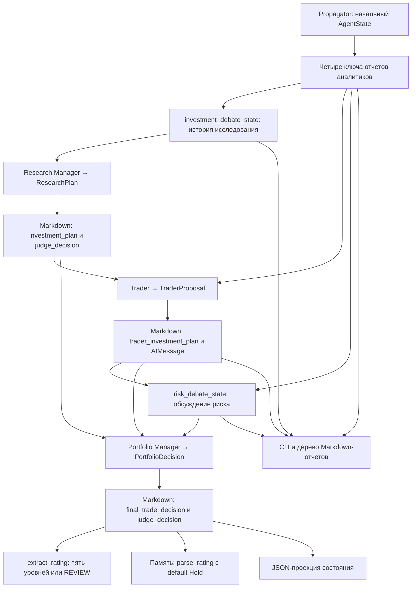

# Контракты состояния и результатов

TradingAgents передает данные между узлами через LangGraph `AgentState`, но основным форматом аналитических артефактов остается **Markdown**. Pydantic-схемы ограничивают структурированный ответ модели; функции рендеринга превращают его обратно в строки до записи в состояние. Эти строки становятся контекстом следующих агентов, содержимым CLI и файлов отчетов, телом записи памяти и входом извлечения итогового сигнала.

Поэтому совместимость имеет два уровня: **ключи и правила обновления состояния** и **словарь и маркеры текстового протокола**. Изменение производителя может затронуть потребителя далеко за пределами соседнего узла. Связанные темы: [выполнение агентов](../architecture/agent-runtime.md), [провайдеры LLM](../integrations/llm-providers.md), [сохранение и восстановление](../operations/persistence-and-recovery.md), [точки входа анализа](../workflows/analysis-entrypoints.md).

## Сквозная передача данных



*Путь от начального состояния через структурированные решения к Markdown-потребителям; при резервном текстовом вызове типизированный объект и рендеринг обходятся.*

Основание схемы: [построение графа](repo://tradingagents/graph/setup.py#L94-L154), [менеджер исследования](repo://tradingagents/agents/managers/research_manager.py), [Trader](repo://tradingagents/agents/trader/trader.py), [Portfolio Manager](repo://tradingagents/agents/managers/portfolio_manager.py), [отчеты](repo://tradingagents/reporting.py), [завершение выполнения](repo://tradingagents/graph/trading_graph.py#L509-L620). Стрелка отчетов к Trader означает именно `market_report`, а не прямое включение всех четырех отчетов в его запрос.

## Состояние, инициализация и редьюсеры

`AgentState` наследует `MessagesState`; остальные поля объявлены через `Annotated` с текстовыми описаниями. Эти описания **не являются функциями редукции**. Строковые артефакты и вложенные словари заменяются обновлением соответствующего верхнеуровневого ключа; автоматической конкатенации историй или глубокого слияния словарей здесь не задано.

| Группа | Точные ключи | Ответственность |
|---|---|---|
| Идентичность и контекст | `company_of_interest`, `asset_type`, `instrument_context`, `trade_date`, `past_context` | Инициализация запуска; `instrument_context` содержит заранее разрешенную идентичность инструмента, `past_context` — контекст памяти для Portfolio Manager. |
| Сообщения | `messages`, `sender` | История для циклов вызова инструментов и сообщения агентов; Trader записывает `sender="Trader"`. |
| Отчеты аналитиков | `market_report`, `sentiment_report`, `news_report`, `fundamentals_report` | Markdown выбранных аналитиков. До их выполнения все четыре строки пусты. |
| Решения | `investment_debate_state`, `investment_plan`, `trader_investment_plan`, `risk_debate_state`, `final_trade_decision` | Обсуждения и последовательные передачи плана исследования, предложения сделки и окончательного решения. |

`Propagator.create_initial_state()` создает `messages=[("human", company_name)]`, записывает идентичность и контекст, приводит `trade_date` к строке, заполняет оба обсуждения пустыми строками и `count=0`. `investment_plan`, `trader_investment_plan`, `final_trade_decision` и `sender` появляются позднее в производящих узлах. `_run_graph()` получает контекст памяти и разрешает идентичность перед созданием этого состояния. Отсутствие выбранного аналитика означает пустой отчет, а не отсутствие ключа. [Инициализация](repo://tradingagents/graph/propagation.py#L18-L69), [вызов](repo://tradingagents/graph/trading_graph.py#L509-L535).

У `messages` другой контракт: действует редьюсер сообщений LangGraph, унаследованный от `MessagesState`, а не простая замена списка. В частности, очистка между аналитиками возвращает `RemoveMessage(id=m.id)` для прежних сообщений и новый `HumanMessage`, привязанный к инструменту и дате. Это не очистка отчетов. При восстановлении checkpoint `checkpoint_input()` передает `None`, а не начальное состояние: повторная подача начального сообщения добавила бы его через редьюсер. [Состояние](repo://tradingagents/agents/utils/agent_states.py), [очистка](repo://tradingagents/agents/utils/agent_utils.py#L205-L228), [восстановление](repo://tradingagents/graph/trading_graph.py#L460-L468).

### Слияние потока — не редьюсер LangGraph

Программный путь без `debug` получает состояние из `graph.invoke()`. В `debug` собирается `trace`, после чего выполняется последовательный `final_state.update(chunk)`; CLI также собирает итог через `dict.update`. Это **поверхностное слияние верхнеуровневых ключей с приоритетом последнего значения**, без сложения списков сообщений и без глубокого объединения обсуждений.

Важно не принимать комментарии о «per-node deltas» за описание режима LangGraph: `Propagator.get_graph_args()` явно задает `stream_mode="values"`. Слияние полученных снимков/словарей на стороне потребителя не воспроизводит редьюсер сообщений и не заменяет правила обновления внутри графа. При изменении режима потока надо отдельно проверить форму элементов и сборку `final_state`. [Аргументы потока](repo://tradingagents/graph/propagation.py#L71-L84), [программный путь](repo://tradingagents/graph/trading_graph.py#L534-L556), [CLI](repo://cli/main.py#L1255-L1259).

## Вложенные обсуждения и порядок выполнения

Граф выполняет выбранных аналитиков последовательно, затем чередует Bull/Bear, вызывает Research Manager, Trader, обсуждение Aggressive/Conservative/Neutral и завершает работу Portfolio Manager. Прямое индексирование предыдущих результатов делает этот порядок частью контракта, а не только способом отображения прогресса.

### `InvestDebateState`

| Поле | Значение и потребитель |
|---|---|
| `history` | Общая история исследования для исследователей и Research Manager. |
| `bull_history`, `bear_history` | Истории отдельных сторон, используемые в отчетах. |
| `current_response` | Последний аргумент; префикс `Bull` переключает маршрутизацию на Bear. |
| `count` | Число ответов исследователей; при `count >= 2 * max_debate_rounds` управление переходит Research Manager. |
| `judge_decision` | Markdown-план Research Manager для отчетов. |

Исследователи вручную добавляют аргументы с префиксами `Bull Analyst:` и `Bear Analyst:` к общей и своей истории, сохраняют историю другой стороны и увеличивают `count` на один. Они возвращают новый словарь обсуждения, а не частичный патч его вложенных полей: например, первоначальный пустой `judge_decision` не обязан сохраняться до менеджера. Research Manager сохраняет истории и счетчик, записывает план в `judge_decision` и `current_response`, а ту же строку — в верхнеуровневый `investment_plan`.

### `RiskDebateState`

| Поле | Значение и потребитель |
|---|---|
| `history` | Общая история обсуждения риска для аналитиков и Portfolio Manager. |
| `aggressive_history`, `conservative_history`, `neutral_history` | Истории отдельных ролей для запросов, CLI и файлов. |
| `latest_speaker` | Маршрутизация Aggressive → Conservative → Neutral. |
| `current_aggressive_response`, `current_conservative_response`, `current_neutral_response` | Последние аргументы ролей для возражений. |
| `count` | При `count >= 3 * max_risk_discuss_rounds` управление переходит Portfolio Manager. |
| `judge_decision` | Окончательный Markdown Portfolio Manager для отчетов. |

Каждый риск-аналитик вручную дополняет общую и свою историю, обновляет свой текущий ответ и `latest_speaker`, переносит поля других ролей и увеличивает счетчик. Portfolio Manager сохраняет обсуждение, устанавливает `latest_speaker="Judge"` и дублирует решение в `risk_debate_state["judge_decision"]` и `final_trade_decision`.

Основание: [маршрутизация](repo://tradingagents/graph/conditional_logic.py#L52-L73), [пример исследователя](repo://tradingagents/agents/researchers/bull_researcher.py#L50-L62), [пример риск-аналитика](repo://tradingagents/agents/risk_mgmt/aggressive_debator.py#L44-L62), [Research Manager](repo://tradingagents/agents/managers/research_manager.py#L48-L68), [Portfolio Manager](repo://tradingagents/agents/managers/portfolio_manager.py#L69-L93).

## Типизированные решения и текстовый протокол

`ResearchPlan.recommendation` и `PortfolioDecision.rating` используют `PortfolioRating`: `Buy`, `Overweight`, `Hold`, `Underweight`, `Sell`, от наиболее позитивной до наиболее негативной позиции. Trader отвечает за направление сделки и ограничен `TraderAction`: `Buy`, `Hold`, `Sell`. `Overweight` и `Underweight` нельзя подставлять в `TraderProposal.action`: нюансы экспозиции остаются на уровне портфельного решения.

Trader читает `investment_plan` и добавляет непустой `market_report` с инструкцией обосновывать вход, стоп и размер позиции технической структурой цены. При пустом отчете раздел `Technical Market Report:` и эта инструкция отсутствуют. Результат одновременно записывается в `trader_investment_plan` и `AIMessage`. Portfolio Manager читает оба плана, историю риска и, если он есть, `past_context`. [Trader](repo://tradingagents/agents/trader/trader.py#L24-L81), [контекст Portfolio Manager](repo://tradingagents/agents/managers/portfolio_manager.py#L28-L67).

| Производитель / схема | Обязательные поля | Точные маркеры Markdown |
|---|---|---|
| Research Manager / `ResearchPlan` | `recommendation`, `rationale`, `strategic_actions` | `**Recommendation**:`, `**Rationale**:`, `**Strategic Actions**:` |
| Trader / `TraderProposal` | `action`, `reasoning` | `**Action**:`, `**Reasoning**:` и завершающая строка `FINAL TRANSACTION PROPOSAL: **BUY/HOLD/SELL**` с одним конкретным действием |
| Portfolio Manager / `PortfolioDecision` | `rating`, `executive_summary`, `investment_thesis` | `**Rating**:`, `**Executive Summary**:`, `**Investment Thesis**:` |
| Sentiment Analyst / `SentimentReport` | `overall_band`, `overall_score`, `confidence`, `narrative` | `**Overall Sentiment:** **Band** (Score: n.n/10)`, затем `**Confidence:** Level` и неизмененный `narrative` |

Опциональные поля Trader: `entry_price`, `stop_loss`, `position_sizing`; Portfolio Manager: `price_target`, `time_horizon`. Их заголовки: `**Entry Price**:`, `**Stop Loss**:`, `**Position Sizing**:`, `**Price Target**:`, `**Time Horizon**:`. Числовые поля выводятся при значении, отличном от `None`, строковые — если непустые. Валидаторы опциональных чисел превращают пустую строку и регистронезависимые `none`, `n/a`, `na`, `null`, `nil`, `-`, `tbd`, `unknown` в `None`; настоящие числовые строки по-прежнему разбирает Pydantic.

Для sentiment допустимы `Bullish`, `Mildly Bullish`, `Neutral`, `Mixed`, `Mildly Bearish`, `Bearish`; `overall_score` ограничен диапазоном 0–10 включительно, `confidence` — `low`, `medium`, `high`. Рендеринг показывает оценку с одним десятичным знаком, а уверенность — с заглавной первой буквой. [Схемы и рендеринг](repo://tradingagents/agents/schemas.py).

Завершающий маркер Trader сохраняется ради совместимости с формулировками stop-signal и внешними grep-потребителями, даже если действие уже указано выше. Например:

```text
FINAL TRANSACTION PROPOSAL: **HOLD**
```

Машинные значения и заголовки нельзя переводить вместе с окружающим объяснением: Markdown здесь является API совместимости, а не только оформлением.

## Отказ привязки и резервный текстовый вызов

`bind_structured()` один раз при создании агента вызывает `llm.with_structured_output(schema)`. Дальнейшее поведение зависит от места отказа:

| Ситуация | Поведение |
|---|---|
| Привязка выбросила `NotImplementedError` или `AttributeError` | Предупреждение, результат привязки `None`; агент использует обычный `llm.invoke()` при каждом вызове. |
| Иное исключение при привязке | Не перехватывается этим помощником; создание агента может завершиться ошибкой. |
| Привязка успешна, вызов и рендеринг успешны | Markdown от функции рендеринга записывается в состояние. |
| Структурированный вызов, парсинг/валидация внутри него или рендеринг выбросили `Exception` | Предупреждение и одна попытка обычного вызова с тем же запросом. |
| Структурированный результат равен `None` | Явная ошибка `structured output returned no parsed result` внутри защищенного блока и тот же резервный путь. |
| Обычный вызов или получение `response.content` завершается ошибкой | Ошибка выходит наружу: этот путь не защищен повторным `try/except`. |

Помощник не выполняет отдельной повторной Pydantic-валидации: он рассчитывает на результат структурированной обертки и затем вызывает рендерер. Резервный путь возвращает `response.content` без рендеринга, нормализации или восстановления заголовков. Нет цикла исправления ответа; «graceful fallback» **не гарантирует успешного завершения**. Совместимость свободного текста зависит от модели и запроса. [Реализация](repo://tradingagents/agents/utils/structured.py#L42-L89).

На пути schema-only единственным ожидаемым инструментом является схема. Research Manager, Trader, Portfolio Manager и Sentiment Analyst включают `NO_EXTERNAL_TOOLS` в фактический запрос: использовать только предоставленные данные, не вызывать внешние инструменты и не искать в интернете. Неизвестный вызов вроде поиска иначе может потратить структурированную попытку и привести к свободному тексту. Это ограничение данного пути, а не утверждение, что все аналитики работают без инструментов. [Ограничение](repo://tradingagents/agents/utils/structured.py#L31-L39), [проверки запросов](repo://tests/test_structured_agent_prompts.py).

## Извлечение рейтинга: пять уровней, `REVIEW` и память

Извлечение детерминировано и не вызывает LLM. `SignalProcessor` сохраняет совместимый конструктор с необязательным `quick_thinking_llm` и метод `process_signal(text)`, но модель не сохраняет и не использует.

`extract_rating(text)`:

1. Возвращает `None` для пустого текста.
2. Нормализует Unicode через **NFKC**: например, `Rating：Overweight` с полноширинным двоеточием становится распознаваемым.
3. Ищет по строкам явную метку `Rating: X` или `Rating - X`, допуская Markdown bold и различия регистра. Первая распознанная метка имеет приоритет над словами в более ранней прозе.
4. Если подходящей метки нет, ищет первое отдельное слово из пятиуровневой шкалы через границы слов. `buyer` и `holding` не считаются `Buy` и `Hold`.
5. При отсутствии совпадения возвращает `None`, а не нейтральную позицию.

Далее существуют **два разных контракта**:

| Потребитель | Отсутствие распознанного рейтинга |
|---|---|
| `SignalProcessor.process_signal()` и `TradingAgentsGraph.process_signal()` | Возвращают `RATING_REVIEW`, то есть строку `REVIEW`. |
| `parse_rating(text, default="Hold")`, используемый памятью | Возвращает переданный `default`, по умолчанию `Hold`, ради обратной совместимости. |

`REVIEW` — не шестой уровень `PortfolioRating` и не торговая рекомендация: это признак необходимости проверки человеком или повторного запуска. Перед `PortfolioRating(signal)` нужно проверить `is_review(signal)`; эта функция проверяет точное равенство `REVIEW`. Вызов `propagate()` возвращает `(final_state, signal)`, где `signal` — один из пяти рейтингов **или `REVIEW`**. [Контракт API](repo://tradingagents/graph/trading_graph.py#L409-L434), [делегирование парсеру](repo://tradingagents/graph/trading_graph.py#L623-L625).

Следствие: один неразбираемый окончательный текст может дать `REVIEW` в API и тег `Hold` в памяти. Нельзя считать тег памяти доказательством явного решения модели. Сохранять `**Rating**: <значение шкалы>` особенно важно на резервном текстовом пути: эвристика без метки способна выбрать случайное слово из обоснования. [Парсер](repo://tradingagents/agents/utils/rating.py), [адаптер](repo://tradingagents/graph/signal_processing.py), [память](repo://tradingagents/agents/utils/memory.py#L30-L49).

## Отчеты и сохранение

`write_report_tree(final_state, ticker, save_path)` используется CLI и программным `TradingAgentsGraph.save_reports()`. Непустые артефакты сохраняются в следующую структуру; отсутствующие разделы не создают пустых файлов:

```text
1_analysts/
  market.md
  sentiment.md
  news.md
  fundamentals.md
2_research/
  bull.md
  bear.md
  manager.md
3_trading/
  trader.md
4_risk/
  aggressive.md
  conservative.md
  neutral.md
5_portfolio/
  decision.md
complete_report.md
```

Решение исследования читается из `investment_debate_state["judge_decision"]`, решение портфеля — из `risk_debate_state["judge_decision"]`, **не из их верхнеуровневых копий**. CLI использует то же соответствие и Rich `Markdown`. `complete_report.md` получает заголовок с тикером и временем формирования и доступные разделы `I`–`V`; сам сводный файл записывается даже при отсутствии содержательных разделов. `save_reports()` без явного пути выбирает `results_dir/reports/<safe ticker>_<timestamp>/` и возвращает путь сводного отчета. [Writer](repo://tradingagents/reporting.py), [API](repo://tradingagents/graph/trading_graph.py#L494-L507), [CLI](repo://cli/main.py#L763-L826).

В программном `_run_graph()` после выполнения устанавливается `curr_state`, вызывается `_log_state()`, затем `memory_log.store_decision()`, очищается успешный checkpoint и возвращается сигнал из `final_trade_decision`. Сохранение Markdown-дерева — отдельный вызов `save_reports()`, а не автоматическое следствие `propagate()`.

`_log_state()` записывает **проекцию**, а не сериализацию всего `AgentState`, в `results_dir/<safe ticker>/TradingAgentsStrategy_logs/full_states_log_<trade_date>.json`. В нее входят отчеты, выбранные поля обсуждений, `investment_plan` и `final_trade_decision`; сообщения и все служебные поля туда не копируются. Историческое имя Trader в JSON — `trader_investment_decision`, хотя живой ключ — `trader_investment_plan`. [Завершение и JSON](repo://tradingagents/graph/trading_graph.py#L563-L625).

Если настроен `memory_log_path`, память сохраняет полный окончательный Markdown под `DECISION:` и тег рейтинга через `parse_rating()`. Без пути запись — пустая операция. Pending-записи идемпотентны по тикеру и дате; разделитель `<!-- ENTRY_END -->` не путается с обычной Markdown-линейкой `---`. При последующем разрешении исхода добавляются метаданные и `REFLECTION:`. Подробности жизненного цикла — в [сохранении и восстановлении](../operations/persistence-and-recovery.md).

## Инварианты и безопасное расширение

При добавлении поля или изменении формата:

1. Согласовать Pydantic-схему, описания полей и рендерер; сохранить старые заголовки, если потребители не мигрируют одновременно.
2. Обновить производящий ключ и все необходимые вложенные копии `judge_decision`. Не рассчитывать на глубокий merge обсуждения.
3. Проверить запрос на свободнотекстовом пути: схема и рендерер там обходятся, а ошибки обычного вызова могут прервать запуск.
4. Не смешивать три действия Trader, пять рейтингов Portfolio Manager и служебный `REVIEW`; отдельно учитывать default памяти.
5. Проверить downstream-запросы, CLI, writer, JSON-проекцию, память и внешние ожидания маркеров.
6. При изменении маршрутизации сохранить префиксы ответов, `latest_speaker` и счетчики; при изменении потока — отдельно проверить сборку состояния и message reducer.

### Прицельные проверки

- `tests/test_structured_agents.py`: заголовки и опциональные поля, nullish-числа, все пять рекомендаций Research Manager, маркер Trader, передача `market_report` и его отсутствие, дублирование сообщения, sentiment, неподдерживаемая привязка, ошибка вызова и результат `None`.
- `tests/test_structured_agent_prompts.py`: `NO_EXTERNAL_TOOLS` действительно присутствует в отправляемом запросе, а не только импортирован.
- `tests/test_signal_processing.py`: явные метки, приоритет над прозой, Unicode NFKC, границы слов, отсутствие LLM-вызовов, `REVIEW` на уровне адаптера и графа, отдельный совместимый default `parse_rating()`.
- `tests/test_memory_log.py`: тег рейтинга, сохранение решения, разделение Markdown-записей, идемпотентность и передача контекста Portfolio Manager.
- `tests/test_reporting.py`: дерево файлов, содержание сводного отчета и одинаковый writer для API/CLI.

Это проверки совместимости передач и сохраняемых артефактов, а не только оформления. При расширении резервного пути стоит отдельно покрыть ошибку рендеринга, необрабатываемое исключение привязки и ошибку обычной повторной попытки. Общий подход — в [проверке изменений](../testing/change-validation.md).
lidation.md).
