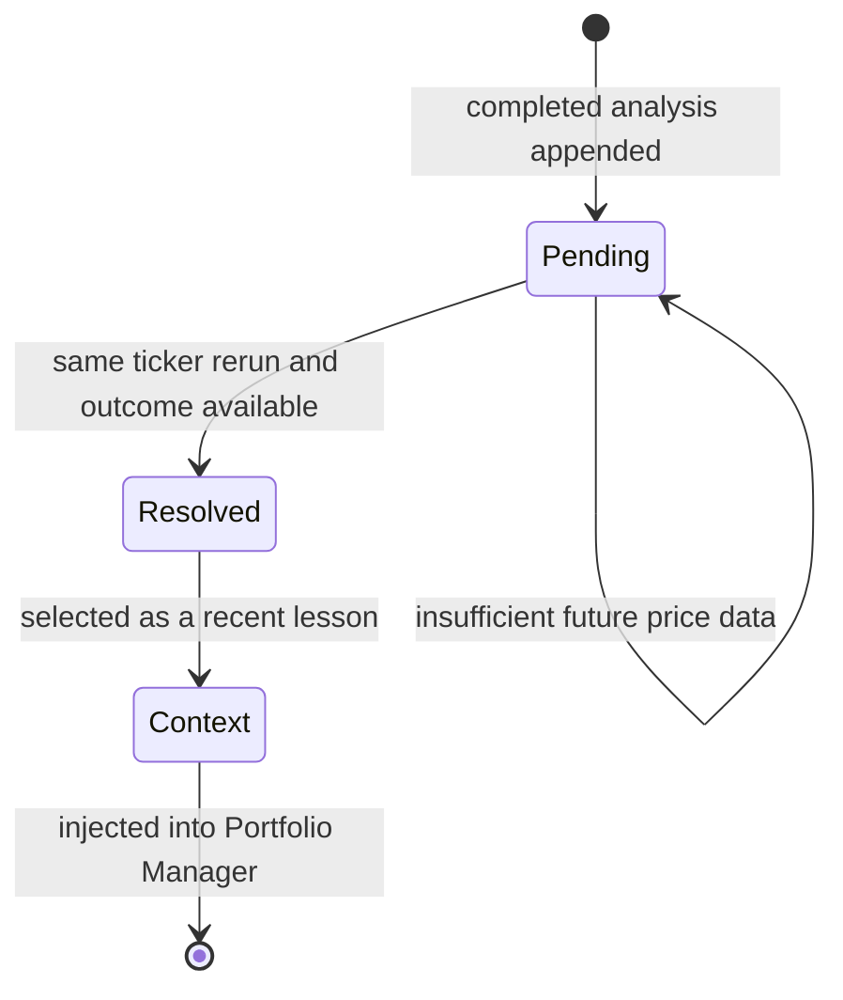

# Trading decision domain

TradingAgents models a simplified research desk rather than an order-execution system. Agents collect evidence, challenge directional conclusions, propose a transaction, and issue a portfolio rating. The [architecture](/openwiki/architecture/overview.md) encodes these roles, while the [analysis workflow](/openwiki/workflows/analysis-run.md) defines their execution order.

## Roles and responsibilities

| Role | Primary responsibility | Output |
|---|---|---|
| Market Analyst | Technical and price analysis grounded by verified market data | `market_report` |
| Sentiment Analyst | Aggregate Yahoo news, StockTwits, and Reddit mood | Structured `sentiment_report` |
| News Analyst | Ticker news, global macro context, insiders, FRED, and Polymarket | `news_report` |
| Fundamentals Analyst | Company overview and financial statements | `fundamentals_report` |
| Bull / Bear Researchers | Argue opposing interpretations of analyst evidence | Debate histories |
| Research Manager | Judge the research debate and set directional strategy | Five-tier `investment_plan` |
| Trader | Convert strategy into an executable direction and levels | Three-tier proposal |
| Risk Debaters | Stress the proposal under aggressive, conservative, and neutral views | Risk histories |
| Portfolio Manager | Integrate evidence, risk, and prior lessons | Final five-tier decision |

The analyst key `social` is retained in saved configuration for compatibility, but its domain name and report field are sentiment-oriented (`graph/analyst_execution.py`).

## Rating contracts

The Research Manager and Portfolio Manager share the canonical five-tier scale:

`Buy → Overweight → Hold → Underweight → Sell`

The Trader uses only `Buy / Hold / Sell`. It chooses transaction direction; the managers own nuanced exposure and sizing (`agents/schemas.py`). Prompts tell managers to reserve Hold for genuinely balanced evidence rather than uncertainty avoidance.

Structured decisions are rendered into stable Markdown. In particular, the Trader retains `FINAL TRANSACTION PROPOSAL: **BUY/HOLD/SELL**`, and the Portfolio Manager retains `**Rating**`, `**Executive Summary**`, and `**Investment Thesis**` headings because reports, memory, parsers, and external users rely on them.

## Grounding and temporal rules

The domain assumes a stated analysis date is the agent's “current date.” Exact numerical conclusions must come from the [data-access contract](/openwiki/integrations/data-and-llm.md), not model memory.

- Instrument identity is resolved once from the ticker and propagated to every role. This prevents a model from silently analyzing the wrong company.
- Crypto context suppresses inappropriate company-fundamentals assumptions.
- The Market Analyst must treat the verified snapshot as the conflict-resolution source for exact OHLCV and indicator values.
- No-data sentinels explicitly require the agent to state that evidence is unavailable rather than estimate it.
- Historical news and social inputs remain live; therefore a pinned trade date does not create a fully reproducible evidence set.

## Debate semantics

Research debate is an adversarial directional check. A configured round contains one bull and one bear response; the Research Manager sees the complete history. Risk debate is a portfolio-construction check. A configured round contains aggressive, conservative, and neutral responses; the Portfolio Manager sees the complete history.

These debates are bounded by response counts, not semantic consensus. Increasing round counts increases cost and latency, and can approach the graph recursion limit. Complete path maps keep routing crash-safe if speaker labels drift, but fallback routing does not guarantee that malformed labels preserve the intended semantic order.

## Decision memory lifecycle

Decision memory is distinct from LangGraph checkpoints. Checkpoints recover an interrupted run; memory evaluates completed decisions and supplies lessons to future runs. Operational locations are documented in the [runbook](/openwiki/operations/runbook.md).

The memory lifecycle is activity-driven: a pending entry is evaluated only when the same ticker is analyzed again.

A successful run appends its full final decision as pending. On a later same-ticker run, the system fetches up to five available trading days, calculates raw return and benchmark alpha, generates a short LLM reflection, and marks the entry resolved (`agents/utils/memory.py`, `graph/reflection.py`, `graph/trading_graph.py`).

Context selection favors:

- up to five recent resolved entries for the same ticker, including full decisions and reflections;
- up to three cross-ticker entries, lesson/reflection only;
- no pending entries.

Only the Portfolio Manager currently consumes `past_context`. This limits feedback injection to the final decision layer rather than shaping all earlier research.

## Benchmark and market identity

Outcome reflection uses an explicit `benchmark_ticker` when configured. Otherwise it resolves an index by exchange suffix, with SPY as the US/default benchmark (`default_config.py`, `TradingAgentsGraph._resolve_benchmark`). The mapping includes India, Japan, Hong Kong, London, Toronto, Australia, Shanghai, and Shenzhen.

Ticker-derived paths are sanitized before writing logs and checkpoint databases. Symbol normalization is also source-specific: for example, Yahoo crypto symbols such as `BTC-USD` are translated to the forms expected by StockTwits and Reddit.

## Product boundaries

- The framework informs a simulated/research decision; this repository does not implement a brokerage execution integration.
- Results vary with model sampling, provider behavior, data freshness, and live social/news inputs.
- Report trees may omit sections when state fields are absent; report generation itself does not certify analytical completeness.
- Memory resolution depends on future reruns and has no background scheduler.

## When changing domain behavior

- Rating changes require schema, renderer, parser, prompts, reports, memory, and tests to move together.
- New agent roles require state, graph, routing, reporting, CLI, and persistence review.
- New memory fields require backward-compatible parsing of the append-only Markdown log.
- Changes to historical-data semantics should add look-ahead regression tests and update [integration documentation](/openwiki/integrations/data-and-llm.md).
