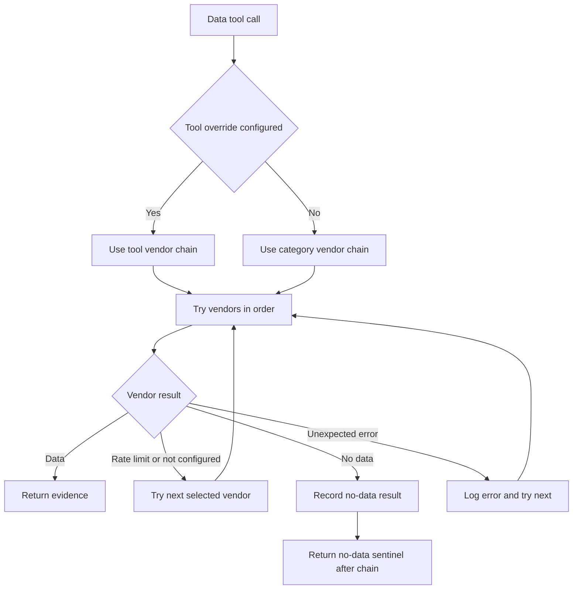

# Data and LLM integrations

The graph isolates external dependencies behind two registries: data tools route through `tradingagents/dataflows/interface.py`, and model creation routes through `tradingagents/llm_clients/factory.py`. These integrations supply the [architecture](/openwiki/architecture/overview.md) and are invoked by the [analysis workflow](/openwiki/workflows/analysis-run.md). Configuration and troubleshooting live in the [operations runbook](/openwiki/operations/runbook.md).

## Data access contract

Tools are grouped into categories with configurable vendor chains:

| Category | Tools | Implementations |
|---|---|---|
| Core prices | `get_stock_data` | yfinance, Alpha Vantage |
| Technical indicators | `get_indicators` | yfinance/stockstats, Alpha Vantage |
| Fundamentals | overview, balance sheet, cash flow, income statement | yfinance, Alpha Vantage |
| News and insiders | ticker/global news, insider transactions | yfinance, Alpha Vantage |
| Macro | `get_macro_indicators` | FRED |
| Prediction markets | `get_prediction_markets` | Polymarket |

Sentiment additionally reads StockTwits and Reddit directly from its analyst implementation rather than through this registry.

### Routing precedence

For a tool call, routing uses:

1. `tool_vendors[tool_name]`;
2. the containing `data_vendors[category]`;
3. `default` when no category choice exists.

A comma-separated setting is the exact ordered chain. The router does **not** silently try unselected vendors. The special `default` value means all implementations registered for that tool (`dataflows/interface.py`, `default_config.py`).

This control flow preserves source intent and makes fallback provenance explicit.

### Failure semantics

- Rate limits, missing vendor configuration, no-data, and unexpected errors allow the next explicitly selected vendor to run.
- If any vendor establishes genuine no/stale data and none succeeds, the router returns `NO_DATA_AVAILABLE` with a “do not fabricate” instruction.
- If all selected vendors fail with real errors, core categories raise the first error.
- FRED and Polymarket are optional enrichment. Their terminal failures return `DATA_UNAVAILABLE` so a macro/event lookup does not abort the whole analysis.

The typed error taxonomy is in `dataflows/errors.py`; routing behavior is covered by `tests/test_vendor_errors.py`, `test_vendor_routing.py`, and `test_no_data_handling.py`.

## Temporal safety and data grounding

Recent history shows sustained hardening against look-ahead and stale data (`CHANGELOG.md`, commits `40774ca`, `d78c698`, and the Alpha Vantage fixes).

- OHLCV rows are filtered to `Date <= analysis date`.
- yfinance's exclusive end date is compensated by requesting an extra day, then applying the cutoff.
- Same-day cached candles receive a TTL refresh because the current candle may still be partial; historical caches are treated as immutable.
- Financial-statement columns after the analysis date are removed.
- Alpha Vantage statements are parsed and filtered by `fiscalDateEnding <= analysis date`.
- Yahoo news timestamps are normalized to UTC and selected from a half-open interval.
- Undated Yahoo articles are excluded from historical windows but retained for windows that reach the present.
- FRED requests set `observation_end` to the analysis date.
- A deterministic market snapshot validates exact OHLCV and indicator claims; conflicts should be reported, not invented.

Known limitations:

- Live news, StockTwits, and Reddit inputs change over time even for the same historical analysis date.
- Alpha Vantage statement filtering uses fiscal period end, not actual filing/publication availability.

Use `tests/test_news_lookahead.py`, `test_ohlcv_cache_freshness.py`, `test_date_boundaries.py`, `test_alpha_vantage_hardening.py`, and `test_yfinance_stale_ohlcv_guard.py` for regression coverage.

## LLM provider architecture

`create_llm_client()` lazily selects a native client for Anthropic, Google, Azure OpenAI, or Amazon Bedrock. All other supported providers route through the unified OpenAI-compatible client registry (`llm_clients/factory.py`, `openai_client.py`).

OpenAI-compatible providers include OpenAI, xAI, DeepSeek, Qwen global/China, GLM global/China, MiniMax global/China, OpenRouter, Mistral, Kimi, Groq, NVIDIA NIM, Ollama, and generic `openai_compatible` endpoints such as vLLM, LM Studio, or llama.cpp.

Endpoint precedence within the OpenAI-compatible client is explicit base URL, then a provider-specific endpoint environment variable such as `OLLAMA_BASE_URL`, then provider default. Native OpenAI uses the Responses API only for an unset or OpenAI-host URL; custom/proxy endpoints use Chat Completions.

### Credentials

API-key environment names are centralized in `llm_clients/api_key_env.py` and summarized in `.env.example`/README. Examples include `OPENAI_API_KEY`, `GOOGLE_API_KEY`, `ANTHROPIC_API_KEY`, and `ALPHA_VANTAGE_API_KEY`. Bedrock can use `AWS_BEARER_TOKEN_BEDROCK` or the normal AWS credential chain; its SDK support requires the optional `bedrock` package extra. Ollama typically needs no API key.

Do not commit or document secret values. The CLI can prompt for a missing selected-provider key and persist it into the local `.env`; unattended systems should provision environment variables directly.

## Capability and structured-output handling

Provider behavior is capability-driven (`llm_clients/capabilities.py`). Important cases include:

- DeepSeek thinking models avoid incompatible forced `tool_choice` and preserve reasoning content.
- MiniMax M2.x avoids incompatible tool-choice behavior and enables reasoning splitting.
- Generic local OpenAI-compatible servers bind schemas without assuming object-form tool choice.
- OpenAI reasoning effort, Anthropic effort, and Gemini thinking level are applied only to models that accept them.
- `temperature` and `llm_max_retries` are forwarded across providers when explicitly configured.

Schema-oriented agents prefer structured output but retry once as free text. The recent `030b434` fix ensures those prompts do not prime the model to call unavailable external tools.

## Adding an integration

### New data vendor

1. Implement the tool function with normalized symbols and date boundaries.
2. Raise the typed vendor errors where appropriate.
3. Register the implementation in `VENDOR_METHODS` and expose configuration choices.
4. Decide whether its category is core or optional.
5. Add routing, no-data, stale-data, and look-ahead tests.
6. Update prompts only if the tool signature or evidence contract changes.

### New LLM provider

1. Prefer a provider spec in the OpenAI-compatible registry when protocol-compatible; otherwise implement `BaseLLMClient` and add a native factory branch.
2. Add API-key/endpoint metadata without reading secrets into logs.
3. Define structured-output and reasoning capabilities.
4. Add provider registry, endpoint, key, model-validation, and structured-output tests.
5. Update CLI choices and the fast-changing model catalog only when a curated list is maintainable.

The [source map](/openwiki/source-map.md) lists the exact entrypoints.
