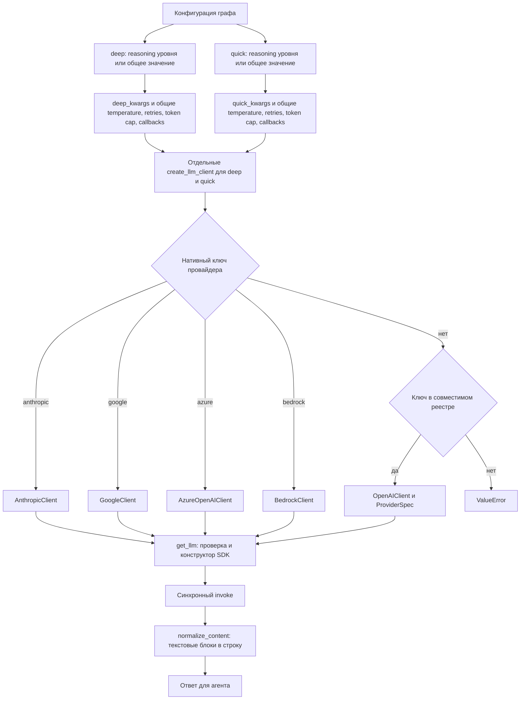
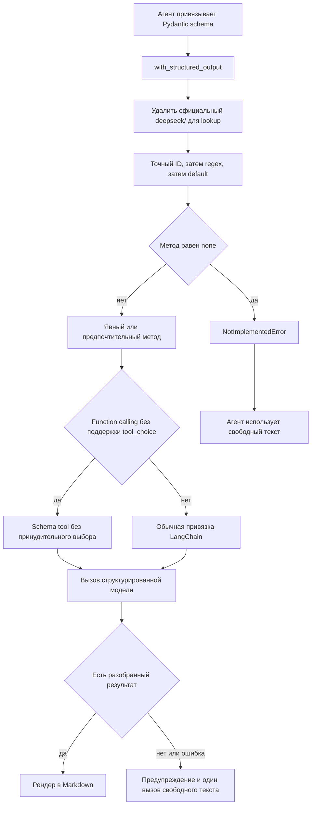

# Провайдеры LLM и совместимость моделей

Слой совместимости превращает настройки провайдера, модели, endpoint и генерации в две chat-модели LangChain: quick-thinking и deep-thinking. Точка входа — `create_llm_client()`, общий контракт `BaseLLMClient` — `get_llm()` и `validate_model()`. Импорты клиентов отложены до выбора провайдера: импорт фабрики сам по себе не требует загрузки всех SDK.

Важно различать **провайдера**, который выбирает API и адаптер, **идентификатор модели**, который выбирает каталог и правила совместимости, и **endpoint**, который определяет адрес запросов. Совпадение имени модели не переключает адаптер на другой протокол.

## От конфигурации графа до SDK

`TradingAgentsGraph` независимо собирает `deep_kwargs` через `_get_provider_kwargs("deep")` и `quick_kwargs` через `_get_provider_kwargs("quick")`. В оба словаря добавляются callbacks, если они переданы. Затем граф вызывает `create_llm_client()` сначала для `deep_think_llm`, затем для `quick_think_llm`: `llm_provider` и `backend_url` одинаковы, но reasoning-настройка разрешается отдельно для каждого уровня. После этого `get_llm()` обоих клиентов выполняет предупреждение о неизвестной модели, разрешение настроек адаптера и конструирование chat-объекта. Фабрика передаёт kwargs выбранному адаптеру; она не проверяет допустимость reasoning для модели.

| Семейство | Ключи провайдеров | Адаптер |
|---|---|---|
| Нативный API | `anthropic`, `google` | `ChatAnthropic`, `ChatGoogleGenerativeAI` с нормализацией ответа |
| Развёртывание или облачный runtime | `azure`, `bedrock` | `AzureChatOpenAI`, `ChatBedrockConverse` с собственными правилами настройки |
| Размещённый OpenAI-совместимый API | `openai`, `xai`, `deepseek`, `qwen`, `qwen-cn`, `glm`, `glm-cn`, `minimax`, `minimax-cn`, `openrouter`, `mistral`, `kimi`, `groq`, `nvidia` | `OpenAIClient`, управляемый `OPENAI_COMPATIBLE_PROVIDERS` |
| Локальный или произвольный совместимый endpoint | `ollama`, `openai_compatible` | Ключ необязателен; для произвольного endpoint обязателен URL |


*Выбор провайдера определяет адаптер и SDK, а нормализация синхронного ответа сохраняет строковый контракт для агентов.*

Нативные ветви проверяются до импорта `openai_client`. Остальные ключи должны присутствовать в реестре, иначе фабрика выдаёт `ValueError`. Для Bedrock импорт `langchain_aws` отложен ещё дальше — до `get_llm()`; созданный класс кешируется. Если необязательная зависимость отсутствует, `ImportError` содержит подсказку `pip install "tradingagents[bedrock]"`.

Источники: [создание моделей графом](repo://tradingagents/graph/trading_graph.py#L108-L129), [фабрика](repo://tradingagents/llm_clients/factory.py), [реестр](repo://tradingagents/llm_clients/openai_client.py#L183-L233).

## Endpoint и учётные данные

Разрешение URL происходит в два этапа:

1. CLI выбирает `TRADINGAGENTS_LLM_BACKEND_URL` перед URL меню или регионального выбора, затем использует свой default провайдера. Для `openai_compatible` без URL предусмотрен отдельный запрос адреса.
2. `OpenAIClient` выбирает явный `base_url` перед переменной endpoint из `ProviderSpec`, затем перед default реестра. Сейчас такой переменной является `OLLAMA_BASE_URL`. `require_base_url=True` не позволяет `openai_compatible` незаметно уйти на hosted endpoint: отсутствие адреса вызывает `ValueError` и в неинтерактивном режиме.

`ProviderSpec` также определяет класс chat-адаптера, необязательность ключа, placeholder и использование Responses API. Источник имён переменных ключей — `PROVIDER_API_KEY_ENV`; им пользуются CLI и совместимый runtime-клиент. Для hosted-провайдера отсутствие обязательной переменной приводит к ошибке в `get_llm()` с её именем. Проверка окружения выполняется **до** переноса пользовательских kwargs: один лишь явный `api_key` не обходит этот ранний контроль обязательной переменной в `OpenAIClient`.

Для `openai_compatible` используется `OPENAI_COMPATIBLE_API_KEY`, если он задан, иначе `EMPTY`. Для Ollama карта не задаёт переменную ключа, а placeholder равен `ollama`; явный `api_key` может быть передан через kwargs. CLI не навязывает ввод ключа для key-optional записей.

Qwen, GLM и MiniMax имеют отдельные международные и китайские ключи провайдера, endpoint и переменные учётных данных: например, `DASHSCOPE_API_KEY` / `DASHSCOPE_CN_API_KEY`, `ZHIPU_API_KEY` / `ZHIPU_CN_API_KEY`, `MINIMAX_API_KEY` / `MINIMAX_CN_API_KEY`. Общий список model ID не означает взаимозаменяемости региональных credentials.

### Нативные клиенты не повторяют правила OpenAIClient

| Клиент | Реальное разрешение параметров |
|---|---|
| Anthropic | Принимает явный `api_key`, иначе оставляет SDK его обычное разрешение окружения; передаёт `base_url`, если он задан. |
| Google | Непустой унифицированный `api_key` имеет приоритет над legacy `google_api_key`; в SDK уходит `google_api_key`. `base_url` передаётся при наличии. |
| Azure | `azure_deployment` берётся из `AZURE_OPENAI_DEPLOYMENT_NAME`, а при отсутствии переменной — из настроенной модели. Любое имя deployment допустимо. Endpoint, ключ и API version разрешаются через настройки Azure SDK, включая `AZURE_OPENAI_ENDPOINT`, `AZURE_OPENAI_API_KEY`, `OPENAI_API_VERSION`; сохранённый `base_url` клиент не передаёт. |
| Bedrock | Регион: `AWS_REGION` → `AWS_DEFAULT_REGION` → `us-west-2`. Непустой `AWS_BEARER_TOKEN_BEDROCK` передаётся как `api_key`, иначе используется стандартная AWS credential chain. `base_url` не передаётся. Model — Bedrock model ID или cross-region inference profile ID. |

У `openai` внутри совместимого семейства есть исключение: Responses API включается только при незаданном endpoint либо hostname, проходящем проверку `.openai.com` в `_is_native_openai_base_url()`. Пользовательский proxy, gateway или локальный адрес вне этой проверки оставляет Chat Completions. Наличие OpenAI-совместимого API само по себе не включает Responses API.

Полная настройка окружения находится на странице [конфигурации и развёртывания](../operations/configuration-and-deployment.md). Здесь существенны границы разрешения: [CLI](repo://cli/utils.py#L338-L402), [credentials и URL совместимого клиента](repo://tradingagents/llm_clients/openai_client.py#L276-L333), [карта ключей](repo://tradingagents/llm_clients/api_key_env.py), [Azure](repo://tradingagents/llm_clients/azure_client.py), [Bedrock](repo://tradingagents/llm_clients/bedrock_client.py).

## Каталог, пользовательские ID и валидация

`MODEL_OPTIONS` используется одновременно для статических quick/deep меню CLI и для получения известных валидатору model ID. Региональные варианты Qwen, GLM и MiniMax используют общие списки. Для `openai_compatible`, Mistral, Kimi, Groq, NVIDIA и Bedrock каталог предлагает `Custom model ID`; Ollama имеет и предложенные модели, и пользовательский ввод. OpenRouter получает список динамически и также допускает custom ID, а Azure сразу запрашивает имя deployment.

Подписи вроде «Latest», «Fast», «1M ctx» и порядок моделей — **конфигурация репозитория**, а не независимо проверенные сведения о производительности, доступности или лимитах сервиса. Каталог не заменяет проверку доступа выбранного аккаунта к модели.

Валидация рекомендательная, а не разрешительный список. `BaseLLMClient.warn_if_unknown_model()` выдаёт `RuntimeWarning` для неизвестной модели каталогизированного провайдера, но продолжает создание клиента. `_ANY_MODEL_PROVIDERS` включает Ollama, OpenRouter, произвольный endpoint, Mistral, Kimi, Groq, NVIDIA и Bedrock: они принимают любые ID без предупреждения. Azure отдельно принимает любое имя deployment.

Каталог и таблица возможностей отвечают за разные вещи:

- `model_catalog.py` — видимость в меню и рекомендательная проверка;
- `capabilities.py` — совместимость параметров запроса для model ID и шаблонов.

Добавление модели в меню не создаёт для неё исключение протокола; добавление capability не выводит модель в меню.

Источники: [каталог](repo://tradingagents/llm_clients/model_catalog.py), [выбор модели](repo://cli/utils.py#L246-L326), [валидация](repo://tradingagents/llm_clients/validators.py), [предупреждение](repo://tradingagents/llm_clients/base_client.py#L40-L52).

## Структурированный вывод и порядок capability lookup

`NormalizedChatOpenAI.with_structured_output()` использует неизменяемые `ModelCapabilities`. Разрешение имеет строгий порядок:

1. Удалить **только** начальный официальный namespace `deepseek/` для lookup.
2. Найти точный ID в `_BY_ID`.
3. Проверить regex из `_BY_PATTERN` по порядку.
4. Вернуть permissive default с предпочтительным методом `function_calling`.

Так, `deepseek/deepseek-v4-flash` получает правила `deepseek-v4-flash`, а `tngtech/deepseek-v4-flash` остаётся на default: произвольный namespace не удаляется. Это локальная нормализация lookup, а не переписывание ID модели в запросе. Шаблоны `^deepseek-v\d`, `^deepseek-reasoner` и `^MiniMax-M\d` распространяют правила на новые варианты, включая MiniMax M3.

Метод берётся из явного `method` либо `preferred_structured_method`. Значение `none` в capability вызывает `NotImplementedError`. При `function_calling` и отсутствии поддержки `tool_choice` адаптер по умолчанию устанавливает `tool_choice=None`, но сохраняет схему как tool. Это реализовано через `setdefault`: явно переданный вызывающим кодом `tool_choice` не перезаписывается. Для произвольного `openai_compatible` такое подавление применяется независимо от model ID.


*Capability lookup адаптирует привязку схемы, а общий helper агента обеспечивает отдельный переход к свободному тексту.*

Общий `bind_structured()` ловит `NotImplementedError` и `AttributeError` при привязке. `invoke_structured_or_freetext()` при ошибке структурированного вызова, рендера или результате `None` пишет предупреждение и один раз вызывает обычный `invoke()` с тем же prompt. Это не транспортный retry SDK; ошибка самого резервного вызова не скрывается.

Источники: [lookup](repo://tradingagents/llm_clients/capabilities.py#L93-L135), [привязка](repo://tradingagents/llm_clients/openai_client.py#L38-L68), [fallback](repo://tradingagents/agents/utils/structured.py#L42-L89), [проверка namespace](repo://tests/test_capabilities.py#L119-L155).

## Нормализация ответа и сохранение reasoning_content

Все конкретные адаптеры нормализуют результат синхронного `invoke()`: если `response.content` — список, `normalize_content()` соединяет непустые строки и блоки `type="text"` через перевод строки. Reasoning и metadata blocks не попадают в `content`. Это не обещание аналогичной обработки всех streaming/async путей и не удаление служебных полей из всего сообщения.

Особенности протокола остаются в узких адаптерах:

- **DeepSeek:** `_create_chat_result()` сохраняет полученный `reasoning_content` в `AIMessage.additional_kwargs`; `_get_request_payload()` переносит его обратно в соответствующее исходящее assistant-сообщение. Поддерживаются списки сообщений и объекты с `to_messages()`, включая `ChatPromptValue`. Так сохраняется необходимый thinking-моделям обмен между ходами, не загрязняя обычный текст ответа.
- **Граница OpenRouter:** удаление `deepseek/` в capability lookup включает правила привязки схемы, но не выбирает `DeepSeekChatOpenAI`. Запись `openrouter` по-прежнему использует `NormalizedChatOpenAI`; специализированное сохранение `reasoning_content` реализовано в классе, выбранном для провайдера `deepseek`, а не автоматически по capability-флагу `requires_reasoning_content_roundtrip`.
- **MiniMax:** если capability требует `requires_reasoning_split`, адаптер добавляет `reasoning_split=True` в `extra_body`. Это сохраняет reasoning отдельно от текста, не передавая неизвестный SDK параметр верхнего уровня. Уже заданное значение не перезаписывается.

Источники: [нормализация](repo://tradingagents/llm_clients/base_client.py#L6-L22), [DeepSeek и MiniMax](repo://tradingagents/llm_clients/openai_client.py#L71-L162), [тесты round trip](repo://tests/test_deepseek_reasoning.py#L55-L179).

## Thinking, температура, retries и лимит токенов

`TradingAgentsGraph._get_provider_kwargs(tier)` — вход операционных настроек для отдельного уровня. Каждый вызов создаёт новый словарь: temperature, retries и лимит токенов остаются общими настройками, а reasoning разрешается независимо. Окончательная передача в SDK определяется allowlist и правилами модели конкретного клиента.

### Независимый reasoning для deep и quick

`deep_think_reasoning_effort` и `quick_think_reasoning_effort` переопределяют общее значение **активного** провайдера:

| `llm_provider` (без учёта регистра) | Общее значение для наследования | Аргумент фабрики и адаптера |
|---|---|---|
| `openai` | `openai_reasoning_effort` | `reasoning_effort` → `OpenAIClient` |
| `anthropic` | `anthropic_effort` | `effort` → `AnthropicClient` |
| `google` | `google_thinking_level` | `thinking_level` → `GoogleClient` |
| Остальные ключи | Не используются | Эта функция не добавляет reasoning-аргумент |

Для каждого уровня порядок таков: значение уровня → общее значение активного провайдера → отсутствие аргумента. Отсутствующий ключ, `None` и `""` наследуют общее значение; если и оно отсутствует, равно `None` или `""`, аргумент опускается. Реализация использует истинность значения (`or` и `if`), а не специальный маркер отключения. Настройки неактивных провайдеров не участвуют в наследовании. В частности, другие OpenAI-совместимые ключи, включая `deepseek`, `openrouter`, `ollama` и `openai_compatible`, не получают reasoning от этой функции, несмотря на общий `OpenAIClient`; это относится также к `azure` и `bedrock`.

Литерал `"none"` — непустая строка, а не Python `None`: он передаётся как значение. Строки из пробелов и строки с крайними пробелами граф тоже не нормализует. Здесь нет универсального enum: допустимость значения принадлежит адаптеру, модели и SDK/API. Передача графом не гарантирует принятия сервисом. Вызов `_get_provider_kwargs()` без `tier` сохраняет прежнее поведение с общей настройкой, игнорируя overrides уровней. Разрешение не изменяет `config` и не переносит результат одного уровня в другой.

Например, при `llm_provider="openai"`, `openai_reasoning_effort="medium"`, `deep_think_reasoning_effort="high"` и `quick_think_reasoning_effort=""` фабрика получает `reasoning_effort="high"` для deep и `reasoning_effort="medium"` для quick. Дальше каждый адаптер отдельно проверяет поддержку параметра своей моделью.

Источники: [разрешение уровней](repo://tradingagents/graph/trading_graph.py#L170-L213), [два вызова фабрики](repo://tradingagents/graph/trading_graph.py#L108-L131), [передача адаптерам](repo://tradingagents/llm_clients/factory.py#L29-L54), [матрица наследования](repo://tests/test_per_tier_reasoning_effort.py#L14-L88).

### Общие параметры генерации

| Настройка графа | Поведение |
|---|---|
| `temperature` | Непустое значение преобразуется через `float()`; `None` или пустая строка не передаются. Ограничения модели и SDK остаются в силе. |
| `llm_max_retries` | Непустое значение преобразуется через `int()` в `max_retries`; boolean и отрицательный результат запрещены. При отсутствии настройки сохраняется default SDK. |
| `max_tokens` | Непустое значение преобразуется через `int()`, boolean и результат `<= 0` запрещены. Для Google граф передаёт `max_output_tokens`, для остальных — `max_tokens`. По умолчанию настройка равна `None`. |
| `callbacks` | Переданные графу callbacks добавляются в kwargs обеих моделей и передаются их chat-конструкторам. Это отдельный путь от callbacks выполнения инструментов графа. |

Проверки целых значений — именно преобразование `int()`, а не строгая проверка Python-типа: строка `"1.5"` вызывает ошибку, но числовой `float` может быть усечён. Для предсказуемой конфигурации задавайте целые значения или целочисленные строки.

**Лимит токенов необходимо проверять до конечного SDK.** `OpenAIClient`, `AnthropicClient` и `BedrockClient` передают `max_tokens`; `GoogleClient` передаёт `max_output_tokens`. Однако в текущем `_PASSTHROUGH_KWARGS` Azure нет `max_tokens`: граф создаёт этот kwarg, но Azure-клиент его не переносит в SDK. Поэтому настройка пока не является сквозным ограничителем для всех провайдеров. `tests/test_llm_max_tokens.py` проверяет преобразование, маршрутизацию имени и передачу OpenAI/Google, но не устраняет этот пробел Azure.

Thinking-настройки также не универсальны:

- После разрешения уровня граф передаёт `reasoning_effort` только для ключа `openai`; `OpenAIClient` сохраняет этот аргумент лишь для имён моделей, соответствующих `^(gpt-5|o[1-9])` после приведения имени к нижнему регистру и удаления крайних пробелов. Это нормализация имени модели, не значения effort.
- Для Anthropic `effort` ограничен распознаваемыми семействами и минимальными версиями в `_supports_effort()`, включая отдельные точные исключения. Неизвестные или неподдерживаемые имена консервативно остаются без параметра.
- Google передаёт непустой `thinking_level` непосредственно строкой. Если имя модели содержит `pro` без учёта регистра, `minimal` заменяется на `low`; остальные значения не переписываются. Преобразования в `thinking_budget` здесь нет.

Соответствующие overrides: `TRADINGAGENTS_TEMPERATURE`, `TRADINGAGENTS_LLM_MAX_RETRIES`, `TRADINGAGENTS_MAX_TOKENS`, `TRADINGAGENTS_GOOGLE_THINKING_LEVEL`, `TRADINGAGENTS_OPENAI_REASONING_EFFORT`, `TRADINGAGENTS_ANTHROPIC_EFFORT`. Инструкции по окружению см. на [операционной странице](../operations/configuration-and-deployment.md).

Источники: [валидация чисел](repo://tradingagents/graph/trading_graph.py#L48-L76), [kwargs графа](repo://tradingagents/graph/trading_graph.py#L170-L213), [Google](repo://tradingagents/llm_clients/google_client.py#L26-L54), [Anthropic](repo://tradingagents/llm_clients/anthropic_client.py), [Azure allowlist](repo://tradingagents/llm_clients/azure_client.py#L8-L47), [тест лимита](repo://tests/test_llm_max_tokens.py).

## Безопасные точки расширения

1. **Новый провайдер:** отдельная ветвь фабрики нужна для действительно иного API или облачной интеграции. OpenAI-совместимый сервис добавляется в `OPENAI_COMPATIBLE_PROVIDERS`, с явными endpoint, key optionality, required URL, режимом Responses API и при необходимости узким subclass.
2. **Credentials и выбор региона:** согласуйте `PROVIDER_API_KEY_ENV`, `_llm_provider_table()` и региональный выбор CLI. `None` в карте ключей означает отсутствие единственной переменной для запроса, а не универсальное отсутствие аутентификации.
3. **Новая модель:** обновляйте quick/deep каталог либо custom/dynamic путь; отдельно решайте, нужна ли запись capability. Сохраняйте рекомендательный характер валидации и осознанно выбирайте `_ANY_MODEL_PROVIDERS`.
4. **Новая особенность протокола:** предпочтите точный ID или обоснованный шаблон в `capabilities.py`; сохранение служебных полей запроса/ответа изолируйте в subclass. Не распространяйте специальную логику по агентам и не считайте декларативный флаг реализацией механизма.
5. **Новый параметр:** проследите весь путь от конфигурации и преобразования в графе до allowlist каждого нужного клиента и фактического конструктора SDK. Одной записи в kwargs графа недостаточно, что показывает текущая граница Azure для `max_tokens`.
6. **Проверка:** обновите тесты реестра, ключей, валидации, endpoint, capabilities и конечного payload. Для нативных клиентов проверяйте собственные параметры, а не выводите их поведение из OpenAI. При наличии credentials используйте smoke-проверку поддерживаемого скриптом провайдера.

Инварианты расширения: hosted-сервис не становится key-optional случайно; произвольный endpoint не получает hosted default; нативный API не попадает в совместимый реестр; неизвестный model ID остаётся допустимым; типизированная схема и reasoning-поля не теряются при адаптации.

## Фокусная проверка

Команды для локальной проверки (в рамках этой документационной правки тесты не запускались):

```bash
pytest tests/test_provider_registry.py tests/test_api_key_env.py tests/test_model_validation.py
pytest tests/test_capabilities.py tests/test_deepseek_reasoning.py tests/test_minimax.py
pytest tests/test_openai_compatible_provider.py tests/test_openai_responses_base_url.py
pytest tests/test_bedrock_provider.py tests/test_llm_max_retries.py tests/test_temperature_config.py tests/test_llm_max_tokens.py
pytest tests/test_google_api_key.py tests/test_google_thinking_level.py tests/test_openai_reasoning_effort.py tests/test_anthropic_effort.py tests/test_structured_agents.py
pytest tests/test_per_tier_reasoning_effort.py
```

`test_per_tier_reasoning_effort.py` запрещает сеть и проверяет матрицу наследования, независимость словарей, неизменность config, вызов helper без уровня, буквальные строки и отсутствие reasoning у DeepSeek. Тест конструктора графа перехватывает обе фабричные операции, проверяя модели, endpoint, общие параметры, callbacks и отдельные результаты `get_llm()`. Он не проверяет принятие значений реальным API: границу адаптер → SDK отдельно покрывают `test_openai_reasoning_effort.py` (сохранение и удаление параметра по модели), `test_anthropic_effort.py` (семейства и версии, сохранение остальных kwargs при удалении effort) и `test_google_thinking_level.py` (Flash, преобразование Pro `minimal` → `low`, отсутствие `thinking_budget`).

Особенно важны: официальный namespace и сторонний publisher в `test_capabilities.py`; получение и обратная отправка `reasoning_content` через list и `ChatPromptValue`; сохранение schema tool при подавлении `tool_choice`; конечный `max_output_tokens` Google; fallback при результате `None`. Live-тест DeepSeek пропускается без реального ключа, но с ключом может обратиться к API.

Для проверки цепочки типизированный результат → Markdown на реальном сервисе:

```bash
OPENAI_API_KEY=... python scripts/smoke_structured_output.py openai
DEEPSEEK_API_KEY=... python scripts/smoke_structured_output.py deepseek
```

Скрипт проверяет ожидаемые маркеры отрендеренных результатов; это проверка интеграции, не подтверждение всех возможностей или качества модели.

См. также: [исполнение агентов](../architecture/agent-runtime.md), [контракты состояния и вывода](../concepts/state-and-output-contracts.md), [конфигурация и развёртывание](../operations/configuration-and-deployment.md), [проверка изменений](../testing/change-validation.md).
