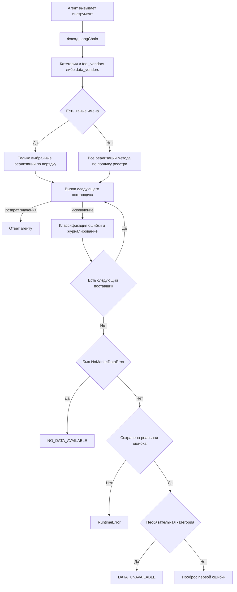

# Рыночные данные: маршрутизация, качество и временные границы

Слой данных связывает инструменты агентов с поставщиками, но не делает все внешние ответы исторически достоверными автоматически. Нужно различать **выбор источника**, **пригодность данных**, **дату наблюдения** и **версию сведений, известную на дату анализа**. Детерминированный проверенный снимок защищает точные числовые утверждения от выдумывания моделью, но сам использует Yahoo, а не независимый источник котировок.

## Инструмент → категория → цепочка поставщиков

Публичный фасад — `tradingagents.agents.utils.agent_utils`. Тонкие LangChain-обёртки передают вызовы в `route_to_vendor`; `get_indicators` предварительно разбирает список индикаторов, разделённых запятыми, и маршрутизирует отдельные запросы. В `tradingagents/dataflows/interface.py`:

| Контракт | Ответственность |
|---|---|
| `TOOLS_CATEGORIES` | Категория метода: цены, технические индикаторы, фундаментальные данные, новости, макроэкономика или рынки прогнозов |
| `VENDOR_METHODS` | Реализации конкретного метода у поддерживаемых поставщиков |
| `OPTIONAL_CATEGORIES` | Необязательное обогащение: `macro_data` и `prediction_markets` |

`tool_vendors` имеет приоритет над `data_vendors` категории. Значение `"yfinance"` разрешает только Yahoo; `"yfinance,alpha_vantage"` явно разрешает переход ко второму источнику. Неизвестные имена отбрасываются при пересечении со списком реализаций метода; если ни одного допустимого явно выбранного имени нет, возникает конфигурационный `ValueError`. При отсутствии явных имён, в частности для `"default"`, используются все реализации **в порядке реестра метода**, а не общего `VENDOR_LIST`.

По умолчанию цены, индикаторы, фундаментальные данные и новости закреплены за yfinance, макроэкономика — за FRED, рынки прогнозов — за Polymarket. Конфигурация слоя данных принадлежит процессу: конструктор `TradingAgentsGraph` устанавливает её через `set_config`, словари обновляются слиянием на один уровень, `get_config` возвращает глубокую копию. Подробнее: [Конфигурация и развёртывание](../operations/configuration-and-deployment.md).

*Рисунок 1. Общий роутер переключает поставщиков по исключениям; обычная строка, даже с описанием ошибки, завершает цепочку.*

### Ошибки и ответы агентам

Общая иерархия `VendorError` классифицирует поведение, а не бренд: `NoMarketDataError`, `VendorRateLimitError`, `VendorNotConfiguredError`. Последний также наследует `ValueError`; специальные типы Alpha Vantage и FRED наследуют общий контракт.

1. Любое нормальное возвращаемое значение завершает маршрутизацию.
2. `VendorRateLimitError` журналируется и переводит вызов к следующему поставщику, но не сохраняется как `first_error`.
3. `VendorNotConfiguredError` и прочие исключения журналируются; сохраняется первая такая ошибка, затем выполняется следующая попытка.
4. `NoMarketDataError` сохраняется отдельно как отсутствие пригодных данных; роутер также пробует следующий источник.
5. После исчерпания цепочки наличие `NoMarketDataError` имеет приоритет: возвращается `NO_DATA_AVAILABLE` с исходным и, если отличается, каноническим символом, причиной и запретом придумывать значения. Сопутствующий реальный сбой остаётся видимым в журнале.
6. Иначе сохранённая ошибка превращается в `DATA_UNAVAILABLE` только для необязательной категории; для основных категорий пробрасывается исходное исключение. Если не сохранено ни отсутствие данных, ни реальная ошибка — например, все попытки завершились только типизированным ограничением частоты, — возникает `RuntimeError`.

Это **контракт роутера, а не гарантия одинакового поведения всех адаптеров**. Например, Yahoo news перехватывает исключения и возвращает `Error fetching ...`; такой ответ не запускает резервный источник. Пустая новостная выборка тоже представлена обычной строкой. Polymarket самостоятельно преобразует сетевую ошибку в рекомендацию продолжить без сигнала. Обёртка `get_indicators` также превращает вышедший из роутера `ValueError` в текст для соответствующего индикатора, продолжая обработку списка. Не следует обещать универсальный `NO_DATA_AVAILABLE` для любого пустого ответа или проброс всех ошибок новостей.

Источники: [роутер](repo://tradingagents/dataflows/interface.py), [ошибки](repo://tradingagents/dataflows/errors.py), [Yahoo news](repo://tradingagents/dataflows/yfinance_news.py).

## Символ: нормализация не равна безопасности пути

`normalize_symbol` выполняет синтаксическое преобразование Yahoo: удаляет крайние пробелы, приводит к верхнему регистру и снимает брокерский суффикс `+`; применяет явные псевдонимы (`XAUUSD` → `GC=F`, `USOIL` → `CL=F`, `SPX500` → `^GSPC`); известные криптопары USD/USDT/USDC переводит в `BASE-USD`, а шестибуквенные пары известных валют — в форму с `=X`. Акции, ETF и биржевые суффиксы в остальных случаях сохраняются после приведения регистра. Это не поиск похожей компании и не доказательство экономической эквивалентности брокерского контракта фьючерсу Yahoo.

Канонический символ используется в Yahoo-путях цен, индикаторов, фундаментальных данных, новостей, идентичности и расчёта реализованной доходности. Исходный тикер остаётся в контексте и, где предусмотрено, в происхождении ответа или ошибки.

Перед включением канонического символа в имя CSV отдельно вызывается `safe_ticker_component`: запрещены пустые значения, разделители пути, пробелы, неподдерживаемые символы, компоненты только из точек и длина свыше 32 символов. Функция либо возвращает компонент без изменения, либо поднимает `ValueError`; нормализация сама по себе не является защитой от выхода за `data_cache_dir`.

### Идентичность в программном API и CLI

`resolve_instrument_identity` получает `.info` через нормализованный `yf.Ticker`, очищает имя, сектор, отрасль, биржу и тип котировки; сбой допускается без остановки анализа — возвращается пустой словарь. Результат, включая неудачную попытку, хранится в процессном LRU-кэше на 256 входных тикеров. Это не бессрочная гарантия «один запрос за жизнь процесса»: после вытеснения возможен новый запрос.

`TradingAgentsGraph.resolve_instrument_context` превращает метаданные в инструкцию сохранять точный тикер и не подменять инструмент. Программный путь `_run_graph` и CLI, который создаёт начальное состояние самостоятельно, оба передают `instrument_context` в `create_initial_state`. Агенты читают его из состояния; если контекст отсутствует, `get_instrument_context_from_state` строит вариант только с тикером **без сетевого поиска внутри графа**. Криптоактив дополнительно обозначается как актив, для которого нельзя предполагать наличие корпоративной отчётности.

Источники: [контекст](repo://tradingagents/agents/utils/agent_utils.py#L92-L201), [программный запуск](repo://tradingagents/graph/trading_graph.py#L509-L526), [CLI](repo://cli/main.py#L1113-L1125). См. также [Точки входа анализа](../workflows/analysis-entrypoints.md).

## OHLCV, индикаторы и проверенный снимок

Есть два разных Yahoo-пути:

- `get_YFin_data_online` получает запрошенный диапазон через `Ticker.history`, проверяет пустоту и давность, затем форматирует CSV. Он **не использует общий файловый кэш**.
- `load_ohlcv` в `stockstats_utils.py` — общий источник данных для окна индикаторов, `StockstatsUtils` и `build_verified_market_snapshot`. Поэтому изменение его нормализации или проверки качества влияет одновременно на технический анализ и проверку чисел.

### Даты Yahoo и порядок очистки

Yahoo трактует `end` как исключительную границу. Прямой диапазон запрашивается до `end_date + 1 день`, а загрузчик кэша — до завтра по текущим часам процесса. `load_ohlcv` затем самостоятельно исключает `Date > curr_date`.

Текущий порядок в загрузчике важен:

1. Название столбца даты приводится к `Date` из `index`, `Datetime` или `date`.
2. Даты нормализуются **по локальному календарному дню каждого бара**, без перевода в UTC: часовой пояс снимается, время обнуляется. Так токийская полночь не становится предыдущим днём, а смешанные смещения DST остаются допустимыми. Неразбираемые даты удаляются, OHLCV приводится к числам.
3. Применяется отсечение по `curr_date`.
4. До удаления неполных строк проверяется `Close` последней оставшейся строки: отсутствие цены вызывает `NoMarketDataError`, а не незаметную подмену последнего бара предыдущим. Здесь используется `iloc[-1]`, то есть порядок входных строк существенен; загрузчик сам не сортирует их.
5. Более ранние строки без `Close` удаляются, остальные пробелы OHLCV заполняются `ffill().bfill()`.
6. Проверяется давность данных.

Неполный будущий бар не должен блокировать исторический запрос: проверка отсутствующей последней цены выполняется **после** временного отсечения. Источники: [загрузчик](repo://tradingagents/dataflows/stockstats_utils.py#L48-L268), [регрессии последнего бара](repo://tests/test_ohlcv_latest_bar.py).

### Жизненный цикл кэша и давность

CSV располагается в `data_cache_dir` под именем `{safe_symbol}-YFin-data-{start_str}-{end_str}.csv`: окно — последние пять лет относительно текущего дня до завтра. Это общий файл для символа и текущего окна, а не отдельный файл на каждую историческую дату анализа; при смене текущего дня меняются границы в имени.

Прочитанный CSV принимается, если DataFrame непуст и содержит `Close`. Иначе выполняется загрузка. Важное ограничение: `pd.read_csv` здесь не обёрнут обработчиком `EmptyDataError`; буквально нулевой или неразбираемый файл может вызвать исключение, а не автоматически стать промахом кэша.

Исторические запросы повторно используют подходящий кэш без TTL-обновления. Для сегодняшних запросов действует `OHLCV_CACHE_TTL_SECONDS = 900` по времени изменения файла; код применяет его также к будущей дате запроса. Обновление требуется независимо от наличия сегодняшней строки: её цена может ещё отражать незавершённую сессию. Это снижает частоту запросов в выходные, но не подтверждает окончательность дневной свечи.

На промахе выполняется `yf.download(..., auto_adjust=True)`. `yf_retry` повторяет только `YFRateLimitError` с экспоненциальной задержкой; остальные ошибки немедленно выходят из этой обёртки. Пустая загрузка или отсутствие `Close` вызывает `NoMarketDataError` **до записи**. Однако запись непустой загрузки происходит до полной очистки и проверки последнего `Close`, поэтому наличие файла не доказывает пригодность его содержимого.

`_assert_ohlcv_not_stale` отвергает непустые данные, если последняя дата более чем на `MAX_OHLCV_STALE_DAYS = 10` календарных дней старше запрошенной. Эта проверка используется и прямым ценовым путём, и общим загрузчиком. Причина, даты и число дней попадают в типизированную ошибку; в маршрутизируемом вызове возможен резервный поставщик, затем sentinel. TTL файла и допустимая давность бара — разные проверки.

### Детерминированная проверка чисел

`get_verified_market_snapshot` не входит в `VENDOR_METHODS`: это локальный инструмент на базе `load_ohlcv`, зарегистрированный в рыночном `ToolNode` вместе с ценами и индикаторами. Промпт рыночного аналитика требует вызвать его перед итоговым отчётом.

Снимок повторно разбирает даты, сортирует строки и применяет отсечение; выбирает последнюю торговую строку не позже даты анализа, вычисляет фиксированный набор индикаторов stockstats и показывает от 1 до 30 последних строк закрытия. На выходном это предыдущая допустимая торговая сессия, а не перенос анализа вперёд. В отличие от снимка, одиночный `StockstatsUtils.get_stock_stats` для дня без торгов возвращает `N/A: Not a trading day (weekend or holiday)`.

Отдельная ошибка индикатора даёт `N/A`, не уничтожая снимок; пустой вход или отсутствие допустимых строк вызывает `ValueError`. Снимок предписано считать источником точных OHLCV, уровней цен и значений индикаторов. Противоречие другому ответу нужно явно отметить, а не выдумывать согласованное число. Утверждения о подтверждённых отскоках или точном процентном движении требуют конкретных дат и цен. Даже если основной ценовой инструмент настроен на Alpha Vantage, этот снимок остаётся Yahoo-зависимым.

Источники: [проверка](repo://tradingagents/dataflows/market_data_validator.py), [прямые цены и индикаторы](repo://tradingagents/dataflows/y_finance.py), [рыночный аналитик](repo://tradingagents/agents/analysts/market_analyst.py).

## Новости и социальные источники: отдельная временная модель

Для Yahoo news, StockTwits и Reddit общий `date_window.in_window` проверяет полуоткрытый UTC-интервал **`[start_date, end_date + 1 день)`**. Время без часового пояса считается UTC; время со смещением переводится в UTC. Ровно полночь после конечного дня исключается. Это правило публикаций отличается от сохранения локального дня OHLCV.

Материал без разбираемой даты допускается только при `end >= now(UTC) - 1 день`; для исторического окна он отбрасывается. Это точная проверка близости к настоящему, а не поиск архивной даты. Yahoo обрабатывает и вложенный `content.pubDate`, и плоский `providerPublishTime` как UTC epoch. Если все кандидаты отсечены, возвращается сообщение об отсутствии новостей. Фильтрация свежей ленты не превращает её в полный исторический архив.

### Прямой путь sentiment-аналитика

`sentiment_analyst` до вызова LLM собирает три блока за окно от `trade_date - 7 дней` до `trade_date`: новости через `get_news.func` и общий роутер, StockTwits и Reddit — **прямыми вызовами**, без `tool_vendors`. Внешнего tool-calling у этого аналитика нет: блоки уже находятся в промпте. Нельзя считать комментарий о мягкой деградации гарантией перехвата любых исключений: вокруг маршрутизируемого `get_news.func` отдельного `try/except` нет.

StockTwits использует публичную свежую ленту без ключа; криптопары преобразуются в `BASE.X`. Reddit ищет по криптобазе, например `BTC`, а не `BTC-USD`. Оба применяют общий фильтр при наличии **обеих** границ; без полной пары границ возвращается нефильтрованный список. Обычные сетевые/транспортные сбои превращаются в placeholders, а историческое окно часто остаётся пустым из-за отсутствия старых материалов в свежих лентах. Аналитик должен явно снизить уверенность при недостатке источников.

Reddit по умолчанию сразу обращается к Atom/RSS `search.rss`, не тратя запрос на часто блокируемый публичный JSON. Сохранённый `_fetch_subreddit_json` при ошибке переключается на RSS, но это **не основной путь**. При RSS HTTP 429 выполняется одна повторная попытка: числовой `Retry-After` учитывается с потолком 30 секунд, иначе используется задержка с jitter; запросы к разным subreddit также разнесены во времени. Чтение ограничено 5 MiB. RSS не содержит score/comments: поля остаются отсутствующими, форматирование не подставляет ложные нули.

Источники: [окно](repo://tradingagents/dataflows/date_window.py), [sentiment-аналитик](repo://tradingagents/agents/analysts/sentiment_analyst.py#L61-L120), [StockTwits](repo://tradingagents/dataflows/stocktwits.py), [Reddit](repo://tradingagents/dataflows/reddit.py).

## FRED, Alpha Vantage и Polymarket: границы гарантий

**FRED.** `get_macro_data` принимает псевдоним либо идентификатор ряда, требует `FRED_API_KEY` и использует сетевой timeout 30 секунд. `observation_start`/`observation_end` ограничивают окно наблюдений. Дополнительно **оба запроса**, метаданные `series` и `series/observations`, получают `realtime_start = realtime_end = min(curr_date, _fred_today())`. `_fred_today()` использует `America/Chicago` через pytz: локальное «завтра» вызывающего процесса не должно приводить к HTTP 400 из-за будущей даты FRED. Историческая дата остаётся неизменной. Это фиксация vintage, предотвращающая получение поздних пересмотров CPI/GDP вместо известных тогда значений.

FRED пропускает отсутствующие значения `.`/пустые, показывает до 40 последних наблюдений, но изменение рассчитывает по всему окну. Отсутствие данных в выбранном vintage объясняется явно — возможны ещё не опубликованные наблюдения или отсутствие покрытия ALFRED. Это не повод повторять запрос без фиксации версии.

**Alpha Vantage.** Требуется `ALPHA_VANTAGE_API_KEY`; общий HTTP timeout — 30 секунд. Сообщения `Information`/`Note` различают ограничения частоты и недействительный ключ через типизированные ошибки. CSV-фильтр включает обе границы дат, но при ошибке разбора предупреждает и возвращает исходный ответ. Поэтому его нельзя описывать как безусловно закрывающий утечку будущих строк. Этот адаптер не наследует автоматически Yahoo-кэш, нормализацию или все проверки качества.

**Polymarket.** Публичный Gamma API не требует ключа. Адаптер ищет рынки, исключает закрытые и те, чья разбираемая `endDate` уже прошла относительно текущего UTC-времени, требует outcomes/prices и сортирует по объёму. Отсутствующая или неразбираемая дата сама по себе не исключает рынок. Это **текущие** подразумеваемые вероятности событий, а не достоверный исторический снимок: API инструмента не принимает `curr_date`. Сетевой сбой превращается в сообщение о недоступности, покрытие отдельной акции может отсутствовать, вероятность не является гарантированным прогнозом.

Наконец, `filter_financials_by_date` отсекает Yahoo-столбцы по дате окончания финансового периода, **не по времени публикации отчёта**. Текущие метаданные идентичности, скорректированные цены Yahoo и живые вероятности нельзя объявлять универсально point-in-time безопасными только из-за наличия даты анализа. Временная фильтрация памяти результатов — отдельный механизм: см. [Память результатов и восстановление](../operations/persistence-and-recovery.md), а не переносите её гарантии на внешние данные.

Источники: [FRED](repo://tradingagents/dataflows/fred.py#L153-L272), [Alpha Vantage](repo://tradingagents/dataflows/alpha_vantage_common.py), [Polymarket](repo://tradingagents/dataflows/polymarket.py), [финансовые даты](repo://tradingagents/dataflows/stockstats_utils.py#L271-L282).

## Безопасное расширение и проверка изменений

При добавлении поставщика регистрируйте только реально поддерживаемые методы, используйте общие типы ошибок и явно включайте резервный источник в конфигурацию. Строка «ошибка» и исключение имеют разные последствия для цепочки. Проверяйте дату публикации/версию отдельно от даты наблюдения, сохраняйте происхождение символа, не записывайте пустую загрузку как успешный кэш. Изменения общего OHLCV-пути проверяйте одновременно на индикаторах и снимке. Журналы предупреждений нужны даже при успешном fallback: успешный анализ не означает исправность основного источника.

| Область изменения | Фокус регрессий |
|---|---|
| Цепочка и ошибки | `tests/test_vendor_routing.py`, `tests/test_vendor_errors.py`, `tests/test_no_data_handling.py`: закрепление источника, порядок, приоритет no-data, деградация и проброс |
| OHLCV | `tests/test_ohlcv_latest_bar.py`, `tests/test_ohlcv_cache_freshness.py`, `tests/test_yfinance_stale_ohlcv_guard.py`, `tests/test_stockstats_date_column.py`: локальные даты/DST, отсутствующее последнее закрытие, TTL и давность |
| Временные границы | `tests/test_date_boundaries.py`, `tests/test_social_lookahead.py`, `tests/test_fred.py`: исключительный Yahoo end, UTC-полночь, недатированные материалы, vintage и clamp US Central |
| Идентичность | `tests/test_symbol_utils.py`, `tests/test_symbol_normalization_paths.py`, `tests/test_instrument_identity.py`, `tests/test_safe_ticker_component.py` |
| Проверенный снимок | `tests/test_market_data_validator.py`, `tests/test_market_toolnode.py`: отсечение, выходные, размер результата и регистрация инструмента |

О цикле выполнения инструментов см. [Исполнение агентов](../architecture/agent-runtime.md); о стратегии регрессий — [Проверка изменений](../testing/change-validation.md).
