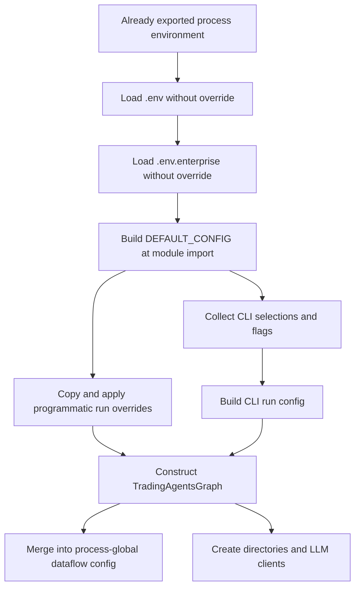

# Конфигурация, установка и запуск в контейнерах

В TradingAgents нет единого рекурсивного загрузчика настроек. Импорт пакета загружает dotenv в окружение процесса; модуль `default_config` строит `DEFAULT_CONFIG`; вызывающий код или CLI формирует конфигурацию запуска; граф передаёт её в отдельное глобальное хранилище настроек dataflow. Порядок применения и границы изменяемости этих объектов важны не меньше самих значений.

## Поток конфигурации



Схема разделяет загрузку окружения, формирование настроек и инициализацию графа: это несколько стадий, а не одно слияние.

## Приоритеты по слоям

### Dotenv при импорте

Импорт `tradingagents` ищет `.env`, затем `.env.enterprise`, поднимаясь от **текущего рабочего каталога**, а не от каталога установленного пакета. Оба файла загружаются без замены уже существующих переменных. Приоритет от высокого к низкому:

1. Окружение, экспортированное оболочкой или переданное контейнеру.
2. `.env`.
3. `.env.enterprise`.

Таким образом, `.env.enterprise` дополняет `.env`, но не перекрывает его. Compose через `env_file: .env` передаёт значения до запуска Python; наличие самого файла внутри образа для этого не требуется.

Загрузка — побочный эффект импорта и обычно выполняется один раз за жизнь интерпретатора. Изменение файла после импорта не пересобирает `DEFAULT_CONFIG`: для обычной эксплуатации перезапускайте процесс. В тестах допускается контролируемая перезагрузка модуля. Без `python-dotenv` загрузка молча пропускается, хотя при штатной установке это обязательная зависимость. Основание: [инициализация пакета](repo://tradingagents/__init__.py#L4-L17).

### Значения по умолчанию и типизированные переменные

В текущем исходном коде `DEFAULT_CONFIG` использует `llm_provider="openai"`, `deep_think_llm="gpt-5.6"`, `quick_think_llm="gpt-5.6-luna"`. `backend_url=None` оставляет выбор адреса клиенту провайдера. Число раундов дебатов и обсуждения риска — по одному, `checkpoint_enabled=False`, язык отчётов — `English`, `max_recur_limit=100`. Закомментированные модели в `.env.example` — примеры, а не актуальный источник значений по умолчанию.

Модуль применяет явное отображение `_ENV_OVERRIDES` при построении словаря:

| Переменная окружения | Ключ конфигурации | Преобразование |
|---|---|---|
| `TRADINGAGENTS_LLM_PROVIDER` | `llm_provider` | строка |
| `TRADINGAGENTS_DEEP_THINK_LLM` | `deep_think_llm` | строка |
| `TRADINGAGENTS_QUICK_THINK_LLM` | `quick_think_llm` | строка |
| `TRADINGAGENTS_LLM_BACKEND_URL` | `backend_url` | строка |
| `TRADINGAGENTS_OUTPUT_LANGUAGE` | `output_language` | строка |
| `TRADINGAGENTS_MAX_DEBATE_ROUNDS` | `max_debate_rounds` | `int` при импорте |
| `TRADINGAGENTS_MAX_RISK_ROUNDS` | `max_risk_discuss_rounds` | `int` при импорте |
| `TRADINGAGENTS_CHECKPOINT_ENABLED` | `checkpoint_enabled` | `bool` при импорте |
| `TRADINGAGENTS_BENCHMARK_TICKER` | `benchmark_ticker` | строка |
| `TRADINGAGENTS_TEMPERATURE` | `temperature` | строка при импорте, затем `float()` в графе |
| `TRADINGAGENTS_LLM_MAX_RETRIES` | `llm_max_retries` | строка при импорте, затем проверка в графе |
| `TRADINGAGENTS_MAX_TOKENS` | `max_tokens` | строка при импорте, затем проверка в графе |
| `TRADINGAGENTS_GOOGLE_THINKING_LEVEL` | `google_thinking_level` | строка |
| `TRADINGAGENTS_OPENAI_REASONING_EFFORT` | `openai_reasoning_effort` | строка |
| `TRADINGAGENTS_ANTHROPIC_EFFORT` | `anthropic_effort` | строка |

Тип преобразования определяется типом встроенного значения: `bool`, `int`, `float`, иначе строка. В частности, `None` не означает автоматическое распознавание числа. Для булевых значений принимаются `true`, `1`, `yes`, `on`, `false`, `0`, `no`, `off` без учёта регистра и с удалением крайних пробелов. Ошибочное значение для типизированного поля вызывает `ValueError` с именем переменной уже при импорте. Пустые строки в отображении пропускаются, неизвестные имена `TRADINGAGENTS_*` не создают новые ключи.

Пути `TRADINGAGENTS_RESULTS_DIR`, `TRADINGAGENTS_CACHE_DIR`, `TRADINGAGENTS_MEMORY_LOG_PATH` читаются отдельно через `os.getenv`. Их пустые значения **не** отфильтровываются и могут вызвать ошибку файловой системы. Чтобы использовать стандартный путь, удалите переменную, а не задавайте пустую строку. Основание: [реализация defaults](repo://tradingagents/default_config.py#L10-L118).

### Программная конфигурация

Для независимого запуска начинайте с полной глубокой копии:

```python
from copy import deepcopy

from tradingagents.default_config import DEFAULT_CONFIG
from tradingagents.graph.trading_graph import TradingAgentsGraph

config = deepcopy(DEFAULT_CONFIG)
config["llm_provider"] = "anthropic"
config["deep_think_llm"] = "claude-sonnet-5"
config["quick_think_llm"] = "claude-sonnet-5"
config["data_vendors"]["core_stock_apis"] = "alpha_vantage"

ta = TradingAgentsGraph(config=config)
```

Модели в примере следует выбирать в соответствии с доступом вашей учётной записи. Граф использует `config or DEFAULT_CONFIG`: непустой словарь заменяет defaults целиком, без дополнения пропущенных ключей; `None` и `{}` выбирают defaults. Неполный непустой словарь может привести к `KeyError` для каталогов, провайдера или моделей.

`DEFAULT_CONFIG.copy()`, используемый в CLI и примере `main.py`, копирует только верхний уровень. Вложенные `data_vendors`, `tool_vendors`, `benchmark_map` и список `global_news_queries` остаются общими. Их изменение на месте меняет значения, видимые последующим запускам в том же процессе. Используйте `deepcopy` либо заменяйте вложенный объект целиком. Это не следует путать с глубоким копированием на границе dataflow.

### CLI: пропуск вопросов и приоритет флагов

CLI собирает выбор пользователя, затем `_build_run_config` начинает с `DEFAULT_CONFIG.copy()`. Правила зависят от поля:

- Непустая `TRADINGAGENTS_OUTPUT_LANGUAGE` пропускает вопрос о языке.
- Только **обе** переменные числа раундов вместе пропускают вопрос о глубине исследования. При сборке конфигурации каждая переменная независимо защищает своё значение: если задана одна, интерактивная глубина заполняет другую.
- `TRADINGAGENTS_LLM_PROVIDER` пропускает выбор провайдера, но не вызов `ensure_api_key`.
- URL выбирается в порядке: `TRADINGAGENTS_LLM_BACKEND_URL` → интерактивный или региональный адрес → адрес провайдера по умолчанию. Явный URL выигрывает и при интерактивном выборе провайдера.
- Если задана хотя бы одна переменная модели, пропускаются **оба** вопроса о моделях; обе модели берутся из `DEFAULT_CONFIG`. Поэтому при смене провайдера безопаснее задавать обе модели, иначе незаданная сторона может остаться моделью OpenAI.
- Переменная thinking/effort пропускает соответствующий вопрос. Если сам провайдер выбран через окружение, все его вопросы reasoning пропускаются и используются значения defaults, включая `None`.
- Без `--checkpoint/--no-checkpoint` сохраняется настройка окружения или встроенное значение. Явный флаг имеет приоритет над обоими.
- `--clear-checkpoints` — действие, а не переопределение: удаляет сохранённые checkpoints в `DEFAULT_CONFIG["data_cache_dir"]`, после чего запускает анализ.

Тикер, дата и выбор аналитиков остаются интерактивными. Переменные уменьшают число вопросов, но не превращают CLI в пакетную команду без терминала. Не меняйте окружение между импортом и выбором CLI: проверка наличия переменной выполняется в момент вопроса, а её значение берётся из уже построенного `DEFAULT_CONFIG`. См. [CLI](repo://cli/main.py#L576-L741), [сборку настроек](repo://cli/main.py#L974-L1001) и [точки входа анализа](../workflows/analysis-entrypoints.md).

## Управление LLM и ошибки инициализации

`google_thinking_level`, `openai_reasoning_effort`, `anthropic_effort` по умолчанию равны `None`. Граф передаёт непустое значение только соответствующему провайдеру: `google` получает `thinking_level`, `openai` — `reasoning_effort`, `anthropic` — `effort`. Это не универсальная настройка всех OpenAI-compatible сервисов. Конкретная поддержка режима зависит от модели и клиента; см. [провайдеры LLM](../integrations/llm-providers.md).

Общие параметры передаются обоим клиентам — deep и quick:

| Параметр | Поведение |
|---|---|
| `temperature` | При заданном непустом значении граф вызывает `float()`. `None` сохраняет поведение провайдера; настройка не гарантирует побитовую воспроизводимость ответа. |
| `llm_max_retries` | Передаётся как `max_retries`, только если задан. После `int()` результат должен быть `>= 0`; булевы значения запрещены. При отсутствии настройки остаётся бюджет повторов SDK. |
| `max_tokens` | Ограничение выходных токенов. После `int()` результат должен быть `> 0`; булевы значения запрещены. Для Google передаётся как `max_output_tokens`, для остальных — `max_tokens`. `None` не задаёт ограничение от графа. |

Ошибки преобразования вызывают `ValueError` до выполнения workflow. Строки `"1.5"` для retries и tokens не допускаются. **Оговорка для Python API:** реализация использует `int(value)`, поэтому числовой `float` может быть усечён, а не отвергнут как дробный. Передавайте настоящие целые числа; это не строгая проверка исходного типа.

Лимит токенов полезен для моделей и шлюзов с чрезмерным reasoning/output, приводящим к зависанию или idle timeout; бюджет повторов — для кратковременного throttling, например 429. Это разные ограничения и не замена проверке доступности сервиса. Основание: [преобразования](repo://tradingagents/graph/trading_graph.py#L48-L76), [передача параметров](repo://tradingagents/graph/trading_graph.py#L168-L208).

Единого прохода валидации нет. Неизвестный провайдер вызывает `ValueError` в фабрике клиентов. Неизвестное имя модели у строгих провайдеров обычно даёт предупреждение, а не запрет запуска; Ollama и OpenRouter принимают произвольные идентификаторы. Отсутствующие права на каталоги проявляются при создании каталогов, а отсутствие внешних credentials может проявиться позже, при обращении к API. Успешный импорт сам по себе не доказывает готовность запуска.

## Поставщики данных и глобальное состояние

Точная стандартная конфигурация категорий:

```python
"data_vendors": {
    "core_stock_apis": "yfinance",
    "technical_indicators": "yfinance",
    "fundamental_data": "yfinance",
    "news_data": "yfinance",
    "macro_data": "fred",
    "prediction_markets": "polymarket",
},
"tool_vendors": {},
```

`tool_vendors` переопределяет отдельный инструмент поверх категории. Строка поставщиков задаёт **точную цепочку**: `"yfinance,alpha_vantage"` означает упорядоченный fallback, а `"default"` делегирует выбор всем доступным поставщикам. Неявного перехода к невыбранному поставщику нет. Настройки категорий и инструментов изменяются программно; они не являются произвольными автоматически распознаваемыми переменными окружения. См. [рыночные данные](../integrations/market-data.md).

При создании графа `set_config(self.config)` обновляет **глобальную для процесса** конфигурацию dataflow ещё до создания каталогов и клиентов LLM. `set_config` глубоко копирует вход, объединяет словари верхнего уровня на один уровень вглубь, а скалярные значения заменяет. `get_config()` возвращает глубокую копию.

Следствия:

1. Частичное обновление `data_vendors` сохраняет остальные категории, последовательные обновления `tool_vendors` накапливаются.
2. Это не рекурсивное слияние произвольной глубины: вложенный словарь следующего уровня заменяется.
3. Отсутствующие ключи не удаляются. Даже повторное применение defaults с `tool_vendors={}` не очищает накопленные tool overrides.
4. Последний граф, изменивший общую конфигурацию, влияет на последующие маршрутизируемые вызовы других графов. Независимые конфигурации нельзя безопасно изолировать одними экземплярами графа в одном процессе.

Для многопользовательской службы предпочтительны отдельные процессы или явная граница полного сброса. Тесты сбрасывают приватный `_config` глубокой копией defaults до и после каждого случая, поскольку публичное слияние не обеспечивает очистку. Основание: [dataflow config](repo://tradingagents/dataflows/config.py), [инициализация графа](repo://tradingagents/graph/trading_graph.py#L97-L131), [изоляция тестов](repo://tests/conftest.py#L40-L56).

## Credentials и endpoints

### LLM

Используйте только ключи нужного провайдера. Шаблон `.env.example` перечисляет `OPENAI_API_KEY`, `GOOGLE_API_KEY`, `ANTHROPIC_API_KEY`, `XAI_API_KEY`, `DEEPSEEK_API_KEY`, `DASHSCOPE_API_KEY`, `DASHSCOPE_CN_API_KEY`, `ZHIPU_API_KEY`, `ZHIPU_CN_API_KEY`, `MINIMAX_API_KEY`, `MINIMAX_CN_API_KEY`, `OPENROUTER_API_KEY`, `MISTRAL_API_KEY`, `MOONSHOT_API_KEY`, `GROQ_API_KEY`, `NVIDIA_API_KEY`. Не публикуйте заполненные файлы и не вставляйте ключи в команды или отчёты.

CLI использует каноническое отображение провайдера на переменную ключа. Если обязательного ключа нет, `ensure_api_key` запрашивает его скрытым вводом, сохраняет в ближайшем `.env` от рабочего каталога (либо создаёт `./.env`) и добавляет в окружение процесса. Отмена разрешена: CLI предупреждает о будущих ошибках API. Это предварительная проверка CLI, а не гарантия программного API.

Особые случаи:

- `openai_compatible`: ключ `OPENAI_COMPATIBLE_API_KEY` необязателен и не запрашивается принудительно. Укажите свой endpoint через `backend_url` или `TRADINGAGENTS_LLM_BACKEND_URL`. Интерактивный запрос URL требует `http://` или `https://` и завершает работу при отмене; не рассчитывайте, что этот вопрос валидирует все программно или через окружение переданные адреса.
- Ollama не требует ключа; `OLLAMA_BASE_URL` меняет стандартный `http://localhost:11434/v1`.
- Azure: `AZURE_OPENAI_API_KEY`, `AZURE_OPENAI_ENDPOINT`, обычно `AZURE_OPENAI_DEPLOYMENT_NAME`; `OPENAI_API_VERSION` — для требований API, отличного от v1. Шаблон — `.env.enterprise.example`; при совпадении имён `.env` имеет приоритет.
- Bedrock требует `pip install "tradingagents[bedrock]"` либо `pip install ".[bedrock]"` из исходников. Используется `AWS_BEARER_TOKEN_BEDROCK` или стандартная цепочка AWS credentials, включая профиль/IAM role. Явный bearer token имеет приоритет над ambient credentials. Регион: `AWS_REGION` → `AWS_DEFAULT_REGION` → `us-west-2`. Без extra ошибка импорта возникает при создании соответствующего клиента.

### Рыночные данные

Alpha Vantage читает `ALPHA_VANTAGE_API_KEY`, FRED — `FRED_API_KEY`. Это независимые от LLM credentials; их наличие проверяется лениво при вызове поставщика, с ошибкой «поставщик не настроен» при отсутствии ключа. Стандартный stock-путь через yfinance ключа не требует, macro-путь через FRED потребует его при фактическом запросе.

**Не включайте секреты в образ.** Текущий `.dockerignore` исключает `.env`, но не `.env.enterprise`. Dockerfile копирует build context, поэтому перед сборкой удалите секретные файлы из контекста либо обеспечьте их исключение в вашей сборке; enterprise credentials передавайте во время запуска. Compose по умолчанию инжектирует только `.env`, не `.env.enterprise`.

## Рабочие каталоги и сохранность состояния

По умолчанию состояние хранится в домашнем каталоге пользователя:

| Ключ | Путь по умолчанию | Переменная |
|---|---|---|
| `results_dir` | `~/.tradingagents/logs` | `TRADINGAGENTS_RESULTS_DIR` |
| `data_cache_dir` | `~/.tradingagents/cache` | `TRADINGAGENTS_CACHE_DIR` |
| `memory_log_path` | `~/.tradingagents/memory/trading_memory.md` | `TRADINGAGENTS_MEMORY_LOG_PATH` |

Граф создаёт каталоги результатов и кэша; инициализация памяти создаёт родительский каталог журнала памяти. CLI записывает результаты анализа в:

```text
<results_dir>/<ticker>/<analysis-date>/
├── message_tool.log
└── reports/
    └── <report-section>.md
```

Отдельный финальный вопрос предлагает экспорт в `./reports/<ticker>_<timestamp>` относительно рабочего каталога. Это **не** `results_dir`: в стандартном контейнере такой экспорт лежит вне постоянного тома. Выберите путь внутри смонтированного каталога или отдельно сохраните экспорт. Кэш, checkpoints и журнал межзапусковой памяти описаны в [сохранении и восстановлении](persistence-and-recovery.md).

## Установка и локальный запуск

В `pyproject.toml` текущая версия пакета — **0.4.0**, заявленный диапазон Python — **>=3.10**, без верхней границы. Сборка использует setuptools, включает `tradingagents*`, `cli*` и `cli/static/*`. Консольная точка входа:

```text
tradingagents = "cli.main:app"
```

Из корня выбранной ревизии репозитория, например в POSIX-оболочке:

```bash
python -m venv .venv
. .venv/bin/activate
pip install .
cp .env.example .env
tradingagents
```

Перед запуском заполните необходимые credentials и настройки в `.env`. Для Bedrock установите extra; основная установка его не включает. Более короткий сценарий см. в [быстром старте](../quickstart.md).

Для воспроизводимого окружения фиксируйте ревизию, версию Python и разрешённые версии зависимостей отдельно: `pyproject.toml` преимущественно задаёт нижние границы, а `pip install .` не является установкой из lockfile. Сохраняйте эффективные параметры запуска без секретов; одинаковые параметры не гарантируют одинаковые ответы удалённой LLM.

## Docker и Compose

Dockerfile использует **Python 3.12 slim**, что является выбором образа, а не минимальной версией пакета. В builder создаётся `/opt/venv` и выполняется `pip install --no-cache-dir .`; runtime получает это окружение, работает как непривилегированный `appuser`, имеет рабочий каталог `/home/appuser/app` и `ENTRYPOINT ["tradingagents"]`. Стандартный образ не устанавливает optional extras: для Bedrock нужна соответствующая установка при сборке.

### Обычный интерактивный контейнер

```bash
cp .env.example .env
docker compose run --rm tradingagents
```

Сначала заполните `.env`. Сервис включает `tty: true` и `stdin_open: true`; запускайте его из настоящего терминала, не как headless-службу через закрытый stdin. На Windows отсутствие console buffer перехватывается CLI с пояснением и кодом выхода 1.

Том `tradingagents_data` смонтирован в `/home/appuser/.tradingagents` и сохраняет логи, кэш, checkpoints и память между удаляемыми контейнерами. Если переопределить пути за пределы тома, добавьте соответствующие mounts и обеспечьте запись для `appuser`. Созданный интерактивно `.env` в рабочем каталоге также не следует считать сохранённым этим томом.

### Профиль Ollama

Профиль `ollama` добавляет сервис `ollama/ollama:latest` с томом `ollama_data:/root/.ollama` и сервис `tradingagents-ollama`. Последний принудительно задаёт `TRADINGAGENTS_LLM_PROVIDER=ollama`, `OLLAMA_BASE_URL=http://ollama:11434/v1`, зависит от Ollama и использует общий том TradingAgents.

Подготовьте сервер и загрузите выбранную модель; ниже `llama3.1:8b` — пример, замените его нужным доступным идентификатором:

```bash
docker compose --profile ollama up -d ollama
docker compose --profile ollama exec ollama ollama pull llama3.1:8b
```

Задайте **обе** модели в `.env`:

```dotenv
TRADINGAGENTS_DEEP_THINK_LLM=llama3.1:8b
TRADINGAGENTS_QUICK_THINK_LLM=llama3.1:8b
```

Удалите конфликтующий `TRADINGAGENTS_LLM_BACKEND_URL` из `.env`, либо установите `http://ollama:11434/v1`: явный backend URL имеет приоритет над адресом Ollama. Затем:

```bash
docker compose --profile ollama run --rm tradingagents-ollama
```

Compose не загружает модели автоматически и не задаёт healthcheck готовности Ollama; наличие `depends_on` не заменяет ожидание работающего сервера. Доступность и выбор модели остаются ответственностью оператора. Для фиксированной сборки закрепляйте также версии или digest образов: `ollama:latest` и `python:3.12-slim` сами по себе не фиксируют содержимое навсегда.

## Проверка перед эксплуатацией и регрессионные тесты

Проверяйте конфигурацию в свежем процессе, права записи в каталоги, наличие выбранных моделей и доступность нужных интеграций. Создание графа проверяет часть настроек, но не все лениво вызываемые источники данных; полезен отдельный пробный запрос к каждому реально используемому провайдеру. Помните, что даже неудачная инициализация графа могла уже изменить глобальный dataflow config.

Основные тесты контракта:

- `tests/test_env_overrides.py`: defaults, преобразования, пустые и неизвестные переменные, явные ошибки импорта.
- `tests/test_cli_env_skip.py`: пропуск вопросов, endpoints и reasoning при сохранении API-key preflight.
- `tests/test_cli_config_precedence.py`: независимый приоритет чисел раундов и трёхсостоянийный checkpoint-флаг.
- `tests/test_dataflows_config.py` и `tests/conftest.py`: глубокое копирование, одноуровневое слияние и полный сброс глобального состояния.
- `tests/test_temperature_config.py`, `tests/test_llm_max_retries.py`, `tests/test_llm_max_tokens.py`: позднее преобразование, отсутствие аргумента при `None`, передача параметров и неверные значения; для Google отдельно проверяется `max_output_tokens`.
- `tests/test_model_validation.py`: предупреждение о неизвестных моделях и произвольные имена для гибких провайдеров.

При расширении настроек добавляйте env-отображение через `_ENV_OVERRIDES`, отдельно решайте, должен ли CLI пропускать вопрос, и покрывайте приоритет тестом. Сохраняйте изоляцию копий на границе dataflow и не предполагайте одинаковые правила для всех полей.
