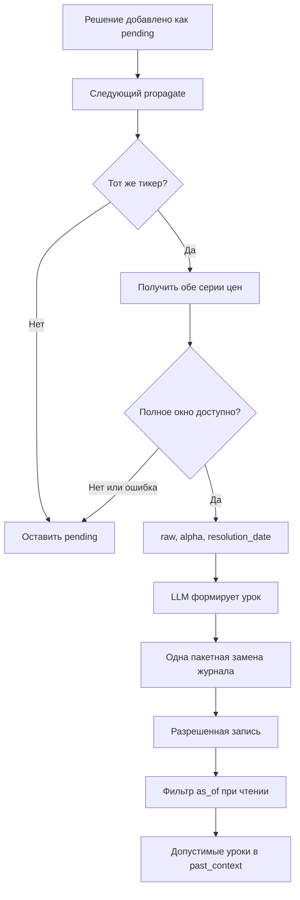
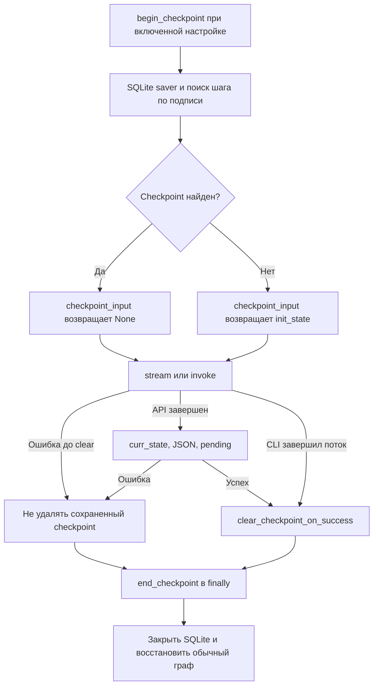

# Сохранение и восстановление

В TradingAgents нужно различать **долговременную память решений**, **контрольные точки выполнения** и **выходные артефакты**. Память переносит уроки между анализами, SQLite позволяет продолжить прерванный граф, а JSON и отчеты сохраняют результаты для просмотра и обработки. JSON и Markdown не служат входом для resume. Успешная очистка checkpoint удаляет строки конкретного запуска, а не всю базу тикера.

Важная граница: **CLI использует общий механизм checkpoint, но не вызывает `propagate`**. Поэтому автоматические разрешение исходов, чтение памяти в `past_context`, запись нового решения и JSON-снимка относятся к программному пути `propagate`, а не к CLI. CLI сохраняет собственные промежуточные отчеты и журнал сообщений; явный экспорт дерева отчетов доступен обоим путям.

См. также [контракты состояния и результатов](../concepts/state-and-output-contracts.md), [точки входа анализа](../workflows/analysis-entrypoints.md) и [конфигурацию и развертывание](configuration-and-deployment.md).

## Карта хранилищ и владельцев

| Артефакт | Путь | Владелец и жизненный цикл |
|---|---|---|
| Память решений Markdown | `memory_log_path`, по умолчанию `~/.tradingagents/memory/trading_memory.md` | `TradingMemoryLog`, вызываемый из `propagate` / `_run_graph`; переживает успешный запуск, ожидающие исхода записи остаются до следующего анализа того же тикера |
| База checkpoint | `<data_cache_dir>/checkpoints/<SAFE_TICKER_UPPER>.db` | `SqliteSaver` через `begin_checkpoint`; общий механизм API и CLI, очистка по `thread_id` после соответствующей точки успеха |
| JSON-снимок | `<results_dir>/<SAFE_TICKER>/TradingAgentsStrategy_logs/full_states_log_<trade_date>.json` | `TradingAgentsGraph._log_state`, автоматически только в пути `_run_graph` |
| Промежуточные отчеты CLI | `<results_dir>/<ticker>/<analysis_date>/reports/<section_name>.md` | Декоратор `message_buffer.update_report_section` в `run_analysis`; непустые разделы перезаписываются по мере поступления |
| Сообщения и вызовы инструментов CLI | `<results_dir>/<ticker>/<analysis_date>/message_tool.log` | Декораторы `add_message` / `add_tool_call`; дописывание, включая начальные сообщения до запуска графа |
| Явный экспорт API | `<results_dir>/reports/<SAFE_TICKER>_<YYYYMMDD_HHMMSS>/...` либо переданный `save_path` | `TradingAgentsGraph.save_reports` → `write_report_tree`; отдельный вызов, не часть `propagate` |
| Явный экспорт CLI | Выбранный пользователем путь, предлагается `<cwd>/reports/<ticker>_<YYYYMMDD_HHMMSS>` | После анализа и вопроса `Save report?`, через `save_report_to_disk` → `write_report_tree` |

По умолчанию `results_dir` расположен в `~/.tradingagents/logs`, `data_cache_dir` — в `~/.tradingagents/cache`; `checkpoint_enabled=False`, ротация памяти выключена (`memory_log_max_entries=None`). Это отдельные настройки: включение checkpoint не включает побочные эффекты API в CLI.

Основание: [владение в API](repo://tradingagents/graph/trading_graph.py#L409-L621), [запись CLI](repo://cli/main.py#L1033-L1079), [экспорт CLI](repo://cli/main.py#L1277-L1296), [значения по умолчанию](repo://tradingagents/default_config.py#L72-L111).

## Память решений: от pending до урока

### Добавление решения

После выполнения графа `_run_graph` устанавливает `curr_state`, записывает JSON и затем вызывает `store_decision`. Этот вызов не обращается к LLM: рейтинг извлекается через `parse_rating`, а `final_trade_decision` сохраняется дословно.

```text
[2026-01-10 | NVDA | Buy | pending]

DECISION:
<final_trade_decision>

<!-- ENTRY_END -->
```

Разделитель `<!-- ENTRY_END -->` отделяет записи независимо от обычных Markdown-разделителей `---` внутри решения. Без настроенного `memory_log_path` операции памяти ничего не записывают и чтение возвращает пустую историю. При наличии пути инициализация раскрывает `~` и создает родительский каталог.

Защита от повторов — последовательный просмотр строк: если уже есть pending с **точным** `(trade_date, ticker)`, повторное добавление пропускается. Это не глобальная уникальность ключа: после разрешения исхода повторный анализ того же тикера и даты может создать новую pending-запись. Нет блокировки между проверкой и append, поэтому конкурентные писатели могут создать дубликаты. [Реализация добавления](repo://tradingagents/agents/utils/memory.py#L12-L68).

### Отложенное разрешение и полное окно удержания

В начале `propagate`, еще **до открытия checkpoint scope**, `_resolve_pending_entries` выбирает только pending-записи с точным совпадением тикера. Записи других тикеров ждут отдельного запуска для них. Для выбранного тикера один раз определяется benchmark, затем для каждой записи выполняются получение доходности и генерация урока. Все собранные обновления применяются одним `batch_update_with_outcomes` до нового графа.

`_fetch_returns` по умолчанию использует `holding_days=5`:

1. Запрашивает обе истории напрямую через `yfinance.Ticker(...).history` от `trade_date` до `trade_date + holding_days + 7` календарных дней. Дополнительные семь дней — буфер, а не гарантия покрытия всех праздников.
2. Требует **более `holding_days` строк в каждой серии**: для пяти интервалов нужно минимум шесть наблюдений. Неполное окно нельзя заменять более короткой доходностью.
3. Вычисляет `raw = (stock.Close.iloc[holding_days] - stock.Close.iloc[0]) / stock.Close.iloc[0]`; аналогично доходность benchmark и `alpha = raw - benchmark_return`.
4. Возвращает `resolution_date = stock.index[holding_days].strftime("%Y-%m-%d")` вместе с доходностями и длиной окна.

Это позиционный расчет по двум сериям, **без объединения по общему календарю**. `resolution_date` берется из последнего использованного бара инструмента, не из максимума дат двух серий и не из времени записи урока. Недостаток строк или исключение при получении/расчете возвращает четыре `None`; исход остается pending. Ошибка получения данных журналируется и не останавливает новый анализ.


*Жизненный цикл памяти в программном пути: запись остается ожидающей до полного окна, а разрешенный исход проходит временной фильтр перед использованием.*

В отличие от получения цен, ошибки `Reflector` и файловых операций здесь не перехватываются. Если один вызов LLM прерывает цикл, пакетная запись еще не выполнена, даже если предыдущие уроки уже вычислены. Если batch успешно записан, последующая ошибка нового анализа не откатывает эти уроки. [Разрешение исходов](repo://tradingagents/graph/trading_graph.py#L278-L370).

### Benchmark и нормализация символа

Непустой `benchmark_ticker` имеет приоритет для всех инструментов. Иначе `_resolve_benchmark` сравнивает суффиксы без учета регистра и возвращает первое совпадение из `benchmark_map`. Резерв — запись с пустым суффиксом, а при ее отсутствии `SPY`; так обрабатывается и неизвестный суффикс, например `BRK.B`.

Стандартная карта: `.NS` → `^NSEI`, `.BO` → `^BSESN`, `.T` → `^N225`, `.HK` → `^HSI`, `.L` → `^FTSE`, `.TO` → `^GSPTSE`, `.AX` → `^AXJO`, `.SS` → `000001.SS`, `.SZ` → `399001.SZ`, пустой суффикс → `SPY`.

Перед запросом доходности **инструмент** проходит `normalize_symbol`, например `XAUUSD` → `GC=F`; benchmark передается как уже канонический Yahoo-символ. Это не нормализация ключей Markdown-памяти. Выбранный benchmark используется и для alpha, и в строке `Alpha vs ...` запроса рефлексии. Этот расчет обращается к yfinance напрямую, а не к цепочке `data_vendors`; см. [рыночные данные](../integrations/market-data.md).

`Reflector.reflect_on_final_decision` получает итоговое решение, raw, alpha и имя benchmark. Запрос просит 2–4 предложения о верности направления, подтверждении или провале тезиса и конкретном уроке. Ответ `quick_thinking_llm` сохраняется без дополнительной проверки формата. [Benchmark и получение цен](repo://tradingagents/graph/trading_graph.py#L257-L329), [запрос рефлексии](repo://tradingagents/graph/reflection.py#L14-L57).

### resolution_date и историческая видимость

Новый разрешенный тег может содержать седьмое поле:

```text
[2026-01-05 | NVDA | Buy | +5.0% | +2.0% | 5d | resolved:2026-01-12]
```

`resolution_date` передается через batch в `resolved:...`, а парсер возвращает его как `entry["resolved"]`. Если дата не передана, сохраняется совместимый старый шестиполевой тег.

`get_past_context(ticker, as_of=...)` сначала исключает pending. При заданном `as_of` остаются только записи с непустым `resolved <= as_of`, **включая cross-ticker уроки**. Дата самого решения недостаточна: исход мог стать известен позже. Старые записи без `resolved` консервативно исключаются из исторического запроса, поскольку их доступность на ту дату нельзя доказать.

`_memory_as_of` сравнивает строку даты анализа с локальной сегодняшней датой в формате `YYYY-MM-DD`: для прошедшего дня возвращает дату анализа, для сегодняшнего или будущего — `None`. С `as_of=None` временная фильтрация отключена, и старые разрешенные записи доступны как раньше.

Это **фильтр чтения**, не запрет разрешать будущие относительно backtest исходы в общем журнале: `_resolve_pending_entries` не получает `as_of` и может записать такой исход, после чего исторический контекст его отфильтрует. На resume подготовленное начальное состояние вообще не передается графу: `checkpoint_input` возвращает `None`, поэтому новый `past_context` не подменяет сохраненное состояние. Не следует трактовать этот фильтр как полную гарантию исторической корректности всех данных или произвольных старых checkpoint.

После фильтрации записи обходятся в обратном порядке файла, а не сортируются по датам. По умолчанию выбираются пять того же тикера с полным решением и рефлексией и три других тикеров с кратким контекстом урока. Если cross-ticker рефлексия пуста, используется до 300 символов решения. `_run_graph` помещает результат в начальное `past_context`, а Portfolio Manager включает раздел уроков только при непустом значении. [Чтение и теги](repo://tradingagents/agents/utils/memory.py#L70-L107), [форматирование](repo://tradingagents/agents/utils/memory.py#L233-L334), [интеграция](repo://tradingagents/graph/trading_graph.py#L384-L393), [ввод графа](repo://tradingagents/graph/trading_graph.py#L514-L540).

### Замена журнала, ротация и конкуренция

`update_with_outcome` и `batch_update_with_outcomes` перестраивают весь журнал в памяти, записывают соседний файл через `with_suffix(".tmp")` и устанавливают его через `Path.replace`. При повторной записи старый `.tmp` перезаписывается; после успешной замены он исчезает. Это атомарная установка одного файла, **не транзакция** с LLM, JSON или SQLite и не обещание устойчивости к потере питания с `fsync`.

Ротация применяется во время обновления исходов, не во время append. `memory_log_max_entries` ограничивает число блоков, распознанных как разрешенные; `None`, ноль и отрицательные значения выключают лимит. Удаляются первые такие блоки в порядке файла. Pending и блоки, не распознанные как разрешенные, сохраняются; число ожидающих записей остается неограниченным.

Фиксированный временный путь и отсутствие файловой блокировки не позволяют безопасно координировать несколько писателей. Для общего `memory_log_path` нужна внешняя сериализация записей. Атомарная замена предотвращает публикацию частично переписанного основного файла, но не потерю обновлений при гонке. [Запись и ротация](repo://tradingagents/agents/utils/memory.py#L111-L283).

## Контрольные точки и восстановление графа

### Разделение баз и идентичность запуска

`_db_path` проверяет тикер через `safe_ticker_component`, переводит в верхний регистр и создает путь под `checkpoints`. Разные тикеры получают разные SQLite-файлы; это уменьшает общую конкуренцию, но не дает обещания безопасного параллельного выполнения одного запуска.

`thread_id` — первые 16 шестнадцатеричных символов SHA-256 строки:

```text
<TICKER_UPPER>:<date>:<graph_signature>
```

При пустой подписи последний разделитель и подпись опускаются, сохраняя старую идентичность для прямых вызовов helper. `_run_signature(asset_type)` включает упорядоченный список `selected_analysts`, `max_debate_rounds`, `max_risk_discuss_rounds` и `asset_type`. Изменение этих параметров создает другой поток, не затрагивая старый checkpoint. Подпись не является хешем всего кода, модели или конфигурации: новый параметр, влияющий на совместимость графа, нужно явно включать в нее. [Идентификаторы](repo://tradingagents/graph/checkpointer.py#L19-L38), [подпись графа](repo://tradingagents/graph/trading_graph.py#L395-L407).

### Общий begin / resume / clear / end

`begin_checkpoint` сбрасывает `_resuming`; при выключенной настройке возвращает `None` без перекомпиляции. При включенной открывает `get_checkpointer`, компилирует workflow с `SqliteSaver`, проверяет `checkpoint_step` для подписи и сообщает в лог о новом запуске или найденном шаге. Возвращенный идентификатор оба caller передают в `config.configurable.thread_id`.

`checkpoint_input(init_state)` возвращает начальное состояние для нового запуска и **`None` для resume**. Повторная передача начальных сообщений при продолжении добавила бы их через reducer вместо чистого продолжения.


*Общий жизненный цикл checkpoint после успешного begin: API очищает поток после своих записей, CLI — после обработки потока; ошибки до очистки ее пропускают.*

`end_checkpoint` закрывает контекст SQLite, обнуляет ссылку на него, компилирует обычный граф и сбрасывает `_resuming`. `checkpoint_scope` оборачивает `begin_checkpoint` и выполнение в `try/finally`; CLI вызывает begin вручную, а `finally` охватывает поток и очистку. Поэтому **CLI begin и добавление thread ID расположены до защищенного блока**: нельзя обещать одинаковый teardown при любой ошибке инициализации в обоих caller. Исключения самого закрытия или перекомпиляции также не подавляются. [Общий lifecycle](repo://tradingagents/graph/trading_graph.py#L436-L497), [CLI lifecycle](repo://cli/main.py#L1130-L1253).

### Точный порядок побочных эффектов

**API `propagate`:**

1. Установить `self.ticker`, разрешить старые pending-записи.
2. Войти в `checkpoint_scope` и выполнить begin.
3. Прочитать отфильтрованную память, разрешить идентичность инструмента, собрать начальное состояние и аргументы.
4. Выполнить `invoke` либо debug `stream` через `checkpoint_input`.
5. Установить `curr_state` → записать JSON → добавить pending-решение.
6. Вызвать `clear_checkpoint_on_success` → выполнить `process_signal` и подготовить возвращаемую пару.
7. Выйти через `finally` scope с `end_checkpoint`.

Ошибка JSON или append не достигает очистки, но уже выполненные действия не откатываются. Если ошибка произойдет **после clear**, например при обработке сигнала или teardown, checkpoint уже мог быть удален, хотя caller не получил успешный возврат. Сохранение checkpoint после ошибки записи не доказывает автоматически, что повторное выполнение всех завершающих действий пройдет без дублей или восстановит частичный JSON.

**CLI `run_analysis`:**

1. Создать каталоги, журнал и декораторы записи; начальные сообщения уже попадают на диск.
2. Собрать состояние с `instrument_context`, но без чтения памяти; вызвать begin и передать thread ID.
3. В `try` читать `graph.graph.stream(graph.checkpoint_input(init_agent_state), ...)`, обрабатывать сообщения, обновлять промежуточные отчеты и накапливать `trace`.
4. После нормального завершения цикла вызвать clear; в `finally` — end.
5. Объединить `trace` в `final_state`, обновить статусы, сообщения и окончательные разделы CLI.
6. Предложить отдельный экспорт. Ошибка записи экспортного дерева выводится пользователю, checkpoint к этому моменту уже очищен.

Таким образом, ошибка записи промежуточного раздела внутри цикла пропускает clear, а ошибка окончательных разделов после цикла — уже нет. CLI не выполняет `_log_state`, `store_decision` или `_resolve_pending_entries`, несмотря на наличие объекта `memory_log` в экземпляре графа. [Порядок API](repo://tradingagents/graph/trading_graph.py#L425-L434), [финал API](repo://tradingagents/graph/trading_graph.py#L563-L579), [порядок CLI](repo://cli/main.py#L1113-L1296).

### Очистка и границы гарантий

`clear_checkpoint` удаляет только строки соответствующего `thread_id` из `writes` и `checkpoints`, затем делает commit; другие даты и подписи остаются. `sqlite3.OperationalError` подавляется, поэтому успешный возврат helper сам по себе не является строгим доказательством удаления. При сомнении проверяйте `checkpoint_step` / `has_checkpoint`.

`clear_all_checkpoints` удаляет все `*.db` под каталогом checkpoint; CLI `--clear-checkpoints` вызывает его до анализа. Это широкий административный сброс, не восстановление и не очистка памяти или отчетов. Нельзя считать его координацией активных писателей. [Очистка](repo://tradingagents/graph/checkpointer.py#L73-L98).

Тесты демонстрируют сохранение успешного узла, падение следующего и продолжение через `None`. Они не доказывают транзакционность внешних вызовов узлов, exactly-once побочные эффекты или восстановление после произвольной порчи файлов. Общей транзакции между памятью, JSON, отчетами и checkpoint нет.

## Выходные артефакты и безопасность путей

### JSON состояния

`_log_state` выбирает сериализуемое подмножество состояния: тикер и дату, отчеты аналитиков, истории и решения инвестиционного и риск-дебатов, торговый план, инвестиционный план и итоговое решение. Торговый план записывается под ключом `trader_investment_decision` из `trader_investment_plan`.

Файл открывается непосредственно через `open(..., "w", encoding="utf-8")` и `json.dump(..., indent=4)`. Повторная дата и тикер перезаписывают тот же файл; атомарной временной замены нет. `log_states_dict` индексирован датой, но файл содержит только выбранное состояние текущей даты, не весь накопленный словарь. [JSON writer](repo://tradingagents/graph/trading_graph.py#L581-L621).

### Явный экспорт Markdown

Общий `write_report_tree` создает разделы только для непустого содержимого, плюс `complete_report.md` с тикером и временем формирования:

```text
<save_path>/
├── 1_analysts/
│   ├── market.md
│   ├── sentiment.md
│   ├── news.md
│   └── fundamentals.md
├── 2_research/
│   ├── bull.md
│   ├── bear.md
│   └── manager.md
├── 3_trading/
│   └── trader.md
├── 4_risk/
│   ├── aggressive.md
│   ├── conservative.md
│   └── neutral.md
├── 5_portfolio/
│   └── decision.md
└── complete_report.md
```

`5_portfolio/decision.md` берется из `risk_debate_state.judge_decision`. Writer возвращает путь `complete_report.md`. Запись идет напрямую через `Path.write_text`; существующие записываемые файлы заменяются, но исчезнувшие из нового состояния разделы не удаляются с диска. Предпочтителен новый каталог на каждый экспорт. Это дерево не следует путать с плоскими промежуточными `<section_name>.md` CLI. [Общий writer](repo://tradingagents/reporting.py#L13-L101).

### Граница проверки путей

`safe_ticker_component` применяется при формировании пути checkpoint, JSON и стандартного каталога API-экспорта. Допускаются буквы ASCII, цифры, `.`, `-`, `_`, `^`, `=`, `+`, длина по умолчанию до 32 символов. Пустые и нестроковые значения, пробелы, разделители каталогов, null-байты, слишком длинные и состоящие только из точек строки вызывают `ValueError`. Корректный тикер возвращается без изменения; только checkpoint дополнительно переводит его в верхний регистр.

`write_report_tree` не ограничивает переданный `save_path`; явный путь находится под ответственностью caller. Не переносите гарантию проверки тикера автоматически на произвольные пользовательские каталоги или все интерполяции CLI. Разрешенные корни вывода должны ограничиваться политикой развертывания. [Валидатор](repo://tradingagents/dataflows/utils.py#L9-L42).

## Эксплуатация и проверка изменений

- Включайте восстановление через `checkpoint_enabled`, `TRADINGAGENTS_CHECKPOINT_ENABLED` или CLI `--checkpoint`; явный `--no-checkpoint` отключает его. Для продолжения сохраняйте тикер, дату и подпись графа. Старые несовпадающие потоки занимают место до отдельной очистки.
- Настраивайте `memory_log_path` / `TRADINGAGENTS_MEMORY_LOG_PATH` отдельно и сериализуйте доступ писателей. `memory_log_max_entries` ограничивает только разрешенную историю, не очередь pending.
- При расширении графа пересматривайте `_run_signature`; при добавлении рынка — `benchmark_map` и совместимость benchmark с Yahoo. Полное окно и календарные ограничения нужно проверять отдельно от выбора индекса.
- Для более сильной надежности JSON и отчетов потребуется отдельный протокол записи; атомарность memory rewrite на них не распространяется.

Полезные тесты для [проверки изменений](../testing/change-validation.md):

| Набор | Что действительно проверяется |
|---|---|
| `tests/test_memory_log.py` | Append, pending-дедупликация, разделитель, пакетные обновления, замена `.tmp`, ротация, полное окно доходности, benchmark, сохранение недоступных исходов, контекст Portfolio Manager |
| `tests/test_memory_pointintime.py` | Сохранение/парсинг `resolved`, включительная граница `as_of`, исключение legacy и будущих уроков для своего и других тикеров, отсутствие фильтра для сегодняшней/будущей даты |
| `tests/test_checkpoint_lifecycle.py` | Общий lifecycle в стиле CLI, no-op при отключении, выбор `None` для resume, продолжение после ошибки второго узла и clear после успеха |
| `tests/test_checkpoint_resume.py` | Сохраненный шаг, продолжение через `None`, новый запуск после clear, изоляция дат и подписей, состав `_run_signature` |
| `tests/test_safe_ticker_component.py` | Допустимые рыночные символы и отклонение опасных компонентов пути |
| `tests/test_reporting.py` | Дерево экспорта, содержимое объединенного отчета, явный путь и стандартный каталог API |

Lifecycle-тест использует небольшой граф и воспроизводит способ вызова CLI, а не весь интерактивный `run_analysis`. Порядок ошибок JSON, финального экспорта и инициализации следует оценивать по caller-коду, не расширяя результаты этого теста до недоказанных гарантий восстановления.
