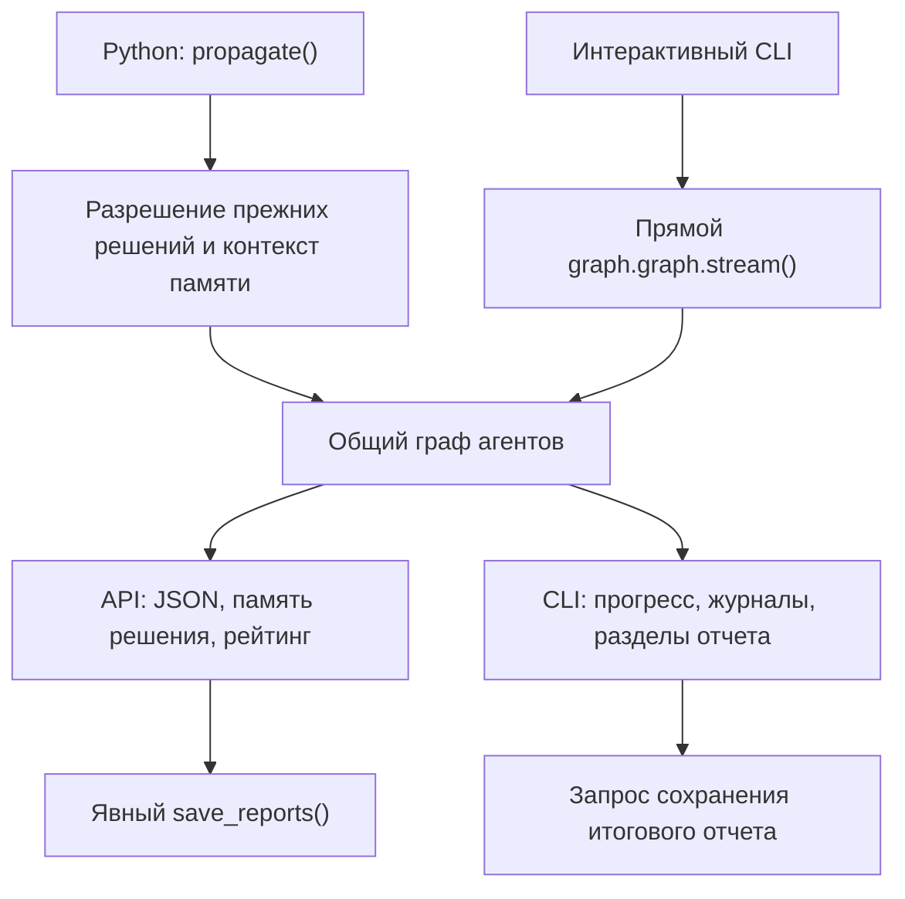

# Быстрый старт и навигация по задачам

TradingAgents — многоагентная система анализа рынка на Python 3.10+ и LangGraph. Основные точки входа — интерактивная команда `tradingagents` и Python API `TradingAgentsGraph.propagate()`. Они используют общий граф, агентов, клиентов LLM и инструменты данных, но не одинаковую обвязку запуска: общие контрольные точки не означают общую память и журналирование.

> TradingAgents — исследовательский инструмент, а не финансовая, инвестиционная или торговая рекомендация. Результаты зависят от моделей, доступности провайдеров и рыночных данных.

## Локальная установка

Клонируйте репозиторий, создайте окружение с Python 3.10 или новее и установите пакет с инструментами разработки:

```bash
git clone https://github.com/TauricResearch/TradingAgents.git
cd TradingAgents
python -m venv .venv
source .venv/bin/activate  # Windows PowerShell: .venv\Scripts\Activate.ps1
pip install -e ".[dev]"
```

Дополнение `dev` содержит pytest и Ruff; для запуска без разработки достаточно `pip install .`. Консольная команда устанавливается как `cli.main:app`. Поддержка AWS Bedrock выделена в отдельное дополнение: `pip install ".[bedrock]"` ([метаданные пакета](repo://pyproject.toml#L5-L49)).

Создайте локальный файл учетных данных:

```bash
cp .env.example .env
```

Укажите ключ выбранного провайдера LLM, например `OPENAI_API_KEY`, `GOOGLE_API_KEY`, `ANTHROPIC_API_KEY`, `XAI_API_KEY` или `DEEPSEEK_API_KEY`. Для источников данных ключи нужны по выбранному маршруту: `ALPHA_VANTAGE_API_KEY` для Alpha Vantage, `FRED_API_KEY` для FRED. Базовые категории цен, индикаторов, фундаментальных данных и новостей используют `yfinance`, макроданные — `fred`, прогнозные рынки — `polymarket`. Не требуется заполнять все ключи из шаблона. Bedrock и локальные серверы имеют отдельные способы настройки — см. [провайдеры LLM](integrations/llm-providers.md).

При импорте пакета поиск `.env`, затем `.env.enterprise` идет вверх от текущего рабочего каталога. Уже экспортированные переменные не перезаписываются. `DEFAULT_CONFIG` применяет известные `TRADINGAGENTS_*` при импорте: задайте их **до запуска процесса или импорта**, а не после создания графа. Ошибки булевых значений и целочисленных настроек с типизированным значением по умолчанию вызывают `ValueError`; необязательные числовые параметры с исходным `None` преобразуются позднее при создании клиентов. Храните файлы ключей локально и не включайте их в коммиты. Подробности — [конфигурация и развертывание](operations/configuration-and-deployment.md).

Основания: [загрузка окружения](repo://tradingagents/__init__.py#L4-L17), [настройки](repo://tradingagents/default_config.py), [шаблон ключей](repo://.env.example), [параметры клиентов](repo://tradingagents/graph/trading_graph.py#L168-L208).

## Запуск анализа

### Установленный CLI

```bash
tradingagents
# Equivalent explicit command:
tradingagents analyze
# Source-tree alternative:
python -m cli.main
```

CLI на Typer/Rich запрашивает тикер, дату, аналитиков, глубину исследования, провайдера, модели и язык результата, показывает ход анализа и предлагает сохранить итоговый отчет. Переменные окружения могут пропускать отдельные шаги выбора настроек, но это по-прежнему интерактивный интерфейс, а не универсальная команда пакетной обработки. Для запуска без диалога используйте Python API; подробнее — [сквозной анализ через CLI и API](workflows/analysis-entrypoints.md).

### Python API

Перед запуском настройте доступного вам провайдера и модели через `.env` или `config`. Пример использует текущий `DEFAULT_CONFIG`, а не гарантирует доступ к моделям в вашей учетной записи.

```python
from tradingagents.default_config import DEFAULT_CONFIG
from tradingagents.graph.trading_graph import TradingAgentsGraph

config = DEFAULT_CONFIG.copy()
ta = TradingAgentsGraph(config=config)
final_state, rating = ta.propagate("NVDA", "2026-01-15")
print(rating)

# Optional human-readable markdown export:
report_file = ta.save_reports(final_state, "NVDA")
print(report_file)
```

`propagate()` возвращает итоговое состояние и один из рейтингов `Buy`, `Overweight`, `Hold`, `Underweight`, `Sell` либо **`REVIEW`**, если рейтинг не удалось извлечь. `REVIEW` — не `Hold` и не значение `PortfolioRating`; перед преобразованием проверяйте его через `tradingagents.agents.utils.rating.is_review`. Извлечение рейтинга детерминированное и не требует дополнительного вызова LLM.

Экспорт Markdown **явный**: `save_reports()` создает дерево отчетов под `results_dir/reports`, если не указан `save_path`. Сам `propagate()` записывает JSON состояния и память решения, но не это дерево Markdown. Для криптоактивов передайте `asset_type="crypto"` явно. Если меняете вложенные словари `data_vendors`, `tool_vendors` или `benchmark_map`, используйте глубокую копию вместо `DEFAULT_CONFIG.copy()`.

Основания: [контракт и жизненный цикл API](repo://tradingagents/graph/trading_graph.py#L404-L574), [проверки рейтинга](repo://tests/test_signal_processing.py#L75-L140).

Можно также выполнить пример из корня репозитория:

```bash
python main.py
```

Это запуск с `debug=True` для `NVDA` на `2024-05-10`, а не CLI. Закомментированный вызов `reflect_and_remember` в [main.py](repo://main.py) не следует использовать как подтвержденный текущий API памяти; действующий цикл описан ниже и на странице [хранения и восстановления](operations/persistence-and-recovery.md).

### Docker

```bash
cp .env.example .env  # add your API keys
docker compose run --rm tradingagents
```

Для профиля Ollama:

```bash
docker compose --profile ollama run --rm tradingagents-ollama
```

Compose сохраняет состояние `/home/appuser/.tradingagents` в именованном томе `tradingagents_data`. Образ использует Python 3.12, работает от непривилегированного `appuser` и запускает установленную команду `tradingagents`. Для Ollama заранее обеспечьте наличие выбранных моделей; настройки контейнеров и сервера — в [руководстве по развертыванию](operations/configuration-and-deployment.md).

## Проверка изменения

Сначала выполните профильные тесты, затем основные проверки репозитория. Например, для изменений запуска, контрольных точек и результата:

```bash
pytest -q tests/test_env_overrides.py tests/test_checkpoint_lifecycle.py tests/test_signal_processing.py
pytest -q
ruff check .
```

`test_env_overrides.py` проверяет наложение окружения и ошибочные значения; `test_checkpoint_lifecycle.py` — сохранение, сбой и возобновление на небольшом графе по схеме CLI; `test_signal_processing.py` — пять уровней рейтинга, `REVIEW` и отсутствие дополнительного обращения к LLM. Это изолированные проверки контрактов, а не доказательство работоспособности внешнего провайдера.

Чтобы исключить тесты с маркером внешней интеграции при наличии реальных ключей в окружении:

```bash
pytest -q -m "not integration"
```

CI выполняет `pytest -q` на Python 3.10–3.13, `ruff check .` и проверяет импорт `tradingagents` и `cli.main` после чистого `pip install .`. Матрица и команды заданы в [CI](repo://.github/workflows/ci.yml#L12-L61). Выбор остальных профильных наборов — [проверка изменений](testing/change-validation.md).

## Ориентиры выполнения

Конструктор `TradingAgentsGraph` передает конфигурацию общему слою данных, создает каталоги результатов и кэша, клиентов быстрого и глубокого рассуждения, группы инструментов аналитиков и компилирует выбранный граф. Поэтому настройка нужна до создания экземпляра, а не только перед `propagate()`.


Схема показывает разные обвязки общего графа; выходы API и CLI относятся к своей точке входа, а не выполняются одновременно.

Главная граница ответственности:

- **API:** `propagate()` разрешает ожидающие исхода записи того же тикера, добавляет контекст памяти и инструмента, выполняет граф, записывает JSON итогового состояния и новое решение в память, очищает успешную контрольную точку и возвращает рейтинг.
- **CLI:** создает начальное состояние самостоятельно и напрямую читает поток `graph.graph`. Он владеет отображением прогресса, журналом сообщений/инструментов, промежуточными Markdown-разделами и запросом итогового экспорта. Этот путь не вызывает обвязку API для разрешения и подстановки памяти, добавления решения в память и `_log_state()`.
- **Контрольные точки общие:** CLI использует `begin_checkpoint()`, `checkpoint_input()`, `clear_checkpoint_on_success()` и `end_checkpoint()`, а API — те же механизмы через `checkpoint_scope()`. При возобновлении передается `None`, чтобы не добавлять начальные сообщения повторно. Сбой потока оставляет контрольную точку для продолжения, успешное завершение очищает ее; ресурс закрывается и обычный граф восстанавливается.

Основания: [API и общие помощники](repo://tradingagents/graph/trading_graph.py#L404-L574), [начало потока CLI](repo://cli/main.py#L1113-L1144), [завершение CLI](repo://cli/main.py#L1244-L1301). Модель ответственности — [обзор системы](architecture/system-overview.md), последовательность агентов и дебатов — [выполнение графа](architecture/agent-runtime.md).

## Создаваемые данные и учетные данные

По умолчанию долговременное состояние расположено под `~/.tradingagents`:

| Назначение | Расположение по умолчанию |
|---|---|
| JSON состояния API и настроенные результаты | `~/.tradingagents/logs` |
| Кэш данных и необязательные базы контрольных точек | `~/.tradingagents/cache` |
| Память решений и рефлексий | `~/.tradingagents/memory/trading_memory.md` |
| Журнал сообщений CLI и промежуточные отчеты | `~/.tradingagents/logs/<ticker>/<analysis-date>/` |
| Итоговый экспорт CLI | После подтверждения; `./reports/<ticker>_<timestamp>/` |
| Markdown-экспорт API | Явный `save_reports()`; под `~/.tradingagents/logs/reports/` |
| Локальные ключи | `.env` и при необходимости `.env.enterprise` около рабочего дерева |

Корни переопределяются через `TRADINGAGENTS_RESULTS_DIR`, `TRADINGAGENTS_CACHE_DIR` и `TRADINGAGENTS_MEMORY_LOG_PATH`. Контрольные точки по умолчанию выключены. В API задайте `config["checkpoint_enabled"] = True`; в CLI используйте `tradingagents analyze --checkpoint` или `TRADINGAGENTS_CHECKPOINT_ENABLED=true`. Флаг `--no-checkpoint` явно выключает механизм, `--clear-checkpoints` удаляет сохраненные контрольные точки перед запуском. Эти флаги работают и при прямом потоковом выполнении CLI — прежняя оговорка о неработающем `--checkpoint` больше не применима.

Повторное использование контрольной точки зависит не только от тикера и даты, но и от выбранных аналитиков, глубины дебатов и режима актива. Подробности восстановления и безопасной очистки — [хранение, память и восстановление](operations/persistence-and-recovery.md).

## Навигация по задаче

Начинайте с поведения, которое хотите изменить, а не с перечня файлов:

| Задача | Куда перейти | Что уточнить |
|---|---|---|
| Определить владельца поведения между CLI, API, графом и хранилищем | [Обзор системы](architecture/system-overview.md) | Общие компоненты и границы обвязки запуска |
| Добавить аналитика, стадию дебатов или изменить переходы и цикл инструментов | [Выполнение графа](architecture/agent-runtime.md) | Сборка, маршрутизация, завершение и лимиты |
| Изменить поля состояния, итоговое решение, рейтинг или подписи Markdown | [Контракты состояния и результатов](concepts/state-and-output-contracts.md) | Совместимость агентов, парсинга, отображения и хранения |
| Изменить диалоги CLI, дату/тикер, порядок запуска или результат API | [Сквозной анализ](workflows/analysis-entrypoints.md) | Различия потокового CLI и программного жизненного цикла |
| Добавить провайдера LLM, модель, endpoint или параметр рассуждения | [Провайдеры LLM](integrations/llm-providers.md) | Аутентификация, SDK и совместимость протоколов |
| Изменить цены, новости, фундаментальные или макроданные | [Рыночные данные](integrations/market-data.md) | Маршруты поставщиков, качество, временные границы и отсутствие данных |
| Изменить окружение, значения по умолчанию, установку или контейнеры | [Конфигурация и развертывание](operations/configuration-and-deployment.md) | Приоритеты, импорт, каталоги и настройка запуска |
| Изменить память, журналы, отчеты или восстановление | [Хранение и восстановление](operations/persistence-and-recovery.md) | Независимые жизненные циклы сохраняемых артефактов |
| Выбрать минимальные регрессионные проверки | [Проверка изменений](testing/change-validation.md) | Профильные тесты, изоляция интеграций и проверки CI |

### Краткие правила расширения

- **Новый аналитик или стадия:** согласуйте сборку графа, состояние, маршруты, отображение CLI и тесты топологии.
- **Новый инструмент аналитика:** проверьте и привязку к агенту, и регистрацию в исполняемом `ToolNode`, затем маршрут данных и ошибки.
- **Новый провайдер:** начинайте со слоя совместимости клиентов, а не с ветвлений внутри агентов.
- **Новый поставщик данных:** сохраняйте явный порядок резервных источников; не подменяйте выбранный пользователем маршрут незаметно.
- **Новое сохраняемое поле или подпись отчета:** рассматривайте изменение как совместимость состояния, рендеринга, памяти и парсинга рейтинга.
- **Изменение жизненного цикла:** заранее решите, должно ли оно затронуть только `propagate()`, только CLI или общий слой ниже их разделения.
