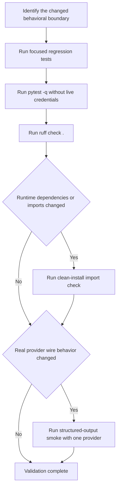
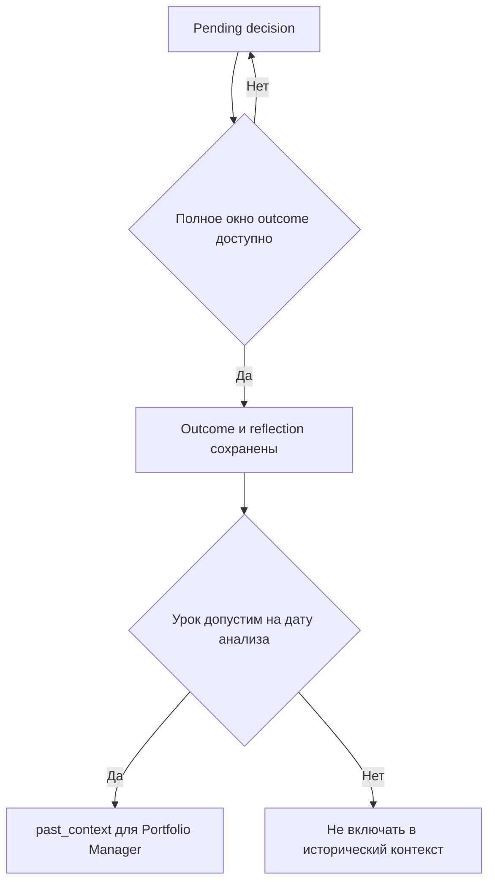

# Проверка изменений и регрессионные тесты

Начинайте с **самой узкой тихой проверки, которая доказывает изменённое поведение**, и сохраняйте полный вывод при сбое — это правило [AGENTS.md](repo://AGENTS.md). Исходники и assertions тестов важнее описаний в wiki, названий тестов и комментариев «end-to-end». Затем расширяйте проверку на соседние контракты: state, глобальную конфигурацию, маршрутизацию и сохранённые результаты. Для широких изменений нужны полный pytest и Ruff; при изменениях зависимостей — чистая установка; реальные вызовы провайдера нужны только там, где mocks не отвечают на вопрос совместимости.


Порядок расширения проверки: от локальной регрессии к общим CI-контрактам и, при необходимости, сетевому smoke.

## Общий контракт: установка, pytest и CI

```bash
pip install -e ".[dev]"
pytest -q
ruff check .
```

Extra `dev` устанавливает `pytest`, `pytest-subtests` и `ruff`. Pytest ищет тесты в `tests`, использует `-ra --strict-markers` и регистрирует `unit`, `integration`, `smoke`. Это допустимые метки, а не полное разбиение набора: немаркированные локальные тесты тоже важны. Поэтому `pytest -m unit` не заменяет полный прогон. См. [pyproject.toml](repo://pyproject.toml#L36-L88).

Для исключения явно помеченных внешних интеграций:

```bash
pytest -q -m "not integration"
```

Это **фильтр меток, не запрет сети**. В частности, живой тест DeepSeek помечен `integration` и пропускается без `DEEPSEEK_API_KEY` либо при значении `placeholder`; экспортированный реальный ключ может включить его в обычный `pytest -q`. Скрипт `scripts/smoke_structured_output.py` — отдельная opt-in программа, а не pytest-тест с меткой `smoke`.

| Проверка CI | Точный контракт |
|---|---|
| Тесты на push в `main` и pull request | Ubuntu, Python **3.10, 3.11, 3.12, 3.13**, `fail-fast: false`; `pip install -e ".[dev]"`, затем `pytest -q` |
| Чистая установка | Python **3.12**, `pip install .` без dev extras, импорт `tradingagents` и `cli.main` |
| Строгий Ruff по всему репозиторию | Python **3.12**, `pip install "ruff>=0.15"`, `ruff check .`; нет разрешения игнорировать ошибки |

Матрица соответствует нижней границе пакета `requires-python = ">=3.10"`. Версионно-зависимые изменения проверяйте и на 3.10, а не только на своём интерпретаторе. Ruff нацелен на `py310`, исключает `results` и `worklog`, выбирает `E/W/F/I/B/UP/C4/SIM`, игнорирует `E501`; для `__init__.py` разрешён `F401`. Массовое форматирование не является частью этого lint-контракта. Источник: [CI](repo://.github/workflows/ci.yml), [Ruff](repo://pyproject.toml#L69-L88).

При изменении runtime-зависимостей, package discovery, импортов верхнего уровня или установленной команды воспроизведите в свежем окружении:

```bash
pip install .
python -c "import tradingagents, cli.main; print('clean-install import OK')"
```

Это smoke импортов, а не запуск анализа или интерактивного CLI. Установленная команда привязана к `tradingagents = "cli.main:app"`.

## Изоляция: что fixtures гарантируют, а что нет

В [tests/conftest.py](repo://tests/conftest.py) две autouse-защиты:

1. `_dummy_api_keys` заменяет отсутствующие и пустые известные API-key переменные на `placeholder`, сохраняя непустые реальные значения. Это позволяет конструировать SDK без настоящих секретов. Fixture выполняется для теста: не рассчитывайте на неё как на защиту импортов при collection.
2. `_isolate_config` до и после каждого теста заменяет `tradingagents.dataflows.config._config` глубокой копией текущего `DEFAULT_CONFIG`. Простого `set_config` недостаточно: он сливает overrides и не удаляет пропущенные ключи, из-за чего `tool_vendors` и другие настройки могли бы зависеть от порядка тестов.

**Dummy credentials сами по себе не блокируют HTTP и LLM.** Патчите именно границу, которую вызывает проверяемый код: `urlopen`, `yf.download`, `yf.Search`, `fred._request`, фабрику клиента или `invoke`. Fixture `mock_llm_client` не autouse и патчит только указанный путь фабрики; заранее импортированная ссылка в другом модуле может требовать отдельного patch. В prompt-тесте Sentiment Analyst явно заглушены StockTwits, Reddit и `get_news.func`, а LLM захватывает итоговый промпт — одного `MagicMock` для LLM недостаточно для изоляции предварительного сбора данных.

Import-time environment — отдельный слой. [test_env_overrides.py](repo://tests/test_env_overrides.py) очищает известные `_ENV_OVERRIDES`, выставляет нужные переменные и делает `importlib.reload(default_config_module)`. Проверяются преобразования чисел и boolean, пустые значения, неизвестные переменные и ошибки импорта при неправильных значениях. После намеренно неудачного reload тесты восстанавливают модуль. Возврат окружения через `monkeypatch` сам по себе не переисполняет уже импортированный модуль; сброс dataflows `_config` тоже не заменяет восстановление `DEFAULT_CONFIG`.

Для SQLite, CSV-кэша, memory log и отчётов используйте `tmp_path` или временный каталог, а не реальные пользовательские `results`/cache/memory. Для TTL и временных окон фиксируйте часы и даты; при retry заглушайте `sleep`, а не ждите реального backoff.

## Карта минимальных проверок

Ниже команды для соответствующего изменения, а не требование запускать все строки после каждой правки. При локальной правке можно начать с конкретного `::test_name`; при изменении общего helper расширьте до всех его потребителей. Не обрезайте traceback ради «тихого» вывода: `-q` уменьшает обычный шум, но полный вывод сбоя нужно сохранить.

### Граф, промпты и схемы

```bash
pytest -q tests/test_analyst_execution.py tests/test_risk_router_path_map.py tests/test_debate_opening.py
pytest -q tests/test_structured_agents.py tests/test_structured_agent_prompts.py
pytest -q tests/test_memory_log.py -k "PortfolioManager"
pytest -q tests/test_i18n_coverage.py
```

Проверяйте обе стороны условного ребра: множество возвращаемых router значений и path map LangGraph. Порядок выбранных аналитиков должен сохраняться, неизвестные ключи — отвергаться; совместимый ключ `social` обозначает `Sentiment Analyst` и `sentiment_report`. Терминальные маршруты и fallback при изменении speaker labels не должны выпадать из карты. См. [тесты порядка](repo://tests/test_analyst_execution.py), [маршрутов](repo://tests/test_risk_router_path_map.py).

В [test_debate_opening.py](repo://tests/test_debate_opening.py) захватываются промпты Bull/Bear и трёх risk debators: пустая реплика оппонента заменяется явным `has not spoken yet`, реальные аргументы передаются дальше. Проверки доказывают отсутствие приглашения опровергать вымышленную реплику в промпте, а не отсутствие галлюцинаций у живой модели.

У structured agents связаны три контракта:

- **Типизированное значение:** допустимые enum, диапазон sentiment score, преобразование null-like строк `None`, `N/A`, `null`, `-`, пустой строки, `TBD` в `None` для optional цен и сохранение числовой строки как числа.
- **Markdown и state/messages:** стабильные `**Recommendation**:`, `**Action**:`, `FINAL TRANSACTION PROPOSAL:`, `**Rating**:`; результат Trader и Sentiment попадает в сообщения, решение PM — в `final_trade_decision`. Изменение поля схемы проверяйте и на typed instance, и после рендеринга.
- **Fallback:** неподдерживаемый binding, structured result `None` и ошибка structured invocation переводят вызов на free-text. Это не обещание вечной безотказности: ошибка последующего plain `invoke` не подавляется helper. См. [structured helper](repo://tradingagents/agents/utils/structured.py#L42-L89).

Текущие assertions дополнительно требуют, чтобы Trader получал `Technical Market Report:` с ATR/support/resistance и инструкцию `Ground concrete price levels`, только если `market_report` непустой. При пустом отчёте обе подсказки отсутствуют, а investment plan остаётся. [Тесты Trader](repo://tests/test_structured_agents.py#L175-L239).

`NO_EXTERNAL_TOOLS` проверяется в реально сформированных промптах Trader, Research Manager, Portfolio Manager и Sentiment Analyst. У Sentiment не должно быть `tool-call date ranges`; у действительно использующих tools Market/News эта формулировка сохраняется (тест проверяет исходный текст модулей). Это снижает риск неизвестного tool call при binding только schema tool, но не доказывает соблюдение инструкции провайдером. Инструкция языка вывода также должна сохраняться у агентов, формирующих отчёты. [Prompt-тесты](repo://tests/test_structured_agent_prompts.py).

### Сигнал и граница исполнимого решения

```bash
pytest -q tests/test_signal_processing.py
pytest -q tests/test_memory_log.py -k "rating"
```

[SignalProcessor](repo://tests/test_signal_processing.py) не делает дополнительный LLM-вызов: извлекает рейтинг детерминированно. Assertions проверяют пять уровней, Markdown, приоритет явного `Rating:` над прозой и fullwidth-двоеточие. Нераспознанное решение даёт **`REVIEW`, не молчаливый `Hold`**; `REVIEW` не входит в `RATINGS_5_TIER`. В отличие от этого, совместимый `parse_rating`, используемый памятью, сохраняет default `Hold` (или переданный default). Не смешивайте эти контракты. Graph-facing тест вызывает `process_signal` у bare instance, а не весь `propagate`.

### Checkpoint и возобновление

```bash
pytest -q tests/test_checkpoint_resume.py tests/test_checkpoint_lifecycle.py
pytest -q tests/test_cli_config_precedence.py
```

Checkpoint хранится в SQLite отдельно по ticker, thread ID детерминирован из ticker, даты и graph-shape signature. Signature учитывает выбранных аналитиков, debate/risk depth и asset type: изменение любого из них не должно продолжать прежний граф. Наличие файла БД недостаточно — тест должен прервать выполнение после committed node и доказать возобновление без повторения уже выполненной работы.

Общий lifecycle теперь используется **и `propagate`, и CLI stream-путём**:

- `begin_checkpoint` при включённой настройке открывает saver, перекомпилирует workflow, возвращает thread ID и определяет `_resuming`; при выключенной настройке — no-op.
- `checkpoint_input(init_state)` возвращает `None` только при resume. Повторная передача initial messages могла бы дублировать их через reducer.
- Успех вызывает `clear_checkpoint_on_success` для ключа данного запуска; mid-stream сбой оставляет сохранённое состояние.
- `end_checkpoint` закрывает ресурс, возвращает обычный граф и сбрасывает `_resuming`; teardown должен выполняться через `finally`.

Источники: [реализация lifecycle](repo://tradingagents/graph/trading_graph.py#L390-L492), [CLI](repo://cli/main.py#L1130-L1253), [очистка после записи решения](repo://tradingagents/graph/trading_graph.py#L558-L574).

`test_checkpoint_resume.py` использует двухузловой toy `StateGraph`: первый узел прибавляет 1, второй падает, затем после `invoke(None)` итог равен 11. `test_checkpoint_lifecycle.py` использует bare `TradingAgentsGraph` с тем же учебным workflow: проверяет begin/recompile, disabled no-op, выбор входа, сохранение/возобновление и очистку. Это реальная SQLite/LangGraph-механика и общий lifecycle, **не запуск настоящего CLI с агентами и провайдерами**.

### Память, outcome и point-in-time

```bash
pytest -q tests/test_memory_log.py tests/test_memory_pointintime.py
```

Память имеет отдельный контракт: идемпотентно записать pending decision, при следующем запуске этого же ticker получить полный outcome, сформировать reflection и атомарно сохранить обновления; pending не включаются в контекст PM. Другие ticker не разрешаются этим запуском. Если `_fetch_returns` ещё не может вычислить результат, запись остаётся pending и reflector не вызывается. Для доходности нужны полные holding windows и акции, и benchmark, а не частичный результат. Возвращается также дата последнего использованного бара — `resolution_date`. [Outcome и разрешение](repo://tradingagents/graph/trading_graph.py#L273-L365), [assertions](repo://tests/test_memory_log.py#L494-L705).


Память отделяет готовность outcome от допустимости уже разрешённого урока на дату исторического анализа.

Важные регрессии:

- Same-ticker контекст содержит decision и reflection, cross-ticker — reflection без полного decision; лимиты контекста соблюдаются, rotation не удаляет pending.
- `past_context` проходит через initial state в PM prompt; при пустом контексте секции уроков нет.
- `resolved:YYYY-MM-DD` сохраняется и читается обратно. `get_past_context(as_of=...)` исключает исходы, ставшие известными **после** даты анализа; равенство разрешено. Фильтр действует и для cross-ticker.
- Legacy записи без resolution date исключаются из исторического запроса консервативно, но доступны без `as_of`. `_memory_as_of` включает фильтр только для даты до сегодняшней; текущая и будущая даты возвращают `None`.

См. [point-in-time assertions](repo://tests/test_memory_pointintime.py). Тест `test_full_cycle_store_resolve_inject` проверяет store/update/context, PM injection проверяется отдельно. Даже `test_full_pipeline_no_regression` подставляет `graph.invoke`, initial state и signal processor через mocks и вызывает реальный путь записи. Это не реальный анализ рынка или полноценный end-to-end CLI.

### Провайдеры и конфигурация

```bash
pytest -q tests/test_provider_registry.py tests/test_openai_compatible_provider.py tests/test_api_key_env.py tests/test_capabilities.py tests/test_model_validation.py
pytest -q tests/test_env_overrides.py tests/test_dataflows_config.py tests/test_llm_max_tokens.py
```

Разделяйте registry/factory, kwargs, wire-format и реальное поведение API. Декларативный OpenAI-compatible registry владеет endpoint, подклассом клиента, optional key, обязательным custom URL и выбором Responses API; native Anthropic, Google, Azure, Bedrock выбираются отдельно lazy factory. Не дублируйте списки провайдеров в новых ветках — проверяйте разрешённый клиент, ключ, URL и аргументы.

[Capability-тесты](repo://tests/test_capabilities.py) различают exact ID, шаблоны будущих DeepSeek/MiniMax и permissive default неизвестной модели. Для OpenRouter удаляется только официальный префикс `deepseek/`: `deepseek/deepseek-v4-flash` получает запрет `tool_choice`, а `tngtech/deepseek-v4-flash` остаётся default. Проверяются reasoning roundtrip/split и immutable capability rows; это метаданные dispatch, не подтверждение поддержки произвольной модели на сервере.

Для token cap [test_llm_max_tokens.py](repo://tests/test_llm_max_tokens.py) проверяет положительные целые и числовые строки, отказ для boolean, неположительных и нецелочисленных строк, отсутствие kwargs при unset. `max_tokens` передаётся для проверяемых non-Google провайдеров, Google получает `max_output_tokens`; есть проверка OpenAI allowlist и свойства сконструированного Google LLM. `TRADINGAGENTS_MAX_TOKENS` проверяется через reload, строка преобразуется при обработке graph kwargs. Эти тесты не измеряют реальные лимиты ответа или время до timeout.

Добавьте соответствующий набор для изменённого семейства/настройки:

```bash
pytest -q tests/test_deepseek_reasoning.py -m "not integration"
pytest -q tests/test_bedrock_provider.py
pytest -q tests/test_google_thinking_level.py tests/test_google_api_key.py
pytest -q tests/test_openai_reasoning_effort.py tests/test_openai_responses_base_url.py
pytest -q tests/test_llm_max_retries.py tests/test_temperature_config.py tests/test_anthropic_effort.py
```

### Рыночные данные: маршрутизация, время и деградация

```bash
pytest -q tests/test_vendor_routing.py tests/test_vendor_errors.py tests/test_no_data_handling.py
pytest -q tests/test_market_data_validator.py tests/test_date_boundaries.py tests/test_ohlcv_cache_freshness.py tests/test_ohlcv_latest_bar.py tests/test_yfinance_stale_ohlcv_guard.py
pytest -q tests/test_news_lookahead.py tests/test_social_lookahead.py
pytest -q tests/test_reddit_fallback.py tests/test_stocktwits_resilience.py
pytest -q tests/test_fred.py
```

**Маршрутизация.** Настроенный список vendors — полная упорядоченная fallback-цепочка; один pinned vendor не должен незаметно обращаться к другому. Реальные сбои логируются; неразрешённые ошибки core-категорий остаются явными. Optional macro/prediction enrichment деградирует до `DATA_UNAVAILABLE`, typed no-data — до `NO_DATA_AVAILABLE` с запретом выдумывать значения. Проверяйте выбор источника вместе с семантикой ошибок, а не отдельно от неё.

**OHLCV.** Verified snapshot исключает строки после даты анализа, для выходного использует предыдущий торговый день, отвергает пустое/слишком раннее окно и ограничивает lookback. Stale frame должен быть отвергнут, а причина — дойти до агента через routing.

[TTL-тесты](repo://tests/test_ohlcv_cache_freshness.py) различают отсутствующий сегодняшний бар и уже присутствующую **частичную дневную свечу**: оба случая после TTL требуют refresh, свежий cache не скачивается повторно, исторический запрос не обновляется по этому TTL. Наличие строки за сегодня не доказывает финальный Close. Проверка `load_ohlcv` с fake download дополнительно доказывает, что обновлённая цена дошла до вызывающего кода; live-получение окончательной свечи она не проверяет.

[Latest-bar регрессии](repo://tests/test_ohlcv_latest_bar.py) не позволяют удалить последний in-range бар с `NaN Close` и выдать предыдущий за последний: нужен `NoMarketDataError` с `no closing price`. Старый пропуск внутри ряда по-прежнему удаляется. Даты свечей сохраняют локальный календарный день, включая Tokyo и mixed DST offsets. Это отличается от UTC-нормализации timestamp новостей.

**Новости и social.** Общий `in_window` сохраняет весь конечный день, но исключает ровно полночь следующего; timezone offset переводится в UTC, а не просто отбрасывается. Будущие и undated статьи исключаются из backtest, undated допускаются в live-окне. Global news после полной фильтрации возвращает понятное сообщение, а не пустой отчёт. StockTwits/Reddit recent feed фильтруется по analysis window; отсутствие подходящих сообщений не подменяется сегодняшним обсуждением. [News](repo://tests/test_news_lookahead.py), [social](repo://tests/test_social_lookahead.py).

**Social fallback.** Reddit по умолчанию RSS-first, без обращения к JSON. Opt-in JSON при 403 или `IncompleteRead` переходит к RSS. Для RSS 429 проверяются ровно один retry и `Retry-After`, включая ноль; без заголовка — jitter. Повреждённый/слишком большой RSS деградирует до пустого списка, RSS-форматирование не выдумывает score/comment counts. StockTwits при проверяемых transport errors возвращает `<stocktwits unavailable...>`, известные crypto пары отображаются в `.X`. Эти тесты мокируют transport и не доказывают доступность Reddit/StockTwits из сети CI.

**FRED revisions.** Недостаточно ограничить `observation_end=curr_date`: поздние ревизии старых наблюдений тоже создают lookahead. [test_fred.py](repo://tests/test_fred.py#L139-L192) проверяет `realtime_start` и `realtime_end` **на обоих запросах**, metadata и observations. Vintage равен дате анализа, но ограничен сверху сегодняшним днём FRED (US Central), чтобы локальная дата на день впереди не вызвала 400. При этом `observation_end` остаётся `curr_date`. Все запросы здесь mocked: assertions доказывают параметры, не историческую полноту ответа FRED. Отдельно проверяются aliases, пропуски `.` в данных, формат таблицы, ограничение числа строк при расчёте изменения по полному диапазону и optional fallback без ключа.

### CLI и сохранённые отчёты

```bash
pytest -q tests/test_cli_config_precedence.py tests/test_cli_env_skip.py tests/test_cli_symbol_handling.py tests/test_cli_no_console.py tests/test_env_overrides.py
pytest -q tests/test_reporting.py
```

Патчите prompt helpers; используйте `typer.testing.CliRunner` для поведения команд и исключений, не запускайте живую интерактивную сессию как unit-тест. Контракты: явные `TRADINGAGENTS_*` настройки пропускают соответствующие prompts; environment debate/risk counts переживают выбор research depth; явный checkpoint flag сильнее environment, отсутствие flag сохраняет default; canonicalization и asset classification согласованы с data layer; Windows no-console ошибка превращается в узкое понятное сообщение, другие исключения не скрываются.

Shared report writer обеспечивает паритет CLI/API: доступные секции попадают в нумерованные каталоги и `complete_report.md`; `TradingAgentsGraph.save_reports` делегирует ему и без явного пути выбирает каталог под `results_dir/reports` с безопасным ticker и timestamp. При смене state key проверьте отдельный файл и сводный отчёт; отсутствие optional секций не должно мешать записи. [Реализация](repo://tradingagents/graph/trading_graph.py#L494-L507), [тесты](repo://tests/test_reporting.py).

## Когда нужен живой structured-output smoke

Используйте его после изменений SDK, structured method/capability, provider/model defaults, сложности схем или промптов/рендеринга трёх decision agents — когда вопрос нельзя решить mocks. Не начинайте с него проверку routing, CLI, памяти или файлов отчёта: это реальные сетевые вызовы, возможные расходы и rate limits.

```bash
OPENAI_API_KEY=... python scripts/smoke_structured_output.py openai
GOOGLE_API_KEY=... python scripts/smoke_structured_output.py google
ANTHROPIC_API_KEY=... python scripts/smoke_structured_output.py anthropic
DEEPSEEK_API_KEY=... python scripts/smoke_structured_output.py deepseek
```

Скрипт также принимает `qwen`, `glm`, `xai`, `--deep-model`, `--quick-model`. Запускайте один осознанно выбранный provider/model за раз; не храните ключи в репозитории.

[Фактический smoke](repo://scripts/smoke_structured_output.py#L105-L170) последовательно вызывает Research Manager → Trader → Portfolio Manager, передавая rendered outputs дальше, затем запускает heuristic `SignalProcessor`. Он **не вызывает `propagate`** и не покрывает настоящий CLI, data tools или checkpoint. Проверяет наличие Markdown headers, печатает результаты и возвращает 1 при отсутствующем marker. Поскольку сами агенты поддерживают free-text fallback, успешные headers не доказывают, что каждый ответ действительно прошёл native typed binding без retry. Проверяйте также предупреждения fallback и вывод; не называйте такой результат полной live-проверкой системы.

## Связанные контракты

- [Исполнение агентов](/openwiki/architecture/agent-runtime.md) — topology, routing и промпты.
- [State и выходные контракты](/openwiki/concepts/state-and-output-contracts.md) — схемы, Markdown и рейтинг.
- [LLM-провайдеры](/openwiki/integrations/llm-providers.md) — capability и wire behavior.
- [Рыночные данные](/openwiki/integrations/market-data.md) — временные окна и fallback.
- [Хранение и восстановление](/openwiki/operations/persistence-and-recovery.md) — checkpoint и память.
- [Точки входа анализа](/openwiki/workflows/analysis-entrypoints.md) — различия CLI и API.

Эта карта описывает проверенные исходники и assertions, а не отчёт об исполнении: при подготовке страницы pytest, Ruff и платные smoke-вызовы не запускались.
