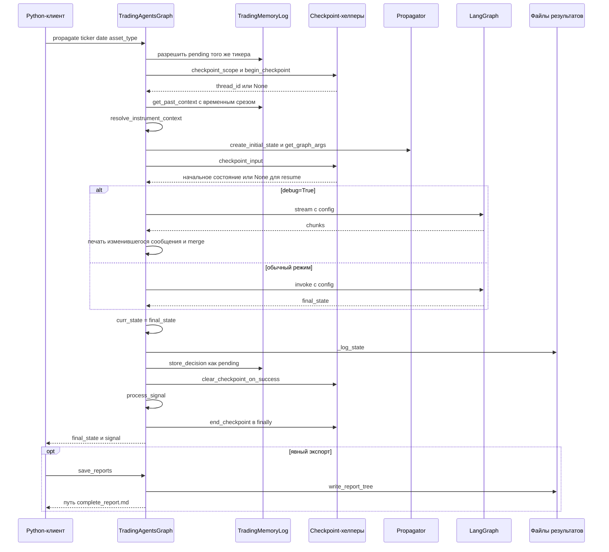
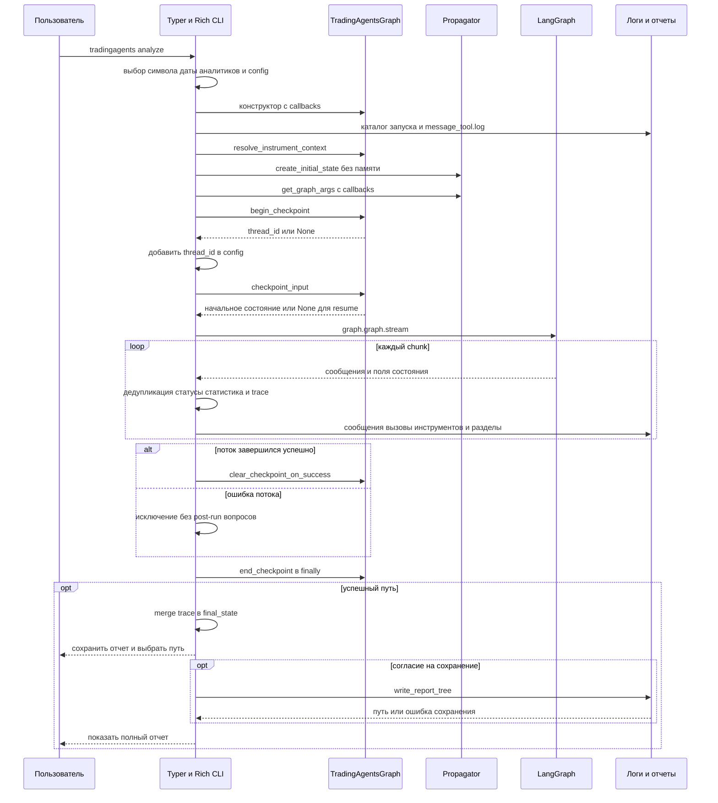

# Сквозной анализ через CLI и Python API

TradingAgents предоставляет два основных входа: интерактивный `tradingagents analyze` и Python-вызов `TradingAgentsGraph.propagate(ticker, trade_date, asset_type=...)`. Команда зарегистрирована как `tradingagents = "cli.main:app"`; из исходников доступен `python -m cli.main`. Корневой `main.py` — минимальный пример API: копирует `DEFAULT_CONFIG`, создает граф с `debug=True`, запускает `propagate("NVDA", "2024-05-10")` и печатает сигнал.

**Общий граф не означает одинаковую внешнюю оркестрацию.** CLI сам создает состояние и вызывает `graph.graph.stream(...)`, а не `propagate()`. Теперь оба пути используют общий жизненный цикл checkpoint: флаг CLI действительно включает сохранение и возобновление. Однако CLI по-прежнему не выполняет API-инициализацию контекста памяти, разрешение прошлых исходов, запись решения в память, `_log_state()` или возврат отдельного рейтинга. Создание объекта `TradingMemoryLog` в общем конструкторе не эквивалентно запуску этих операций.

Это процесс **анализа и подготовки рекомендаций**, заканчивающийся состоянием, сигналом и файлами отчетов, а не сервис отправки брокерских ордеров.

## Сопоставление входов

| Область | Python API: `propagate()` | Интерактивный CLI |
|---|---|---|
| Конфигурация | Переданный `config`, обычно копия `DEFAULT_CONFIG` с уже примененными env-настройками | `_build_run_config()` накладывает выбор пользователя на `DEFAULT_CONFIG`, сохраняет явные env-счетчики раундов; явный checkpoint-флаг имеет приоритет |
| Инструмент и режим | Вызывающий передает тикер и `asset_type`, по умолчанию `stock`; для крипто нужен `asset_type="crypto"` | Проверяет и нормализует символ, затем классифицирует канонический тикер; пустой ввод дает `SPY` |
| Дата и аналитики | Дата от вызывающего; аналитики заданы конструктору, по умолчанию все четыре | Проверка даты и запрет будущей даты; хотя бы один аналитик, без fundamentals для крипто; порядок восстанавливается по `ANALYST_ORDER` |
| Идентичность инструмента | Явный `resolve_instrument_context()` перед выполнением | Тот же явный вызов перед прямым потоком |
| Начальное состояние | Общий `create_initial_state()` с `past_context` и `instrument_context` | Общий builder с `instrument_context`, но `past_context` остается пустой строкой |
| Callbacks | Конструктор привязывает callbacks к LLM; `_run_graph()` вызывает `get_graph_args()` без callbacks | `StatsCallbackHandler` передан и конструктору LLM, и `get_graph_args(callbacks=[...])` для графа/инструментов |
| Выполнение | `invoke()` обычно, `stream()` при `debug=True` | Всегда прямой `stream()` для Rich UI |
| Checkpoint | `checkpoint_scope()` оборачивает `_run_graph()` | Явные `begin_checkpoint()`, `checkpoint_input()`, `clear_checkpoint_on_success()`, `end_checkpoint()` |
| Память и исходы | Разрешение pending-записей того же тикера, загрузка контекста, сохранение нового pending-решения | Эти шаги не вызываются |
| Журнал состояния | `curr_state` и выбранные поля в JSON через `_log_state()` | `message_tool.log` и промежуточные Markdown-разделы, без API JSON-снимка |
| Сигнал | Возвращает `(final_state, signal)`: пять рейтингов либо `REVIEW` | Не извлекает и не возвращает отдельный рейтинг |
| Экспорт отчетов | Отдельный явный `save_reports()` | Вопрос о сохранении и выборе пути после завершения; затем отдельный вопрос о показе отчета |

Основание сравнения — оба вызывающих пути: [CLI](repo://cli/main.py#L974-L1301), [API и checkpoint-хелперы](repo://tradingagents/graph/trading_graph.py#L404-L574), [параметры выполнения](repo://tradingagents/graph/propagation.py#L18-L84).

## Выбор инструмента, конфигурация и общий граф

CLI собирает тикер, дату, язык отчетов, аналитиков, глубину исследования, провайдера, модели, backend URL и поддерживаемые настройки reasoning. Соответствующие env-настройки позволяют пропустить часть вопросов. `_build_run_config()` не заменяет интерактивной глубиной явно заданные `TRADINGAGENTS_MAX_DEBATE_ROUNDS` и `TRADINGAGENTS_MAX_RISK_ROUNDS`. Если `--checkpoint/--no-checkpoint` не указан, сохраняется значение `checkpoint_enabled` из конфигурации.

Тикер допускает Yahoo-символы с суффиксами бирж, `=`, `^` и другими разрешенными символами. `normalize_ticker_symbol()` делегирует в слой данных `normalize_symbol`: например, `BTCUSD` становится `BTC-USD`, а `XAUUSD` — `GC=F`. Классификация выполняется после нормализации: распознанные криптовалютные суффиксы дают `crypto`, остальные инструменты, включая `GC=F`, идут в режиме `stock`. API не повторяет интерактивную классификацию и проверку даты: вызывающий отвечает за выбранный режим и корректную дату, а builder преобразует дату в строку.

Конструктор `TradingAgentsGraph` работает сразу: публикует конфигурацию в слой данных, создает каталоги cache/results, quick/deep LLM с callbacks, инструменты и вспомогательные объекты, затем компилирует выбранный workflow. Аналитики идут последовательно, могут повторять цикл вызовов своего `ToolNode`; переход к следующему аналитику проходит через очистку сообщений. После последнего аналитика следуют инвестиционные дебаты bull/bear, Research Manager с `investment_plan`, Trader с `trader_investment_plan`, риск-дебаты и Portfolio Manager с `final_trade_decision`, затем `END`. Пользовательский Sentiment Analyst имеет ключ `social`. Требуется хотя бы один известный аналитик; выбранный порядок влияет на топологию и checkpoint-подпись.

Подробности узлов и маршрутизации находятся на странице [исполнения агентов](../architecture/agent-runtime.md), параметры и приоритеты — в [конфигурации и развертывании](../operations/configuration-and-deployment.md).

### Идентичность и начальное состояние

Оба входа один раз явно вызывают `resolve_instrument_context()` при подготовке запуска. Он использует кешируемый, допускающий сбой lookup через `yfinance` и строит контекст с точным тикером, доступным названием, сектором, отраслью, биржей и типом инструмента. Ошибка поставщика не блокирует анализ: остается контекст только с тикером. Для крипто добавляется указание анализировать актив, а не предполагать корпоративные fundamentals. Агентские helpers предпочитают готовый `instrument_context`; для вручную созданного состояния без него строят fallback без сетевого обращения.

`Propagator.create_initial_state()` задает исходное human-сообщение, `company_of_interest`, `asset_type`, `instrument_context`, `trade_date`, `past_context`, пустые аналитические отчеты и записи инвестиционных/риск-дебатов с пустыми историями и нулевыми счетчиками. `get_graph_args()` задает `stream_mode="values"`, `recursion_limit` и, если переданы, callbacks графа. На возобновлении созданное начальное состояние **не подается заново**: `checkpoint_input()` возвращает `None`, чтобы продолжить сохраненный поток без повторного добавления исходного сообщения.

Источники: [выбор CLI](repo://cli/main.py#L548-L622), [дата CLI](repo://cli/main.py#L744-L760), [символы](repo://cli/utils.py#L26-L99), [контекст](repo://tradingagents/graph/trading_graph.py#L367-L377), [контракт и тесты идентичности](repo://tests/test_instrument_identity.py#L18-L118).

## Python API: от памяти до сигнала


*Путь API по `propagate()` и `_run_graph()`: очистка checkpoint следует за журналированием и памятью, а Markdown-экспорт остается отдельным действием.*

В начале `propagate()` выставляет `self.ticker` и пытается разрешить pending-записи только этого тикера. При наличии полного окна цен инструмента и benchmark вычисляются доходности и alpha, reflector готовит урок; если данных недостаточно, запись остается pending. В `_run_graph()` завершенные решения этого тикера и уроки других тикеров формируют `past_context`. Для исторической даты `_memory_as_of()` ограничивает уроки теми, чей исход уже был известен к дате анализа; записи без даты разрешения при таком фильтре не включаются. Для текущей даты фильтр отключен. Это ограничение относится к загрузке памяти, а не является общей гарантией point-in-time для всех источников данных.

В обычном режиме граф возвращает состояние через `invoke()`. В debug-режиме `_run_graph()` читает поток, сравнивает сигнатуру последнего сообщения `(type, content)` с ранее напечатанной и не печатает повтор. Chunks из trace накладываются на итоговый словарь через `final_state.update(chunk)`. Это поверхностное объединение полей, а не рекурсивное слияние историй; текущая реализация debug-пути добавляет chunk в trace внутри проверки непустого `messages`, в отличие от CLI, который добавляет каждый chunk.

После выполнения API присваивает `curr_state`, записывает выбранные сериализуемые поля состояния, передает итоговое решение в `memory_log.store_decision()`, очищает успешный checkpoint и извлекает сигнал. Без настроенного пути памяти ее операции не создают историю. Исход нового решения откладывается до последующего запуска того же тикера с достаточной историей цен. Детали хранения и ротации вынесены в [сохранение и восстановление](../operations/persistence-and-recovery.md).

JSON-снимок API содержит отчеты, планы, истории и решения дебатов, итоговое решение и поля инструмента/даты, но не является полным сериализованным объектом LangGraph:

```text
<results_dir>/<safe ticker>/TradingAgentsStrategy_logs/full_states_log_<trade_date>.json
```

### Безопасная обработка `REVIEW` и явный экспорт

`SignalProcessor` не делает дополнительного LLM-вызова. Он детерминированно извлекает из `final_trade_decision` `Buy`, `Overweight`, `Hold`, `Underweight` или `Sell`; отсутствие распознаваемого рейтинга дает **`REVIEW`, а не `Hold`**. Парсер сначала ищет метку `Rating`, затем отдельное слово из пяти уровней и нормализует Unicode через NFKC. `REVIEW` не входит в `PortfolioRating` и требует проверки человеком или повторного анализа. Устаревший удобный `parse_rating()`, используемый памятью, по-прежнему имеет fallback `Hold`; его нельзя путать с контрактом возвращаемого API-сигнала.

```python
from tradingagents.default_config import DEFAULT_CONFIG
from tradingagents.graph.trading_graph import TradingAgentsGraph
from tradingagents.agents.schemas import PortfolioRating
from tradingagents.agents.utils.rating import is_review

config = DEFAULT_CONFIG.copy()
ta = TradingAgentsGraph(config=config)
final_state, signal = ta.propagate("NVDA", "2026-01-15", asset_type="stock")

if is_review(signal):
    rating = None
    print("REVIEW: inspect the decision or rerun the analysis.")
else:
    rating = PortfolioRating(signal)
    print(rating.value)

# Export explicitly, including decisions that require review.
report_file = ta.save_reports(final_state, "NVDA")
print(report_file)
```

Экспорт здесь не скрыт внутри `propagate()` и может отдельно завершиться ошибкой файловой системы. Пример не преобразует `REVIEW` в позицию и не отправляет ордер.

Источники: [память перед запуском](repo://tradingagents/graph/trading_graph.py#L279-L388), [выполнение и сохранение](repo://tradingagents/graph/trading_graph.py#L509-L616), [временной фильтр памяти](repo://tradingagents/agents/utils/memory.py#L70-L107), [рейтинг](repo://tradingagents/agents/utils/rating.py), [проверки сигнала](repo://tests/test_signal_processing.py#L75-L140).

## CLI: прямой поток с общим checkpoint-жизненным циклом

`run_analysis()` готовит config, план аналитиков, `AnalystWallTimeTracker` и `StatsCallbackHandler`, создает граф и Rich-интерфейс. До потока создаются каталог запуска, лог сообщений и каталог промежуточных отчетов. Затем CLI явно разрешает идентичность инструмента и создает состояние **без загрузки `past_context` из памяти**.


*CLI использует прямой поток LangGraph, но явно вызывает общие checkpoint-хелперы; память, JSON-журнал и извлечение API-сигнала в этот путь не входят.*

### Обработка потока и интерфейс

На каждом chunk CLI:

- просматривает все `messages`, пропускает уже обработанные непустые `message.id`, классифицирует сообщения как пользовательские, агентские, данные, управление или системные; сообщения без ID этой дедупликацией не защищены;
- записывает непустой текст и аргументы `tool_calls`;
- обновляет завершенность аналитиков по полям отчетов и измеряет их wall time;
- превращает инвестиционные и риск-дебаты в разделы отчета и переходы статусов команд;
- обновляет Rich UI и добавляет chunk в trace.

После выхода из потока CLI объединяет **все** chunks последовательными `final_state.update(chunk)`, завершает отображаемые статусы, пишет сообщение о завершении и сводку времени, обновляет окончательные разделы. Дедупликация UI не заменяет объединение состояния и не изменяет сам LangGraph.

Счетчики LLM-вызовов, инструментов и токенов в `StatsCallbackHandler` защищены lock. Данные о токенах берутся из метаданных ответа, когда провайдер их предоставляет; отсутствие таких данных не является ошибкой анализа. Constructor callbacks отслеживают LLM отдельно от callbacks, переданных CLI в config графа. Добавляя собственную телеметрию API, нельзя предполагать, что `_run_graph()` автоматически повторяет CLI-передачу graph callbacks.

### Checkpoint: общая механика, разные границы успеха

При включенном checkpoint `begin_checkpoint()` открывает saver для тикера и перекомпилирует workflow. Возвращаемый thread ID зависит от тикера, даты, выбранных аналитиков, глубины инвестиционных и риск-дебатов и `asset_type`. При найденном checkpoint `checkpoint_input(init_state)` возвращает `None`; повторная передача начального состояния могла бы дублировать сообщения через reducer. При отключенном checkpoint начало возвращает `None` как thread ID, а вход графа остается начальным состоянием.

- **API:** `checkpoint_scope()` оборачивает setup и `_run_graph()` с `finally: end_checkpoint()`. Очистка происходит после `_log_state()` и `store_decision()`. Ошибка графа или этих операций не дает нормального возврата и оставляет checkpoint для восстановления.
- **CLI:** `begin_checkpoint()` и добавление thread ID выполняются перед `try` потока; внутри `try` поток должен полностью завершиться, затем вызывается `clear_checkpoint_on_success()`. `finally` закрывает saver и восстанавливает обычный граф через `end_checkpoint()`. Ошибка потока пропускает очистку и post-run вопросы. Гарантия этого `finally` не распространяется на исключение самого CLI-вызова `begin_checkpoint()`, стоящего раньше `try`.
- CLI очищает checkpoint **до** объединения trace и post-run сохранения. API очищает его **после** собственной записи состояния и памяти. Ошибка отдельного экспорта отчетов в обоих случаях не восстанавливает уже очищенный checkpoint.

Таким образом, прежнее представление о `--checkpoint` как неработающем флаге прямого CLI-потока неверно. При изменении пользовательского пути важно сохранить не только config-флаг, но и вызовы begin/input/clear/end. Подробности SQLite и удаления сохранений — на странице [сохранения и восстановления](../operations/persistence-and-recovery.md).

Источники: [CLI-поток и завершение](repo://cli/main.py#L1113-L1301), [общие helpers](repo://tradingagents/graph/trading_graph.py#L431-L492), [регрессия CLI-подобного resume](repo://tests/test_checkpoint_lifecycle.py#L63-L155), [статистика](repo://cli/stats_handler.py#L9-L76).

## Артефакты и экспорт отчетов

CLI ведет собственные артефакты представления:

```text
<results_dir>/<ticker>/<analysis_date>/
├── message_tool.log
└── reports/
    └── <incremental section files>
```

Декораторы методов `MessageBuffer` дописывают сообщения и вызовы инструментов в лог, а при изменении разделов перезаписывают плоские Markdown-файлы. Эти файлы не являются API JSON-снимком или памятью решений.

После выхода из Rich `Live` CLI задает `Save report?`, предлагает `./reports/<ticker>_<timestamp>` и позволяет изменить путь. Исключение report writer перехватывается и отображается как `Error saving report: ...`; затем независимо задается вопрос о выводе полного отчета на экран. Это обработка ошибки **сохранения отчета**, а не превращение ошибки графа в успешный анализ. Верхнеуровневая специальная обработка отсутствующего Windows console buffer также не является общей обработкой ошибок исполнения.

`save_report_to_disk()` CLI и `TradingAgentsGraph.save_reports()` используют один `write_report_tree(final_state, ticker, save_path)`. Writer условно создает наполненные разделы `1_analysts`, `2_research`, `3_trading`, `4_risk`, `5_portfolio` и записывает `complete_report.md` с тикером и временем генерации. Раздел Portfolio Manager берется из `risk_debate_state.judge_decision`: одного произвольного поля `final_trade_decision` в пользовательском минимальном словаре недостаточно для полноценного экспортируемого отчета.

При отсутствии явного `save_path` API выбирает:

```text
<results_dir>/reports/<safe ticker>_<YYYYMMDD_HHMMSS>/complete_report.md
```

Общий writer обеспечивает одинаковый формат финального дерева отчетов, но не уравнивает предшествующие побочные эффекты CLI и API. Успешный `propagate()` или завершение прямого потока само по себе не гарантирует наличие `complete_report.md`.

Источники: [промежуточные CLI-файлы](repo://cli/main.py#L1033-L1079), [вопросы и ошибки экспорта](repo://cli/main.py#L1277-L1334), [общий writer](repo://tradingagents/reporting.py), [API-экспорт](repo://tradingagents/graph/trading_graph.py#L494-L507).

## Безопасные точки изменения и проверки

- **Новый контекст запуска:** изменение только `_run_graph()` не достигает CLI. Общие данные следует вводить через общий builder или явно согласованные операции обоих входов.
- **Новая постобработка:** заранее определить, принадлежит ли она API, CLI или общему слою. Вызов `graph.graph.stream()` не вызывает автоматически сохранение памяти или `_log_state()`.
- **Новые аналитики и порядок:** согласовать общий план исполнения, граф, UI-отображение и checkpoint-подпись.
- **Телеметрия:** различать callbacks LLM и graph/tool callbacks, не требовать метаданных токенов от каждого провайдера.
- **Формат отчета:** менять общий writer для паритета финального экспорта; промежуточные CLI-файлы и экранный renderer остаются отдельными потребителями.

Наиболее полезные регрессионные проверки:

| Тесты | Что защищают |
|---|---|
| `tests/test_cli_config_precedence.py` | Приоритет env-раундов и явных checkpoint-флагов |
| `tests/test_cli_symbol_handling.py` | Допустимые Yahoo-символы, нормализация, классификация |
| `tests/test_instrument_identity.py` | Кеш, fail-open lookup, точный контекст и fallback без сети |
| `tests/test_checkpoint_lifecycle.py` | No-op при отключении, перекомпиляция, `checkpoint_input(None)` при resume, сохранение после сбоя и очистка после успеха в CLI-подобном сценарии |
| `tests/test_checkpoint_resume.py` | Возобновление узлов и изоляция checkpoint по дате и форме графа |
| `tests/test_memory_log.py` | Pending-решения, разрешение исходов и выбор контекста |
| `tests/test_signal_processing.py` | Пять уровней, Markdown/NFKC, отсутствие LLM-вызова, `REVIEW` в графовом контракте отдельно от legacy `Hold` fallback |
| `tests/test_reporting.py` | Содержимое общего дерева отчетов, явный путь и API-путь по умолчанию |

Эти тесты проверяют отдельные контракты; в частности, checkpoint lifecycle тестирует хелперы на небольшом графе, а не весь интерактивный терминальный сеанс.

См. также [обзор системы](../architecture/system-overview.md), [контракты состояния и результатов](../concepts/state-and-output-contracts.md) и [быстрый старт](../quickstart.md).
