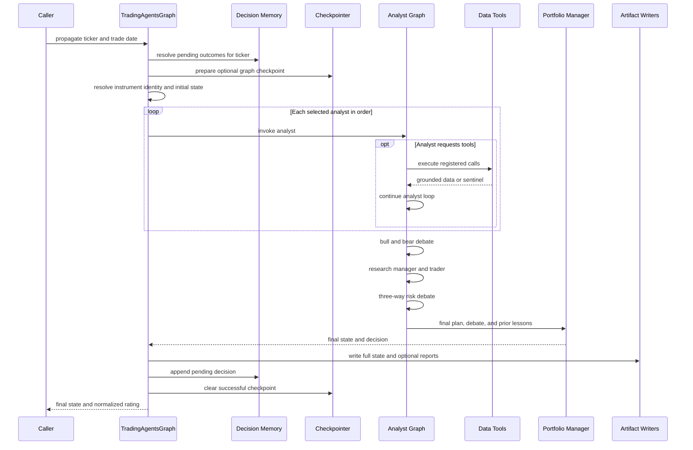
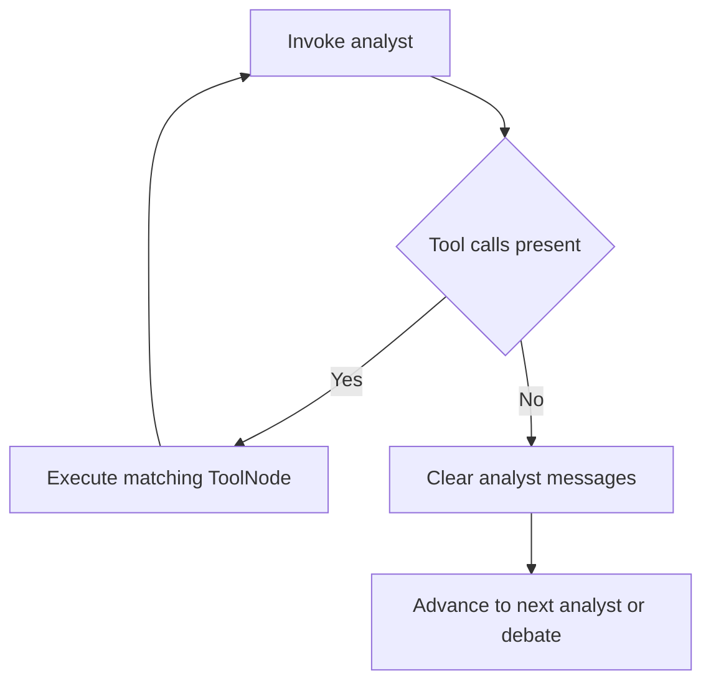
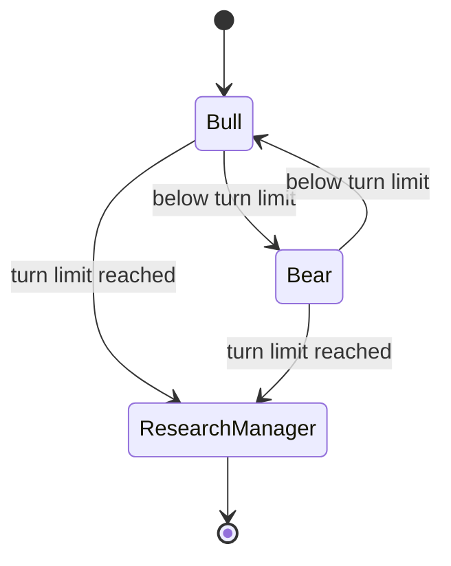
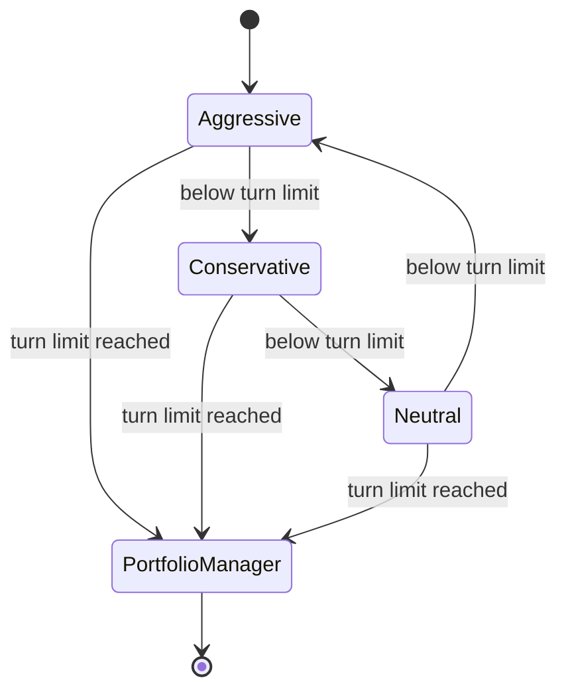

# Analysis run workflow

An analysis run is initiated by the CLI or `TradingAgentsGraph.propagate(ticker, trade_date)`. The [architecture](/openwiki/architecture/overview.md) supplies the graph; the run applies [trading decision rules](/openwiki/domain/trading-decisions.md), calls [integration adapters](/openwiki/integrations/data-and-llm.md), and creates artifacts managed by the [operations runbook](/openwiki/operations/runbook.md).

## End-to-end sequence

The sequence reflects `tradingagents/graph/trading_graph.py`, `setup.py`, `propagation.py`, `reporting.py`, and the agent factories.

## 1. Prepare the run

`propagate()` first tries to resolve prior pending memory entries for the same ticker. If enough subsequent price data exists, it calculates raw return and alpha against an explicit or exchange-derived benchmark, asks the reflector for a lesson, and marks the old entry resolved (`tradingagents/graph/trading_graph.py`, `agents/utils/memory.py`, `graph/reflection.py`).

When checkpointing is enabled, the graph is recompiled with a per-ticker SQLite saver. Its thread identifier hashes ticker, date, selected analysts in order, debate depth, risk depth, and asset type. This prevents a changed graph shape from resuming an incompatible run (`graph/checkpointer.py`, `tests/test_checkpoint_resume.py`).

The initial state resolves instrument identity once and includes deterministic stock/crypto context, analyst report placeholders, debate state, final-decision fields, and memory context (`graph/propagation.py`, `agents/utils/agent_utils.py`).

## 2. Execute analysts

Analyst order is the caller's selected order. At least one recognized analyst is required. The saved key `social` remains accepted for compatibility, but it creates the Sentiment Analyst (`graph/analyst_execution.py`).

### Tool-loop analysts

Market, news, and fundamentals agents bind a known tool set. After each LLM response, conditional logic checks the latest message:

This loop is shared by the tool-using analyst stages; tools must be registered on both the LLM and the matching LangGraph `ToolNode`.

The Market Analyst is required by prompt to gather OHLCV, request indicators as needed, and finish with a deterministic verified snapshot before asserting exact values. The News Analyst can call ticker/global news, insider, macro, and prediction-market tools. The Fundamentals Analyst can call overview and statement tools.

### Sentiment analyst

The Sentiment Analyst is different: it synchronously prefetches Yahoo news, StockTwits, and Reddit evidence inside its node, then asks for a structured sentiment report. It does not use the normal graph tool loop (`agents/analysts/sentiment_analyst.py`). Crypto symbols are transformed for the source-specific conventions.

Data failures follow the [integration contract](/openwiki/integrations/data-and-llm.md): core failures are loud, optional enrichment can degrade, and genuine no-data results explicitly instruct agents not to fabricate.

## 3. Research debate and manager

The Bull Researcher speaks first, then the Bear Researcher, alternating until the count reaches `2 * max_debate_rounds`. Each turn appends combined and role-specific history. The deep-model Research Manager judges the complete debate and emits a five-tier `ResearchPlan`, rendered to Markdown as the `investment_plan` (`agents/researchers/`, `agents/managers/research_manager.py`, `graph/conditional_logic.py`).

The research lifecycle alternates two viewpoints and terminates in a manager decision.

## 4. Trader and risk debate

The Trader translates the research recommendation and analyst reports into a three-tier Buy/Hold/Sell proposal, with optional entry, stop, and sizing. Nuanced Overweight/Underweight exposure is intentionally left to managers (`agents/schemas.py`, `agents/trader/trader.py`).

Risk starts with the Aggressive Analyst, then Conservative, then Neutral, rotating until the count reaches `3 * max_risk_discuss_rounds`. The Portfolio Manager receives the research plan, trader proposal, full risk history, instrument context, and prior lessons.

The risk lifecycle cycles three risk appetites before the final portfolio decision.

## 5. Finalize and persist

The Portfolio Manager emits a five-tier rating and narrative. Signal processing prefers the explicit `Rating:` field and falls back to Hold when it cannot identify a supported tier (`agents/utils/rating.py`, `graph/signal_processing.py`).

After successful graph completion:

1. the final state is stored in memory and written as JSON beneath the results directory;
2. the API or CLI may call the shared report-tree writer;
3. the final decision is appended to decision memory with pending status;
4. the run-specific checkpoint rows are cleared;
5. the checkpointer connection closes and the graph is recompiled without persistence.

Checkpoint cleanup happens only after state logging and memory storage. If post-graph persistence fails, the checkpoint remains so the run can be recovered, although a completed final node may be replayed.

## Failure and recovery behavior

| Failure area | Behavior |
|---|---|
| Unknown/empty analyst selection | Fail before graph construction |
| Tool or primary data vendor failure | Try only the explicitly configured chain; raise if no selected source succeeds |
| Genuine missing/stale data | Return `NO_DATA_AVAILABLE` and forbid fabrication |
| Optional macro/prediction failure | Return `DATA_UNAVAILABLE` and continue |
| Structured-output failure | Warn and retry once as free text |
| Process interruption with checkpointing | Resume latest successful node for matching graph signature |
| Successful completion | Clear matching checkpoint rows |

Use the [testing guide](/openwiki/testing.md) when modifying a stage or failure boundary.
